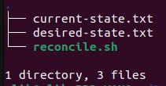
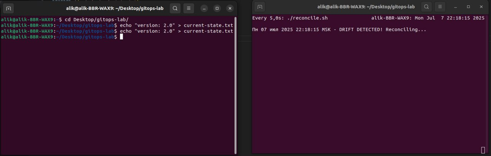
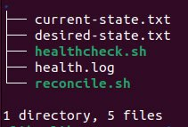

# **GitOps Fundamentals Lab**

## **Task 1: Git State Reconciliation**

As a result of initializing the git repository and creating text files and a script, the repository structure looks like this:



Now, when making changes to the file `current-state.txt` the script will detect the discrepancy and restore the fixed state of the file.

```bash
echo "version: 2.0" > current-state.txt
./reconcile.sh
```

Output:

```bash
Пн 07 июл 2025 22:15:16 MSK - DRIFT DETECTED! Reconciling...
```

You can also run the check in automatic mode - periodically executing the command. In our case, this is the script execution every 5 seconds.

```bash
watch -n 5 ./reconcile.sh
```



---

## **Task 2: GitOps Health Monitoring**

The healthcheck script.sh is used to monitor the compliance of the current system status with the reference one. It compares the file hashes and logs whether there are deviations, allowing early detection of configuration drift.



```bash
./healthcheck.sh
cat health.log
```

Output:

```bash
Пн 07 июл 2025 23:11:00 MSK - OK: States synchronized
```

**Create drift**:

```bash
echo "unapproved change" >> current-state.txt
```

Now

```bash
./healthcheck.sh
cat health.log
```

Output:

```bash
Пн 07 июл 2025 23:11:00 MSK - OK: States synchronized
Пн 07 июл 2025 23:16:59 MSK - CRITICAL: State mismatch!
```

Unlike in the previous case, this script does not correct changes, but it can log changes over time.

The created files and scripts can be found in the directory `gitops-lab`
