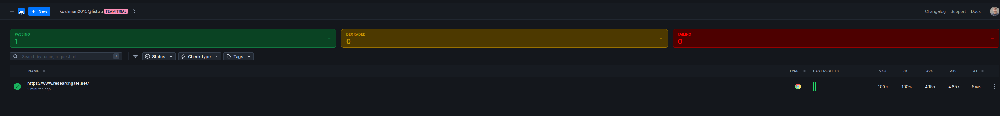

## Task 1

Call the command `htop`

**Top 3 CPU-consuming processes:**
1. **gnome-shell** (PID 2334) - 14% CPU - `/usr/bin/gnome-shell`
1. **firefox** (PID 3662) - 10.8% CPU - `/usr/lib/firefox/firefox`
1. **gnome-terminal-server** (PID 17046) - 6.4% CPU - `/usr/lib/gnome-terminal-server`

**Top 3 Memory-consuming processes:**
1. **firefox** (PID 3159) - 1.7% CPU - `/usr/lib/firefox/firefox --new-window`
2. **firefox** (PID 3162) - 1.7% CPU - `/usr/lib/firefox/firefox --new-window`
3. **firefox** (PID 3163) - 1.7% CPU - `/usr/lib/firefox/firefox --new-window`

**System Overview:**
- **Total Memory:** 62.6GB
- **Used Memory:** 5.66GB
- **Load Average:** 0.33, 0.46, 0.47
- **Tasks:** 160 total, 1269 threads, 303 kernel threads, 1 running
- **Uptime:** 30 minutes 56 seconds

**Analysis:** The system shows healthy resource utilization with Visual Studio Code being the primary application consuming resources, which is expected during development work. The load average indicates moderate system activity

**Disk Space Management**:

~~~bash
Filesystem      Size  Used Avail Use% Mounted on
dev              32G     0   32G   0% /dev
run              32G  2,3M   32G   1% /run
efivarfs        256K  134K  118K  54% /sys/firmware/efi/efivars
/dev/nvme1n1p3  455G  405G   28G  94% /
tmpfs            32G   18M   32G   1% /dev/shm
tmpfs           1,0M     0  1,0M   0% /run/credentials/systemd-journald.service
tmpfs            32G  3,7M   32G   1% /tmp
/dev/loop1       64M   64M     0 100% /var/lib/snapd/snap/core20/2379
/dev/loop2       39M   39M     0 100% /var/lib/snapd/snap/snapd/21759
/dev/loop0       64M   64M     0 100% /var/lib/snapd/snap/core20/2318
/dev/nvme0n1p1   96M   26M   71M  27% /boot/efi
tmpfs           6,3G  164K  6,3G   1% /run/user/1000
~~~

Command `sudo du -ah /var | sort -rh | head -20`

~~~bash
29G     /var/cache/pacman/pkg
29G     /var/cache/pacman
29G     /var/cache
18G     /var/lib
11G     /var/lib/postgres/data
11G     /var/lib/postgres
6.3G    /var/lib/docker
~~~

**Top 3 largest files/directories in /var:**
1. **Package Cache** - 29GB (`/var/cache/pacman/pkg`) - Contains downloaded packages
2. **PostgreSQL Database** - 11GB (`/var/lib/postgres/data`) - Database files
3. **Docker Storage** - 6.3GB (`/var/lib/docker`) - Container images and volumes

**SRE Recommendations:**
1. **Immediate Action Required:** Clean package cache to free up 29GB
2. **Database Monitoring:** Monitor PostgreSQL growth (11GB current usage)
3. **Container Management:** Review Docker images and volumes (6.3GB)
4. **Disk Space Alerting:** Set up alerts when disk usage exceeds 85%

## Task 2

The website `https://www.researchgate.net/`

Created check with checkly:

~~~js
/**
  * To learn more about Playwright Test visit:
  * https://checklyhq.com/docs/browser-checks/playwright-test/
  * https://playwright.dev/docs/writing-tests
  */

const { expect, test } = require('@playwright/test')

// Configure the Playwright Test timeout to 210 seconds,
// ensuring that longer tests conclude before Checkly's browser check timeout of 240 seconds.
// The default Playwright Test timeout is set at 30 seconds.
// For additional information on timeouts, visit: https://checklyhq.com/docs/browser-checks/timeouts/
test.setTimeout(210000)

// Set the action timeout to 10 seconds to quickly identify failing actions.
// By default Playwright Test has no timeout for actions (e.g. clicking an element).
test.use({ actionTimeout: 10000 })

test('visit page and take screenshot', async ({ page }) => {
  // Change checklyhq.com to your site's URL,
  // or, even better, define a ENVIRONMENT_URL environment variable
  // to reuse it across your browser checks
  const response = await page.goto(process.env.ENVIRONMENT_URL || 'https://www.researchgate.net/')

  // Take a screenshot
  await page.screenshot({ path: 'screenshot.jpg' })

  // Test that the response did not fail
  expect(response.status(), 'should respond with correct status code').toBeLessThan(400)
})
~~~

Setup alert by email

