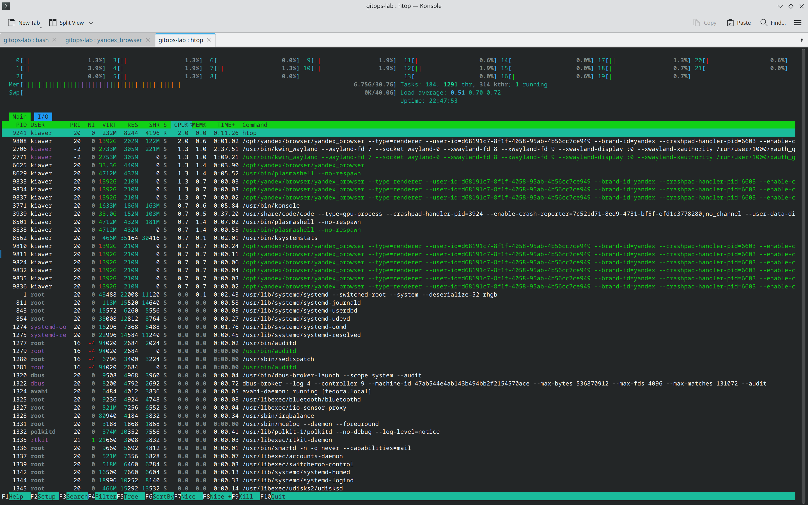
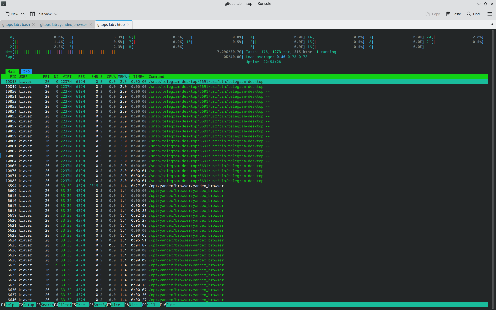
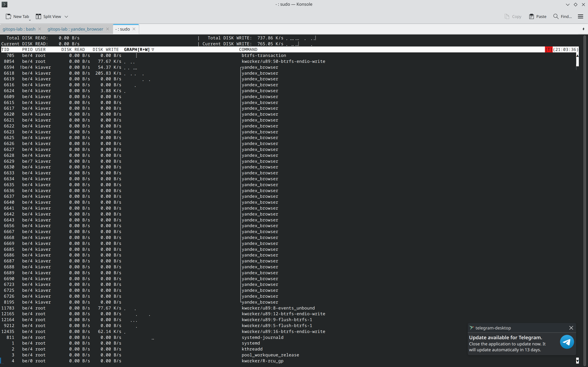
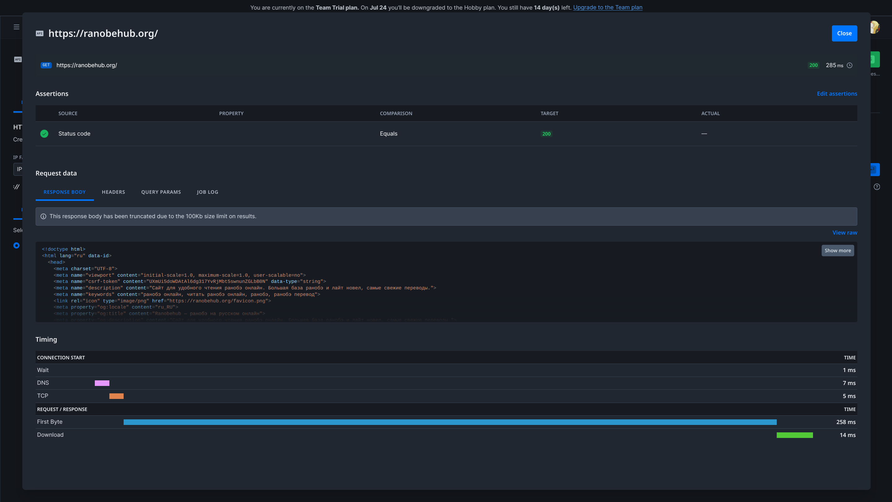
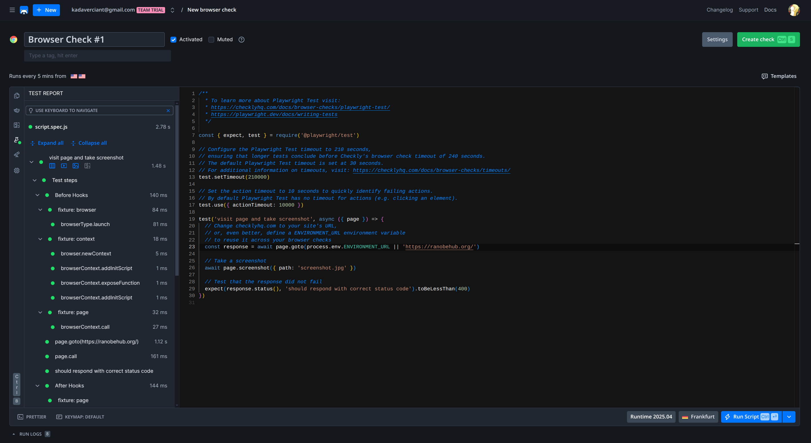
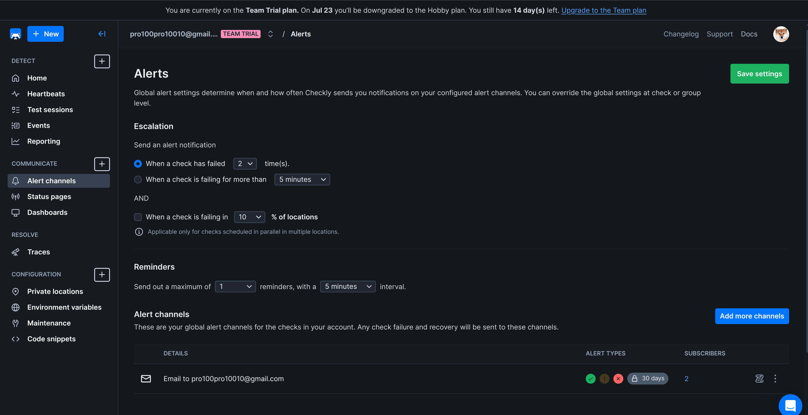

## Task 1: Key Metrics for SRE and SLAs

### Task 1.1: Monitor System Resources
```
htop
```

#### CPU:

Top 3:
- `htop` (2.0%) - command itself
- `yandex-browser` (2.0%) - yandex browser client
- `usr/bin/kwin_wayland` (1.3%) - window manager which is component of KDE Plasma used in Fedora

#### Memory:

Top 3:
- `telegram` (2.0%) - telegram client
- `yandex-browser` (1.4%)  - yandex browser client
- `usr/bin/plasmashell` (1.3%) - KDE Plasma desctop in Fedora

#### I/O usage
```
iostat
```
```
Linux 6.14.9-300.fc42.x86_64 (MiWiFi-RD15-srv)  07/10/2025      _x86_64_        (22 CPU)

avg-cpu:  %user   %nice %system %iowait  %steal   %idle
           1.09    0.00    1.00    0.15    0.00   97.76

Device             tps    kB_read/s    kB_wrtn/s    kB_dscd/s    kB_read    kB_wrtn    kB_dscd
loop0             0.00         0.00         0.00         0.00         17          0          0
loop1             0.00         0.02         0.00         0.00       1812          0          0
loop10            0.01         0.03         0.00         0.00       2704          0          0
loop11            0.06         1.70         0.00         0.00     140729          0          0
loop12            0.02         0.48         0.00         0.00      40045          0          0
loop13            0.00         0.02         0.00         0.00       1322          0          0
loop14            0.00         0.00         0.00         0.00         10          0          0
loop2             0.01         0.08         0.00         0.00       6753          0          0
loop3             0.01         0.11         0.00         0.00       9343          0          0
loop4             0.00         0.02         0.00         0.00       1615          0          0
loop5             0.01         0.03         0.00         0.00       2499          0          0
loop6             0.02         0.05         0.00         0.00       4385          0          0
loop7             0.00         0.01         0.00         0.00       1103          0          0
loop8             0.00         0.00         0.00         0.00        388          0          0
loop9             0.00         0.00         0.00         0.00        385          0          0
nvme0n1           2.85        38.60        30.87      3062.75    3203084    2561969  254158536
zram0             0.00         0.03         0.00         0.00       2224          4          0
```

`iostat` showed smth ininterpretable, so I decided to use `iotop`

Top 3:
- `btrfs-transaction` - Btrfs filesystem transaction
- `kworker btrfs` - also something connnected with filesystem
- `yandex-browser` - yandex browser client

### Task 1.2: Disk Space Management
```
du
```
provided to big output, those I decided to use `df`

```
df -h | sort -k3 -hr
```
```
Filesystem      Size  Used Avail Use% Mounted on
/dev/nvme0n1p8  268G   28G  240G  11% /var
/dev/nvme0n1p8  268G   28G  240G  11% /home
/dev/nvme0n1p8  268G   28G  240G  11% /
/dev/loop11     455M  455M     0 100% /var/lib/snapd/snap/telegram-desktop/6691
/dev/loop10     454M  454M     0 100% /var/lib/snapd/snap/telegram-desktop/6639
/dev/loop13     452M  452M     0 100% /var/lib/snapd/snap/zoom-client/258
/dev/loop5      405M  405M     0 100% /var/lib/snapd/snap/gnome-46-2404/90
/dev/loop12     355M  355M     0 100% /var/lib/snapd/snap/yandex-browser/4
/dev/loop7      291M  291M     0 100% /var/lib/snapd/snap/mesa-2404/887
tmpfs            16G  178M   16G   2% /dev/shm
/dev/loop6       92M   92M     0 100% /var/lib/snapd/snap/gtk-common-themes/1535
/dev/loop2       74M   74M     0 100% /var/lib/snapd/snap/core22/2010
/dev/loop14      74M   74M     0 100% /var/lib/snapd/snap/core22/2045
/dev/loop4       67M   67M     0 100% /var/lib/snapd/snap/core24/988
/dev/loop3       67M   67M     0 100% /var/lib/snapd/snap/core24/1006
/dev/loop9       51M   51M     0 100% /var/lib/snapd/snap/snapd/24718
/dev/loop8       51M   51M     0 100% /var/lib/snapd/snap/snapd/24505
tmpfs            16G   44M   16G   1% /tmp
/dev/nvme0n1p6  511M   20M  492M   4% /boot/efi
tmpfs           6.2G  2.5M  6.2G   1% /run
tmpfs           3.1G  284K  3.1G   1% /run/user/1000
efivarfs        192K  133K   55K  72% /sys/firmware/efi/efivars
/dev/loop0      128K  128K     0 100% /var/lib/snapd/snap/bare/5
tmpfs           1.0M     0  1.0M   0% /run/credentials/systemd-resolved.service
tmpfs           1.0M     0  1.0M   0% /run/credentials/systemd-journald.service
devtmpfs        4.0M     0  4.0M   0% /dev

```
Top 3 in /var:
- `/var/lib/snapd/snap/telegram-desktop/6691` (455M) - current version of telegram
- `/var/lib/snapd/snap/telegram-desktop/6638` (455M) - previous version (snap stores previous versions by default to rollback in case of problems)
- `/var/lib/snapd/snap/zoom-client/258` (452M) - zoom client

## Task 2: Practical Website Monitoring Setup

### Step 1: Choose Your Website
https://ranobehub.org/

### Step 2: Create Checks in Checkly
Api:

Browser:

Alert:
