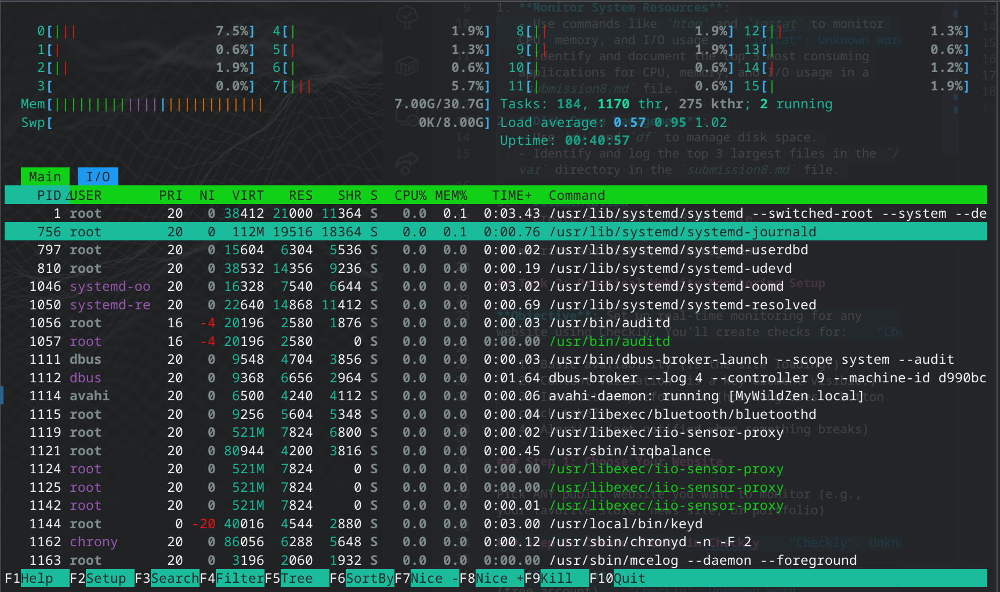

# Solution to Lab 8

by Dmitry Beresnev <d.beresnev@innopolis.university>

The tasks are done under **Linux Fedora 42**

## Task 1: Key Metrics for SRE and SLAs

**Command:**

```bash
htop
```

**Output:**



**Top 3 most consuming applications for CPU:**

1. `htop` (3.8% CPU) - `htop` command
2. `usr/bin/plasmashell --no-respawn` (3.2% CPU) - graphical environment for Fedora KDE Plasma
3. `usr/bin/kwin_wayland` (2.6% CPU) - wayland display server protocol

**Top 3 most consuming applications for Memory:**

1. `node.mojom.NodeService` (2.2% Memory) - after some research, it seems that it is VS Code
2. `app/bin/Telegram` (2.2% Memory) - Telegram Desktop client
3. `opt/google/chrome/chrome` (1.6% Memory) - Google Chrome browser

**Top 3 most consuming applications for I/O:**

1. `usr/share/code/code` (130.39 K/s) - VS Code
2. `opt/google/chrome/chrome` (47.26 K/s) - Google Chrome browser
3. `usr/bin/startplasma-wayland` (1.45 K/s) - graphical processor for Fedora KDE Plasma

> Note: Top processes are not always compatible with processes from screenshot as they are changing dynamically

**Command:**

```bash
du -h
```

**Output:**

```bash
Filesystem       Size  Used Avail Use% Mounted on
/dev/nvme0n1p10  511G   53G  454G  11% /
devtmpfs          16G     0   16G   0% /dev
tmpfs             16G   77M   16G   1% /dev/shm
efivarfs         192K  134K   54K  72% /sys/firmware/efi/efivars
tmpfs            6.2G  2.5M  6.2G   1% /run
tmpfs            1.0M     0  1.0M   0% /run/credentials/systemd-journald.service
/dev/nvme0n1p10  511G   53G  454G  11% /home
tmpfs             16G  8.0M   16G   1% /tmp
/dev/nvme0n1p4   974M  254M  654M  28% /boot
/dev/nvme0n1p1   256M  133M  124M  52% /boot/efi
tmpfs            1.0M     0  1.0M   0% /run/credentials/systemd-resolved.service
tmpfs            3.1G  388K  3.1G   1% /run/user/1000
```

**Command:**

```bash
sudo find /var -type f -exec du -h {} + 2>/dev/null | sort -hr | head -n 3
```

**Output:**

```bash
306M    /var/lib/systemd/coredump/core.python.1000.169151514f1642debccc6971b13dc2c3.67332.1751376159000000.zst
212M    /var/lib/systemd/coredump/core.python.1000.169151514f1642debccc6971b13dc2c3.75921.1751376783000000.zst
187M    /var/lib/flatpak/repo/objects/32/92ca4eb44414c42fb2fc0d0987926d3a699e2a20dc99a96092bf85071e737b.file
```

**Top 3 largest files in the `/var` directory:**

1. `/var/lib/systemd/coredump/core.python.1000.169151514f1642debccc6971b13dc2c3.67332.1751376159000000.zst` (306 Mb) - core dump, file containing a snapshot of the working memory of a python process at the moment it crashed
2. `/var/lib/systemd/coredump/core.python.1000.169151514f1642debccc6971b13dc2c3.75921.1751376783000000.zst` (212 Mb) - core dump, file containing a snapshot of the working memory of a python process at the moment it crashed
3. `/var/lib/flatpak/repo/objects/32/92ca4eb44414c42fb2fc0d0987926d3a699e2a20dc99a96092bf85071e737b.file` (187 Mb) - flatpak (application manager) repository object
