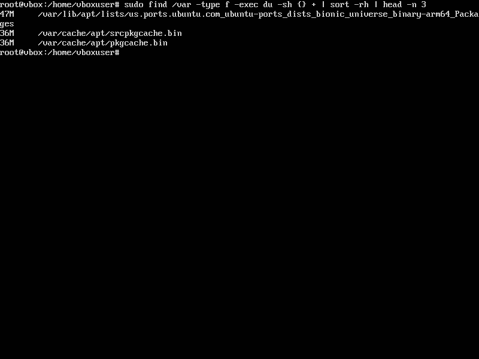
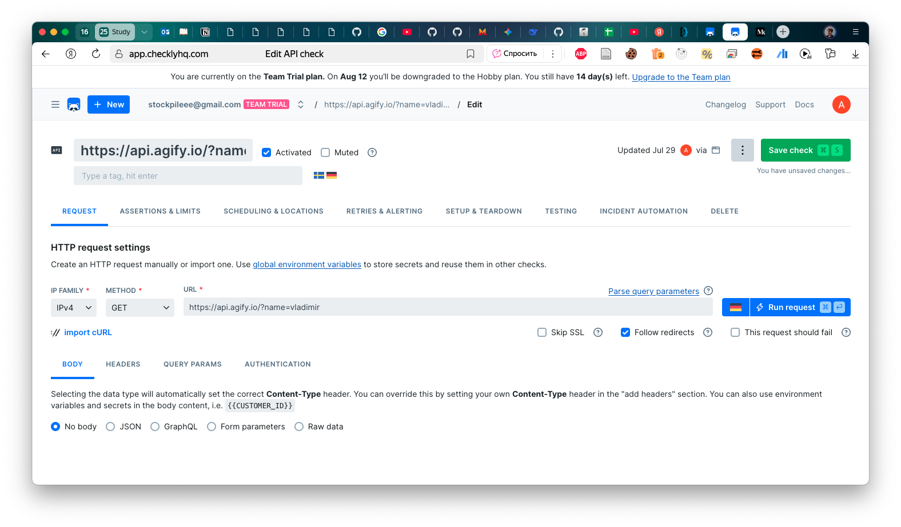
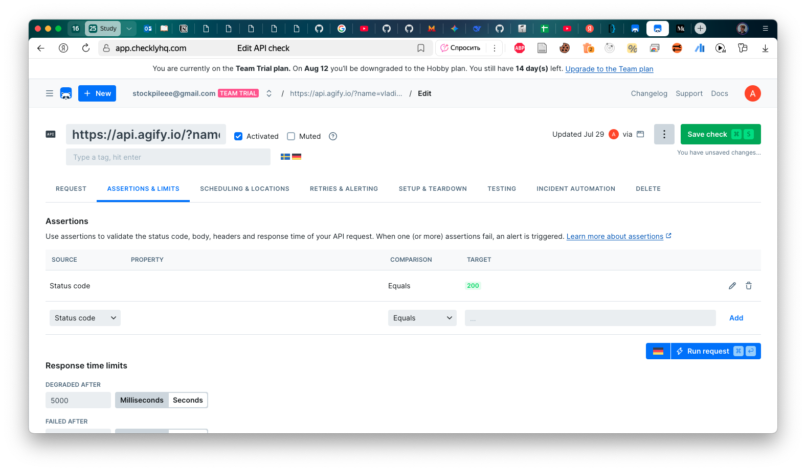
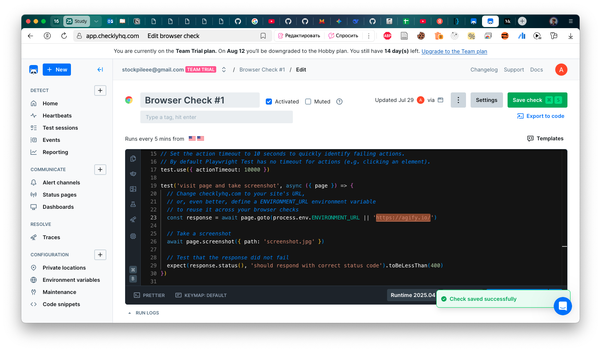
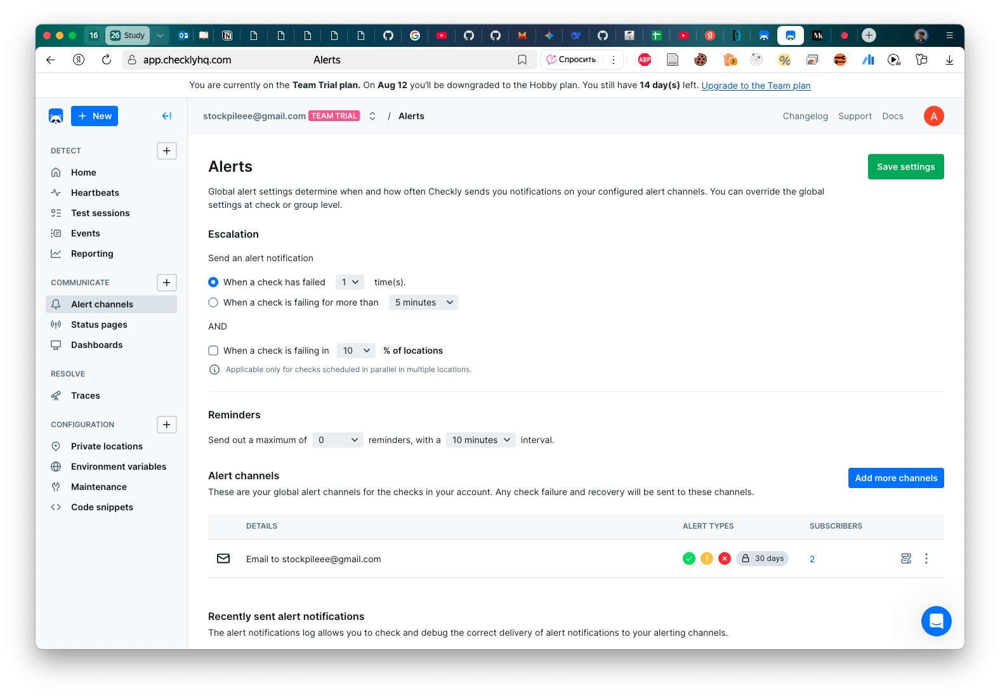
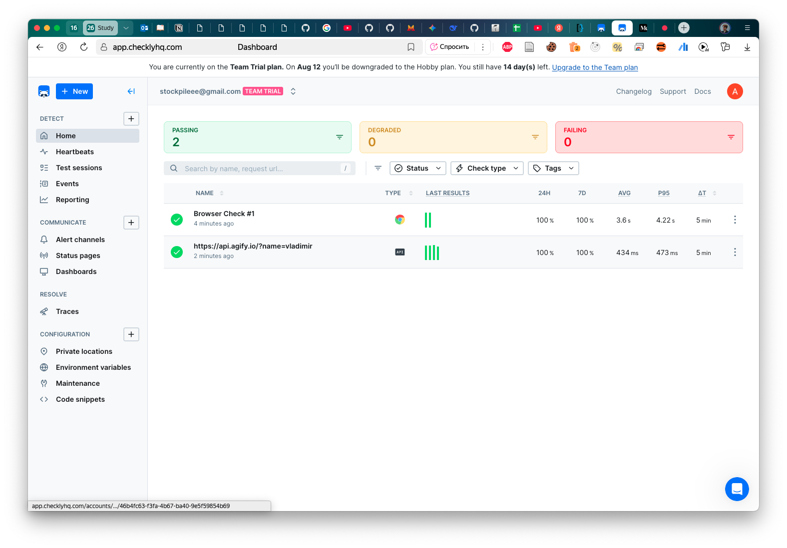

# Lab 08

## Task 1

```bash
htop
```

Top 3 most consuming applications for CPU:
```bash
  PID USER       PRI  NI  VIRT   RES S  CPU%▽MEM%   TIME+  Command
99114 makharev    32  17  395G 88976 R   2.3  0.5  8:24.01 /Applications/VirtualBox.app/Contents/Resources/VirtualBoxVM.app/Contents/MacOS/VirtualBoxVM --comment devops-lab-05 --startvm
41213 makharev     8   0  400G  270M S   0.1  1.6  3:04.47 /Applications/Telegram.app/Contents/MacOS/Telegram
59518 makharev    17   0 1555G  389M S   0.1  2.4  0:10.25 /Applications/Trae.app/Contents/Frameworks/Trae Helper (Renderer).app/Contents/MacOS/Trae Helper (Renderer) --type=renderer --u
```

Top 3 most consuming applications for memory:
```bash
  PID USER       PRI  NI  VIRT   RES S  CPU% MEM%▽  TIME+  Command
59518 makharev    17   0 1555G  357M S   0.3  2.2  0:10.02 /Applications/Trae.app/Contents/Frameworks/Trae Helper (Renderer).app/Contents/MacOS/Trae Helper (Renderer) --type=renderer --u
41213 makharev    17   0  400G  279M S   0.1  1.7  3:04.42 /Applications/Telegram.app/Contents/MacOS/Telegram
75354 makharev    17   0  424G  271M S   0.1  1.7  5:24.26 /Applications/Yandex.app/Contents/MacOS/Yandex --restart
```
- By sorting by CPU usage and memory usage, we can identify the top 3 most consuming applications for CPU and then for memory.

I/O usage:

```bash
(base) ➜  DevOpsFundamentals git:(lab08) ✗ iostat
              disk0               disk5       cpu    load average
    KB/t  tps  MB/s     KB/t  tps  MB/s  us sy id   1m   5m   15m
   20.54  185  3.72   854.39    0  0.00   8  6 86  16.78 11.96 9.14
```

The system monitoring reveals VirtualBoxVM as the primary CPU consumer, while Trae Helper (Renderer) and Telegram lead in memory usage. Disk I/O is primarily active on `disk0` with moderate throughput, while `disk5` shows no activity.

```bash
(base) ➜  DevOpsFundamentals git:(lab08) ✗ df -h
Filesystem        Size    Used   Avail Capacity iused ifree %iused  Mounted on
/dev/disk3s3s1   460Gi    10Gi   210Gi     5%    426k  2.2G    0%   /
devfs            209Ki   209Ki     0Bi   100%     722     0  100%   /dev
/dev/disk3s6     460Gi   8.0Gi   210Gi     4%       8  2.2G    0%   /System/Volumes/VM
/dev/disk3s4     460Gi   6.6Gi   210Gi     4%    1.2k  2.2G    0%   /System/Volumes/Preboot
/dev/disk3s2     460Gi    45Mi   210Gi     1%      56  2.2G    0%   /System/Volumes/Update
/dev/disk1s2     500Mi   6.0Mi   481Mi     2%       1  4.9M    0%   /System/Volumes/xarts
/dev/disk1s1     500Mi   5.4Mi   481Mi     2%      35  4.9M    0%   /System/Volumes/iSCPreboot
/dev/disk1s3     500Mi   2.5Mi   481Mi     1%      53  4.9M    0%   /System/Volumes/Hardware
/dev/disk3s1     460Gi   224Gi   210Gi    52%    2.6M  2.2G    0%   /System/Volumes/Data
map auto_home      0Bi     0Bi     0Bi   100%       0     0     -   /System/Volumes/Data/home
```

My system's primary data partition (`/dev/disk3s1` mounted on `/System/Volumes/Data`) is at **52% capacity**, while other partitions show minimal disk usage.

```bash
sudo find /var -type f -exec du -sh {} + | sort -rh | head -n 3
```



I attached output from VirtualBox Ubuntu since my Mac have no large enough files in `/var`.

## Task 2

I signed up for Checkly and created an account.

Chosen website API: https://api.agify.io/?name=vladimir. Returns age based on the name.




Browser check for https://agify.io/



Alert settings (on-time failure, email as a channel):


Successfull checks:

