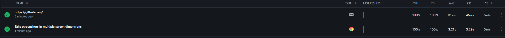
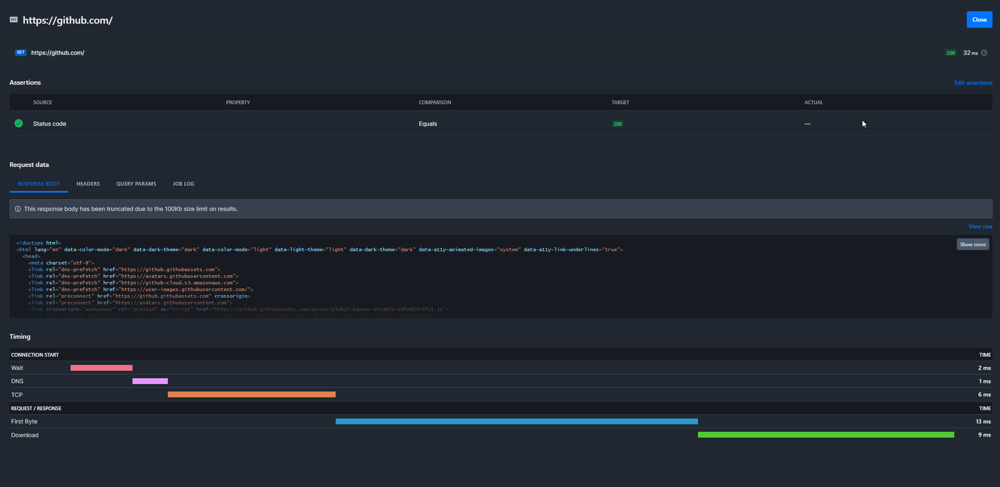
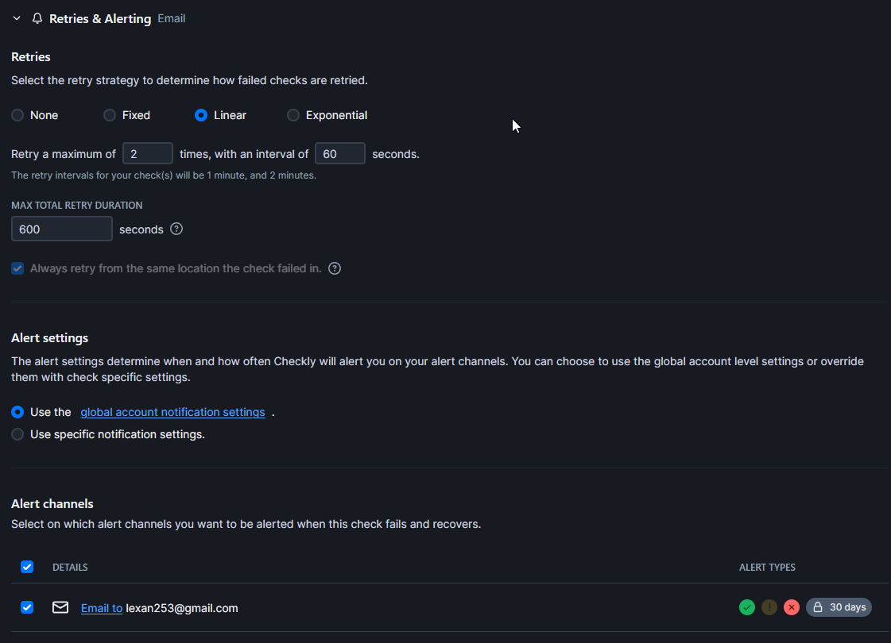

# Lab 8

## Task 1

Был использован инструмент htop, главный потребитель диска был браузер. На скриншоте килобайты в секунду, но были и мегабайты. \

Главным потребителем процессора также был яндекс браузер. \

А вот память, что удивительно, больше всего ел телеграм \

Задача сформулирована не совсем конкретно. В `/var` каталоге у меня нет файлов кроме `.updated`. В задании было сказано только про `/var` без указания рекурсии, поэтому я не рассматривал все файлы во всех подкаталогах. Если говорить про топ 3 директории внутри `/var`, то это соответственно `lib`, `log`, и `cache` \

## Task 2

На Checkly были созданы API и Browser check'и \

Успешный апи чек \

Настройки алерта на почту \

Успешный браузер чек \

Настройка браузер чека, я взял шаблон, который делает скриншоты с разным разрешением \
