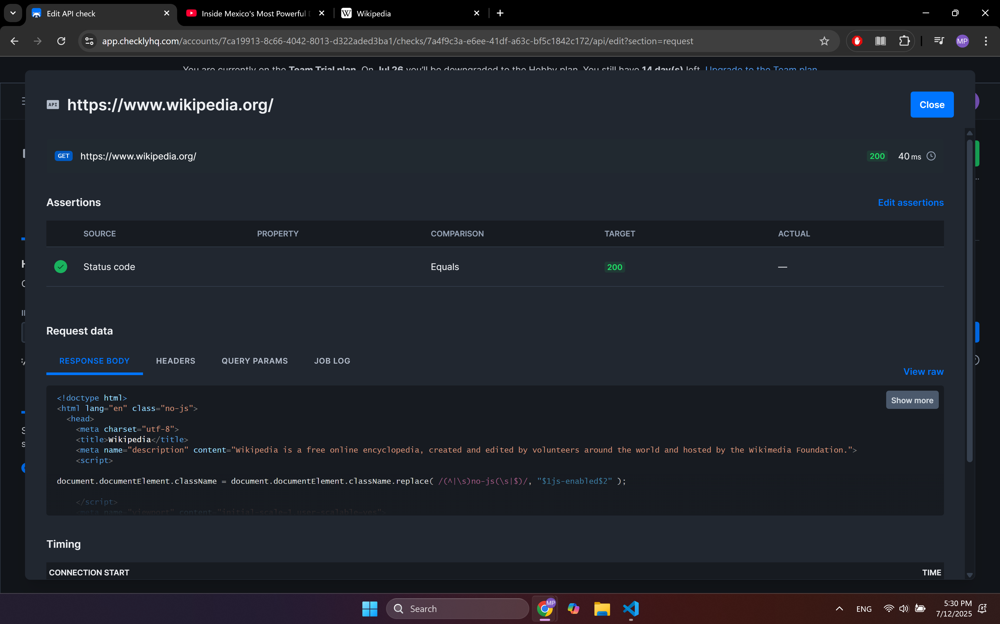
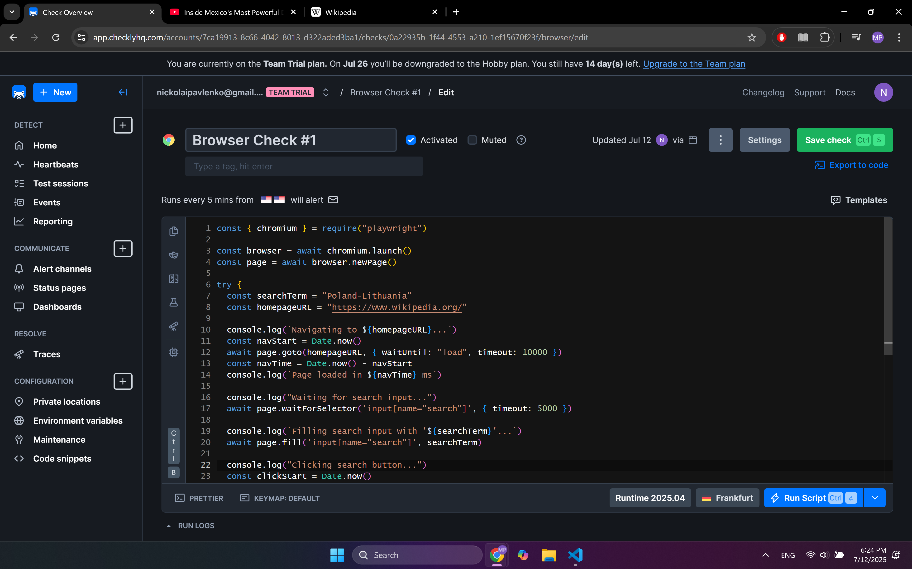
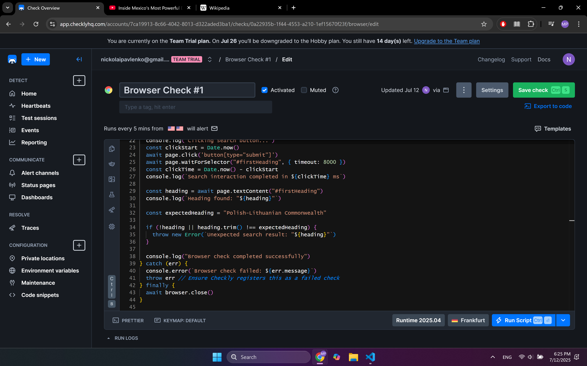
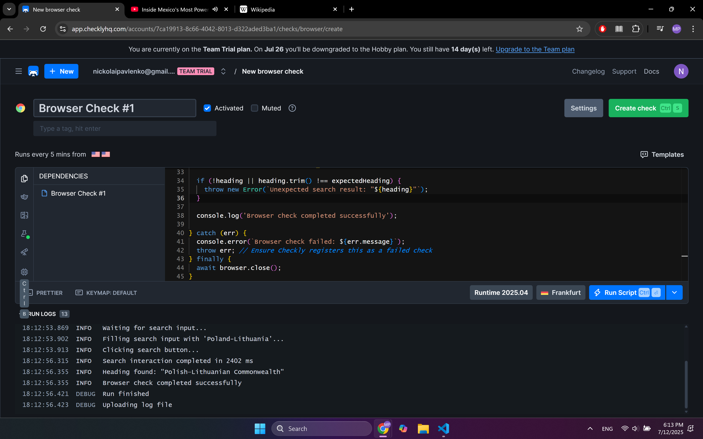
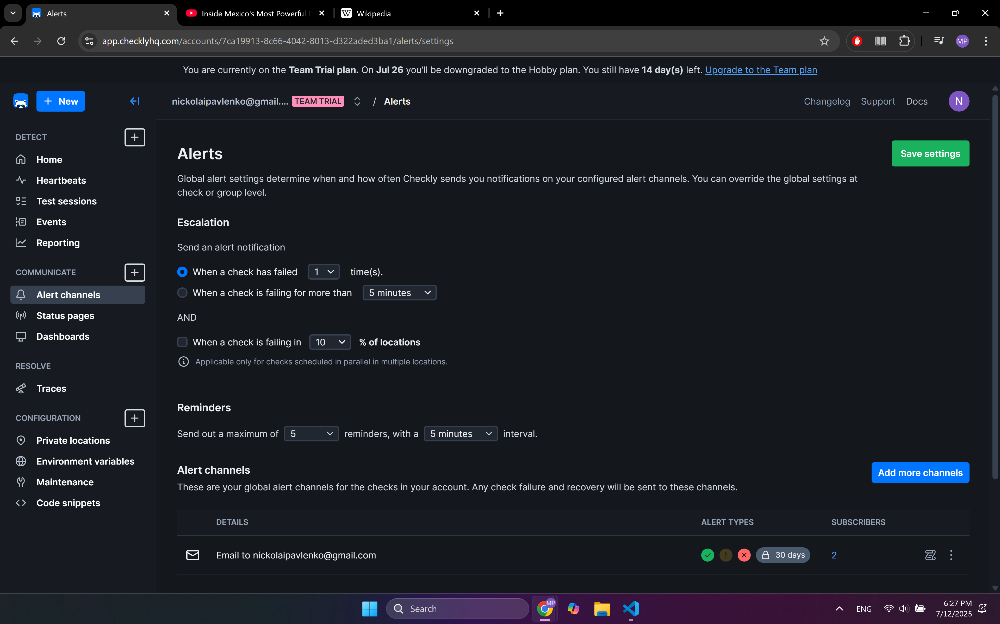

# Lab 8: SRE Lab

## Task 1: Key Metrics for SRE and SLAs

1. **Monitor System Resources**:

Top 3 by CPU:

```sh
ps -eo pid,comm,%cpu --sort=-%cpu | head -n 4
    PID COMMAND         %CPU
    118 snapfuse        13.0
    180 snapd            3.4
      1 systemd          2.7
```

snapfuse and snapd are Snap-related services. This is normal background churn on systems with Snap-based installations.

Top 3 by memory:

```sh
ps -eo pid,comm,%mem --sort=-%mem | head -n 4
    PID COMMAND         %MEM
    354 containerd       0.5
    180 snapd            0.4
    353 unattended-upgr  0.2
```

Extremely light memory usage overall. The system is idle. Containerd showing up means some container service is ready (Docker), but it's not actively used right now.

Top 3 by I/O:
```sh
sudo iotop -o -b -n 3
Total DISK READ:         0.00 B/s | Total DISK WRITE:         0.00 B/s
Current DISK READ:       0.00 B/s | Current DISK WRITE:       0.00 B/s
    TID  PRIO  USER     DISK READ  DISK WRITE  SWAPIN      IO    COMMAND
Total DISK READ:         0.00 B/s | Total DISK WRITE:         0.00 B/s
Current DISK READ:       0.00 B/s | Current DISK WRITE:       0.00 B/s
    TID  PRIO  USER     DISK READ  DISK WRITE  SWAPIN      IO    COMMAND
Total DISK READ:         0.00 B/s | Total DISK WRITE:         0.00 B/s
Current DISK READ:       0.00 B/s | Current DISK WRITE:       0.00 B/s
    TID  PRIO  USER     DISK READ  DISK WRITE  SWAPIN      IO    COMMAND
```

The disk was completely idle during the sampling period.

2. **Disk Space Management**:

```sh
sudo find /var -type f -exec du -h {} + | sort -rh | head -n 3
554M    /var/cuda-repo-wsl-ubuntu-11-8-local/nsight-compute-2022.3.0_2022.3.0.22-1_amd64.deb
271M    /var/cuda-repo-wsl-ubuntu-11-8-local/nsight-systems-2022.4.2_2022.4.2.1-1_amd64.deb
257M    /var/cuda-repo-wsl-ubuntu-11-8-local/libcublas-dev-11-8_11.11.3.6-1_amd64.deb
```

These are CUDA developer tools installed from a local `.deb` repo in `/var/cuda-repo-wsl-*`. This folder is not auto-cleaned by default, and these `.deb` files are just installers, not active components. They can be simply removed without causing any issue.

3. **Documentation**:

The tools `ps`, `iotop`, `du`, and `find` provided a clear snapshot of system health by revealing CPU, memory, I/O activity, and disk usage. Their simplicity and low overhead make them ideal for quick diagnostics and routine monitoring.

## Task 2: Practical Website Monitoring Setup

### Step 1: Choose Your Website

I have chosen the site wikipedia.org.

### Step 2: Create Checks in Checkly

1. **API Check** for basic availability response:

2. **Browser Check** for content & interactions configuration:


3. **Browser Check** for content & interactions response:


### Step 3: Set Up Alerts

Alert settings were configured as follows:
