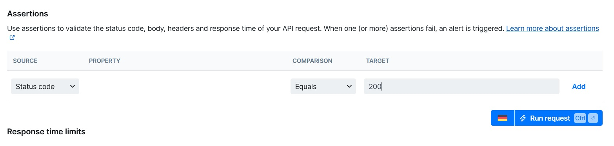
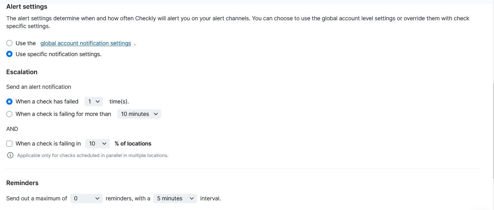
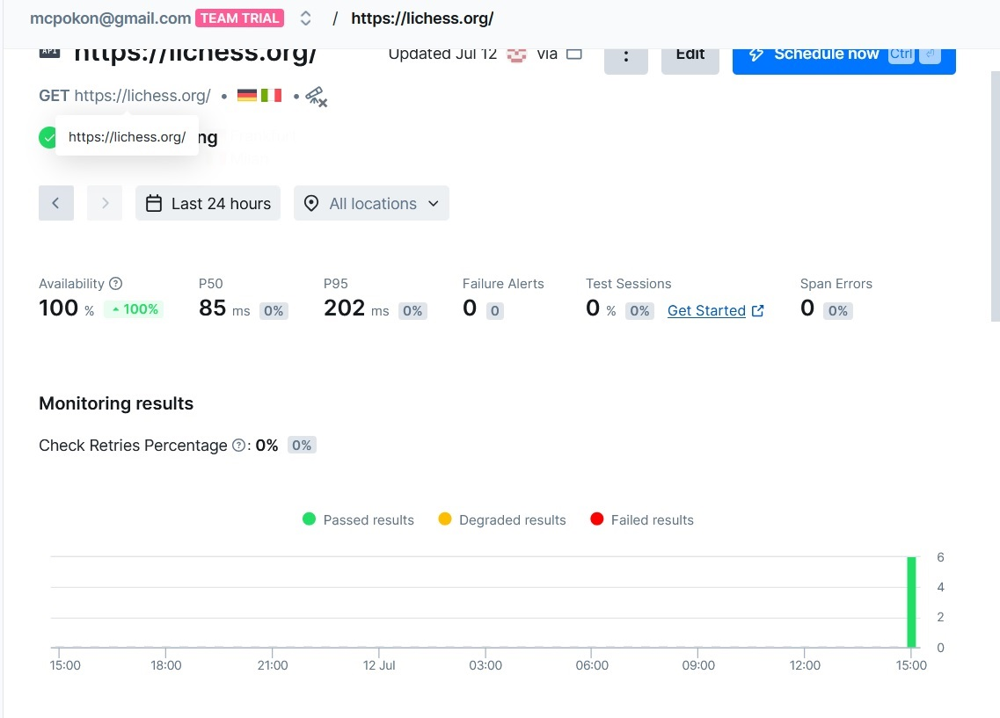
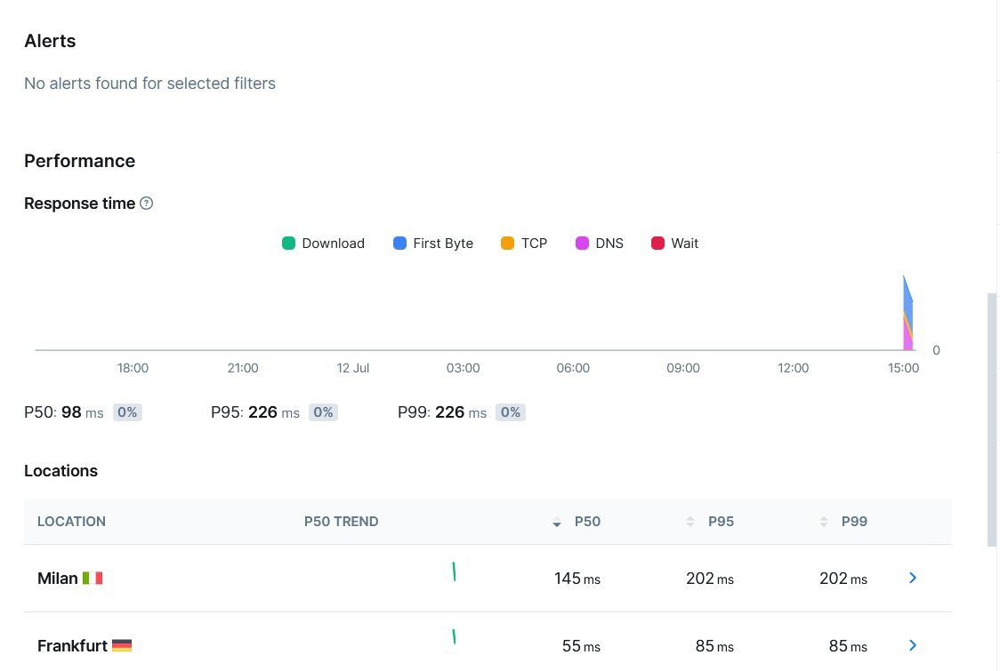
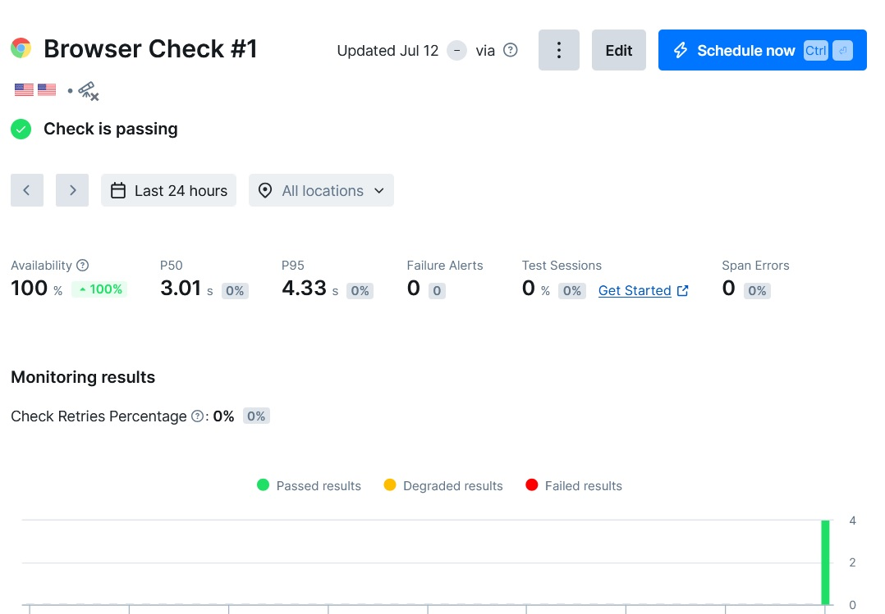
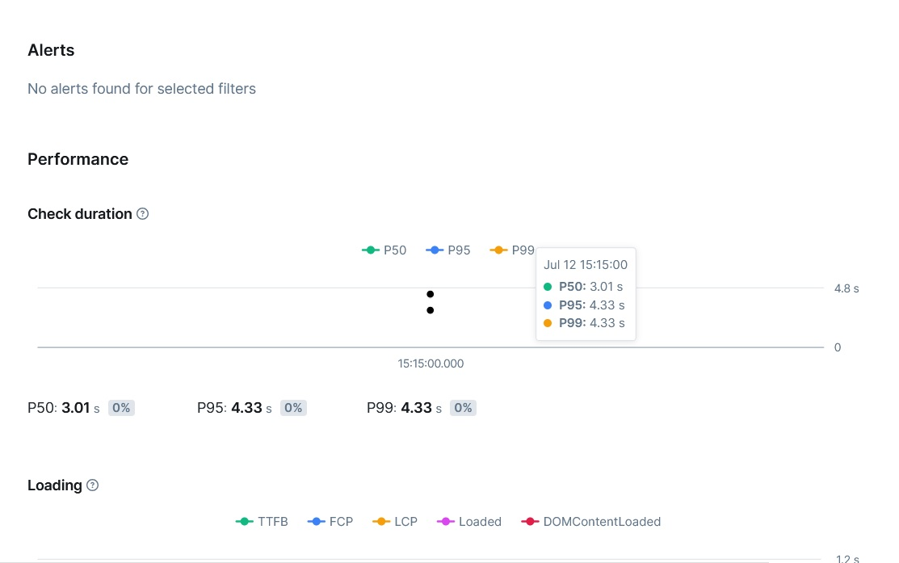
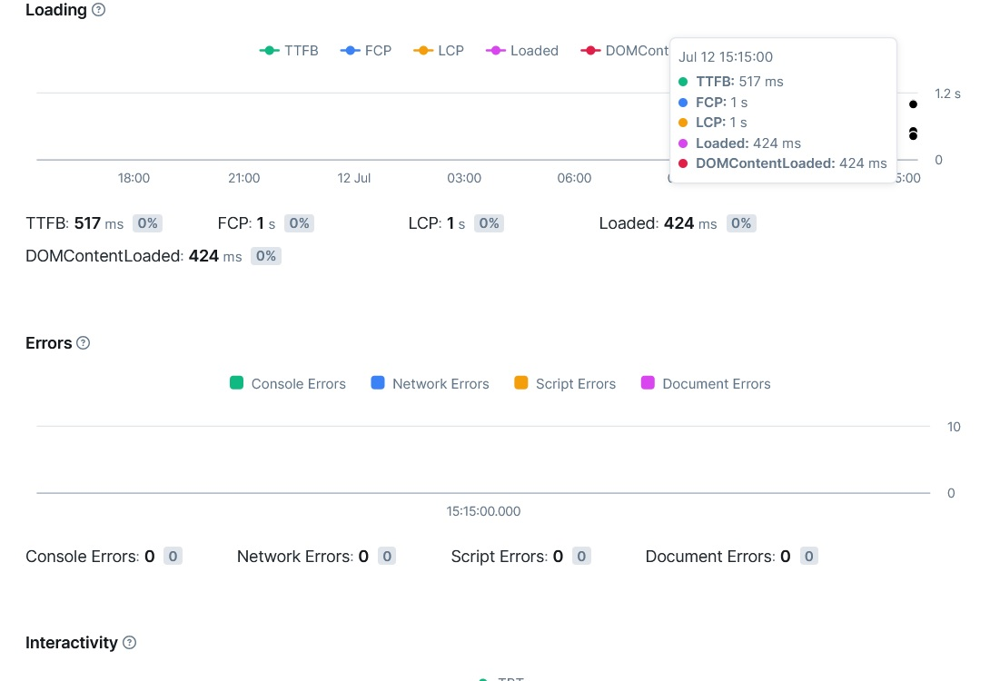
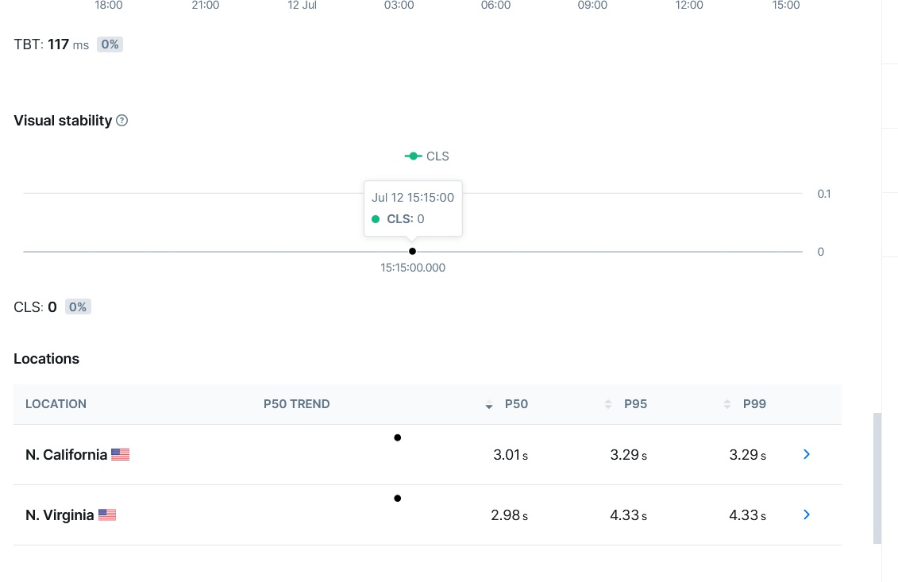
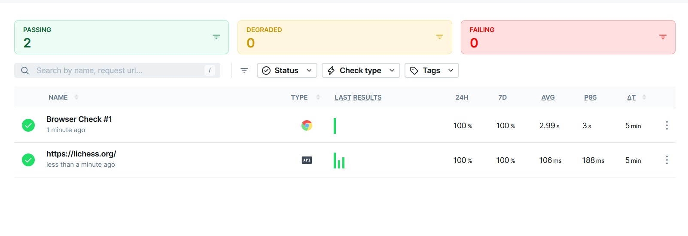

# Lab 8

## Key Metrics for SRE and SLAs

Top 3 CPU consuming processes:

```
java             116
python3         60.2
uvicorn          4.8
```

Top 3 Memory consuming processes:

```
java            66.9
uvicorn         6.4
python3         2.2
```

Avarage CPU load

```
%user: ~5%
%system: ~1%
%iowait: ~0.4–0.5%
%idle: ~93–94%
```

Top 3 IO devices

```
md2 (RAID)
- rkB/s: 47,566.75
- w/s: 185.37
- w_await: 0.88
- %util: 11.63

nvme1n1
- rkB/s: 27,512
- wkB/s: 13,239
- %util: 7.70

nvme0n1
- rkB/s: 24,012
- wkB/s: 13,239
- %util: 4.00
```

```
sudo du -ah /var | sort -rh | head -n 3
```

```
904G    /var
899G    /var/lib
893G    /var/lib/elasticsearch/indices
```

## Practical Website Monitoring Setup

logged in `https://app.checklyhq.com`

i choose `https://lichess.org/` for check










Browser Check Config

```
/**
  * To learn more about Playwright Test visit:
  * https://checklyhq.com/docs/browser-checks/playwright-test/
  * https://playwright.dev/docs/writing-tests
  */

const { expect, test } = require('@playwright/test')

// Configure the Playwright Test timeout to 210 seconds,
// ensuring that longer tests conclude before Checkly's browser check timeout of 240 seconds.
// The default Playwright Test timeout is set at 30 seconds.
// For additional information on timeouts, visit: https://checklyhq.com/docs/browser-checks/timeouts/
test.setTimeout(210000)

// Set the action timeout to 10 seconds to quickly identify failing actions.
// By default Playwright Test has no timeout for actions (e.g. clicking an element).
test.use({ actionTimeout: 10000 })

test('visit page and take screenshot', async ({ page }) => {
  // Change checklyhq.com to your site's URL,
  // or, even better, define a ENVIRONMENT_URL environment variable
  // to reuse it across your browser checks
  const response = await page.goto(process.env.ENVIRONMENT_URL || 'https://lichess.org/')

  // Take a screenshot
  await page.screenshot({ path: 'screenshot.jpg' })

  // Test that the response did not fail
  expect(response.status(), 'should respond with correct status code').toBeLessThan(400)
})
```












