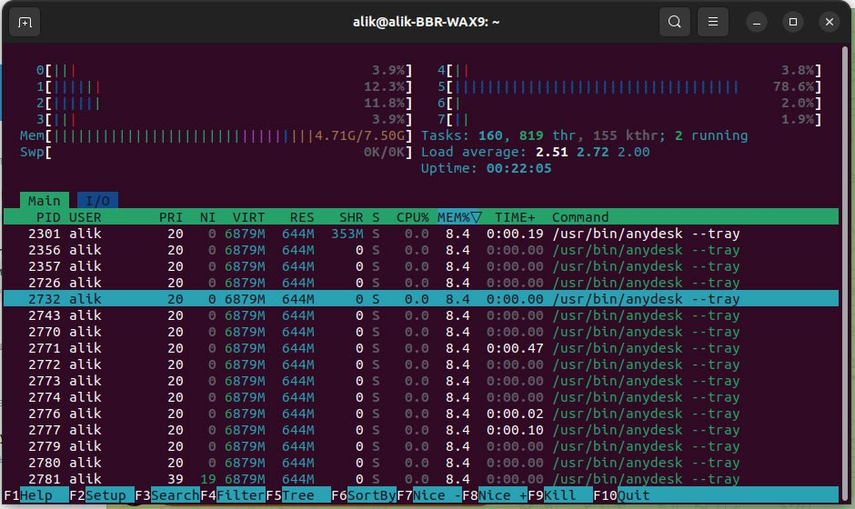
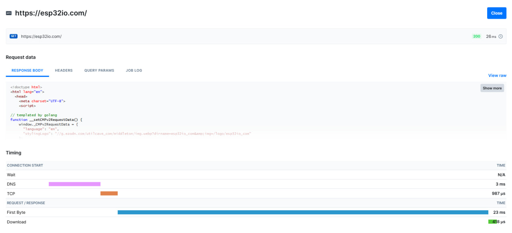
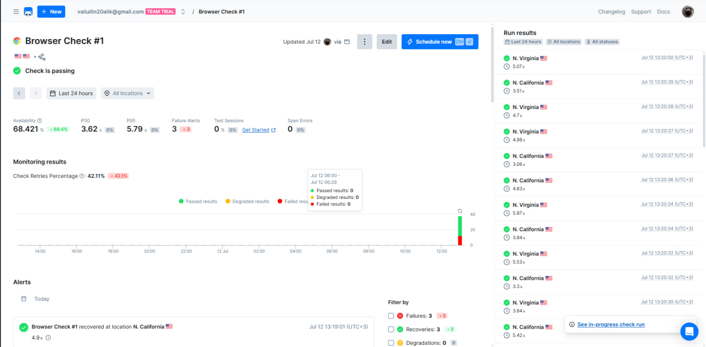
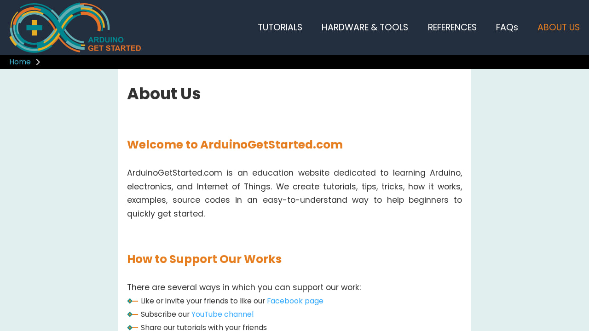
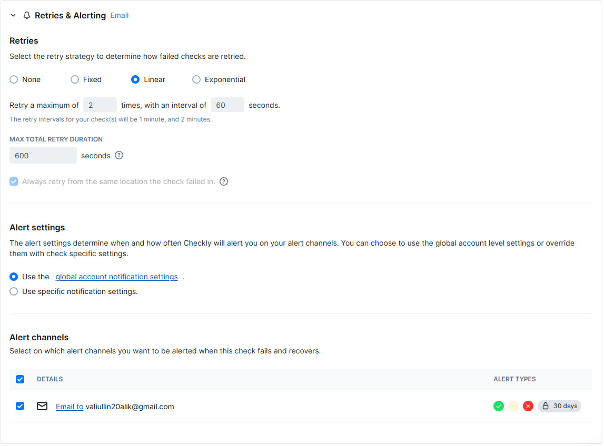
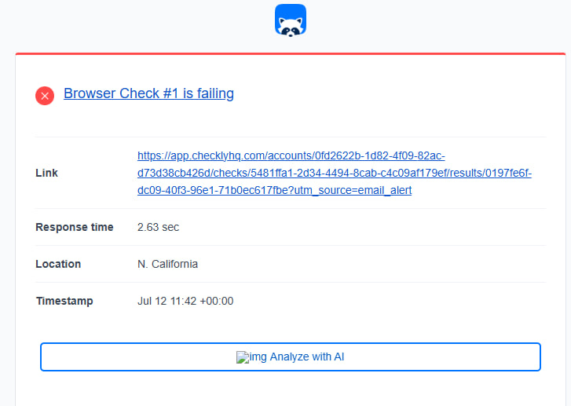
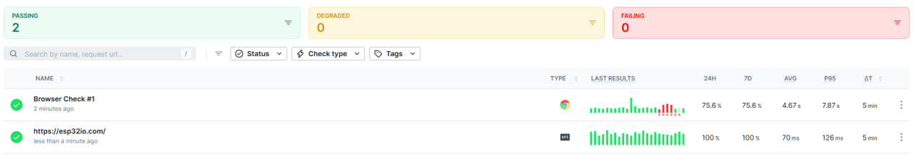

## Task 1: Key Metrics for SRE and SLAs

1. **Monitor System Resources**:

    - Monitor CPU, memory:

        ```bash
        htop
        ```

        Output

        

        


        The screenshot shows that the most CPU-consuming processes are: `tracker-miner-fs-3`, `ynadex browser`, `gnome-shell`

        And the most memory-consuming process is: `anydesk`

    - Monitor I/O usage:
    
        ```bash
        iostat
        ```

        Output

        ```bash
        Linux 6.8.0-60-generic (alik-BBR-WAX9) 	11.07.2025 	_x86_64_	(8 CPU)

        avg-cpu:  %user   %nice %system %iowait  %steal   %idle
                3,30   14,14    1,23    0,39    0,00   80,94

        Device             tps    kB_read/s    kB_wrtn/s    kB_dscd/s    kB_read    kB_wrtn    kB_dscd
        loop0             0,09         1,78         0,00         0,00       3200          0          0
        loop1             0,01         0,01         0,00         0,00         17          0          0
        loop10            1,55        19,87         0,00         0,00      35625          0          0
        loop11            1,91         7,77         0,00         0,00      13933          0          0
        loop12            0,02         0,19         0,00         0,00        349          0          0
        loop13            0,12         1,88         0,00         0,00       3364          0          0
        loop14            0,04         0,22         0,00         0,00        387          0          0
        loop15            0,41        15,38         0,00         0,00      27567          0          0
        loop16            0,01         0,03         0,00         0,00         58          0          0
        loop17            0,02         0,19         0,00         0,00        332          0          0
        loop18            0,03         0,61         0,00         0,00       1085          0          0
        loop19            2,66        84,63         0,00         0,00     151710          0          0
        loop2             0,35         5,17         0,00         0,00       9275          0          0
        loop20            0,02         0,08         0,00         0,00        143          0          0
        loop21            0,48        17,32         0,00         0,00      31042          0          0
        loop22            0,01         0,01         0,00         0,00         14          0          0
        loop3             0,30         5,09         0,00         0,00       9132          0          0
        loop4             0,03         0,60         0,00         0,00       1067          0          0
        loop5             0,03         0,60         0,00         0,00       1084          0          0
        loop6             0,62        21,10         0,00         0,00      37821          0          0
        loop7             0,03         0,60         0,00         0,00       1077          0          0
        loop8             0,04         0,63         0,00         0,00       1123          0          0
        loop9             0,03         0,60         0,00         0,00       1074          0          0
        nvme0n1         118,74      2217,37      1184,06         0,00    3975145    2122697          0
        ```

        `nvme0n1` has the highest load among real devices. The most active virtual disks were `loop19`, `loop10`, and `loop6`, but they do not create I/O delays.

2. **Disk Space Management**:

    The `df` command displays information about the usage of the entire volume or file system. It shows how much total space is available, how much is used, and how much is free in mounted file systems.

    ```bash
    df -h
    ```

    Output

    ```bash
    Filesystem      Size  Used Avail Use% Mounted on
    tmpfs           769M  2,3M  766M   1% /run
    /dev/nvme0n1p5  274G   47G  214G  18% /
    tmpfs           3,8G   76M  3,7G   2% /dev/shm
    tmpfs           5,0M  4,0K  5,0M   1% /run/lock
    efivarfs        184K  179K   192 100% /sys/firmware/efi/efivars
    /dev/nvme0n1p2  100M   56M   44M  56% /boot/efi
    tmpfs           769M  284K  768M   1% /run/user/1000
    ```

    This information allows you to judge how much free space is left in the file system.

    The `du` command determines how much disk space a certain directory or file occupies. It performs a recursive traversal of the specified directory and summarizes the sizes of all files and subdirectories.

    ```bash
    sudo du -sh /var/*
    ```

    Output

    ```bash 
    4,2M	/var/backups
    193M	/var/cache
    4,0K	/var/crash
    6,6G	/var/lib
    4,0K	/var/local
    0	    /var/lock
    394M	/var/log
    4,0K	/var/mail
    4,0K	/var/metrics
    4,0K	/var/opt
    0	    /var/run
    963M	/var/snap
    56K	    /var/spool
    100K	/var/tmp
    ```

    The largest catalogs in `/var`: `lib`, `snap`, `log`


## Task 2: Practical Website Monitoring Setup

- After registering on the site, an **API Check** task was created for the site https://esp32io.com/

    

    

    The verification history shows that the site was accessible for 12 hours.

    

- Next, the **Browser Check** task was created

    

    Executable code

    ```js
    /**
    * To learn more about Playwright Test visit:
    * https://checklyhq.com/docs/browser-checks/playwright-test/
    * https://playwright.dev/docs/writing-tests
    */

    const { expect, test } = require('@playwright/test')

    // Configure the Playwright Test timeout to 210 seconds,
    // ensuring that longer tests conclude before Checkly's browser check timeout of 240 seconds.
    // The default Playwright Test timeout is set at 30 seconds.
    // For additional information on timeouts, visit: https://checklyhq.com/docs/browser-checks/timeouts/
    test.setTimeout(210000)

    // Set the action timeout to 10 seconds to quickly identify failing actions.
    // By default Playwright Test has no timeout for actions (e.g. clicking an element).
    test.use({ actionTimeout: 10000 })

    test('visit page and take screenshot', async ({ page }) => {
    // Change checklyhq.com to your site's URL,
    // or, even better, define a ENVIRONMENT_URL environment variable
    // to reuse it across your browser checks
    const response = await page.goto(process.env.ENVIRONMENT_URL || 'https://esp32io.com/')

    await expect(page.locator('text=ABOUT US')).toBeVisible();

    await page.click('text=ABOUT US');

    // Take a screenshot
    await page.screenshot({ path: 'screenshot.jpg' })

    // Test that the response did not fail
    expect(response.status(), 'should respond with correct status code').toBeLessThan(400)
    })
    ```

    When performing the test, the `ABOUT US` link is clicked on the website, then a screenshot is taken.

    Screenshot

    

    To track failed tests, you can create notifications. Notifications about failed tests were set up to be sent by email.

    

    Example of a failed test message

    

    As a result, 2 checks were created for the site: **API Check** and **Browser Check**

    