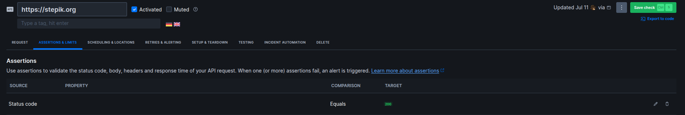
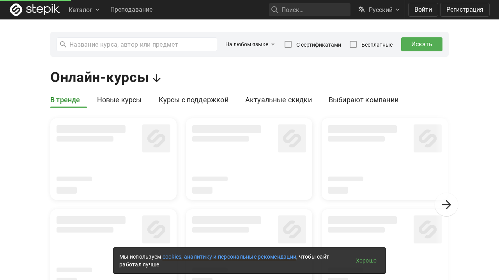
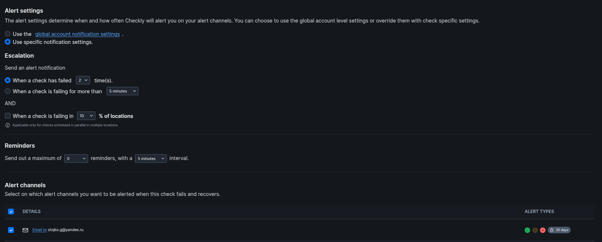

# SRE Lab

## Task 1: Key Metrics for SRE and SLAs

**Objective**: Monitor system resources and manage disk space.

1. **Monitor System Resources**:

   **Command:**
    ```bash
    htop
    ```

    **Top 3 CPU-consuming processes:**
    ```bash
    CPU%     Command
    22.8     /usr/bin/gnome-shell
    12.0     /usr/lib/xorg/...
    9.5      /opt/yandex/browser/yandex_browser
    ```

    **Top 3 Memory-consuming processes:**
    ```bash
    MEM%     Command
    2.5      /opt/yandex/browser/yandex_browser
    1.9      /proc/self/exe ...
    1.7      /snap/code/...
    ```

    **Command:**
    ```bash
    iostat
    ```

    **Top 3 I/O-consuming devices or processes:**
    ```bash
    Linux 6.8.0-60-generic (gleb) 	11.07.2025 	_x86_64_	(8 CPU)

    avg-cpu:  %user   %nice %system %iowait  %steal   %idle
            2,01    0,04    1,76    0,06    0,00   96,14

    Device             tps    kB_read/s    kB_wrtn/s    kB_dscd/s    kB_read    kB_wrtn    kB_dscd
    loop0             0,00         0,00         0,00         0,00         17          0          0
    loop1             0,01         0,10         0,00         0,00       1075          0          0
    loop10            0,35         6,49         0,00         0,00      68698          0          0
    ```


2. **Disk Space Management**:

   **Command:**
    ```bash
    sudo du -ah /var | sort -rh | head -n 3
    ```

    **Top 3 largest files in /var:**
    ```bash
    12G	    /var
    10G	    /var/lib
    4,9G	/var/lib/snapd
    ```

    **Command:**
    ```bash
    df
    ```

    **Disk Space Report:**
    ```bash
    Filesystem     1K-blocks     Used Available Use% Mounted on
    tmpfs            2402044     2244   2399800   1% /run
    /dev/sda4      239225476 92223304 134777404  41% /
    tmpfs           12010200   150480  11859720   2% /dev/shm
    tmpfs               5120        4      5116   1% /run/lock
    efivarfs             128       21       103  17% /sys/firmware/efi/efivars
    /dev/nvme0n1p1     98304    33246     65058  34% /boot/efi
    tmpfs            2402040      144   2401896   1% /run/user/1000
    ```


## Task 2: Practical Website Monitoring Setup

**Objective**: Set up real-time monitoring for any website using Checkly. You'll create checks for:

   1. Basic availability (is the site loading?)
   2. Content validation (is a key element visible?)
   3. Interaction performance (how long does a button click take?)
   4. Alerting (get notified when something breaks)

### Step 1: Choose Your Website

**Chosen website:** `https://stepik.org`  

### Step 2: Create Checks in Checkly

1. Created **API Check** for basic availability:
   - URL: `https://stepik.org`
   - Assertion: Status code is 200
   - Screenshot:
   

2. Created **Browser Check** for content & interactions:
    - URL: `https://stepik.org`

    **Code of script:**
    ```js
    const { test, expect } = require("@playwright/test");

    test("Stepik homepage contains login button", async ({ page }) => {
    // 1. Open a website
    await page.goto("https://stepik.org");

    // 2. Check that the "Log in" button is visible
    const loginLink = page.getByRole("link", { name: "Войти" });
    await expect(loginLink).toBeVisible();

    // 3. Take screenshot
    await page.screenshot({ path: "stepik-home.png" });
    });
    ```

    **Output:**
    ```bash
    Starting job
    Creating runtime version 2025.04 using Node.js 22
    Running Playwright test script
    Running 1 test using 1 worker
    [1/1] [chromium] › test.spec.js › Stepik homepage contains login button
    1 passed (4.3s)
    Run finished
    Uploading log file
    ```

    **Screenshot:**
    


### Step 3: Set Up Alerts

**Alerting Setup for Stepik API Check**

- **Retry Strategy**: Linear backoff with 2 retries at 30-second intervals (total max: 5 minutes)
- **Retry Location**: Always retry from the same region
- **Trigger Condition**: Alert if a check fails and retry attempts are exhausted
- **Alert Method**: Email notification to `stojko.g@yandex.ru`
- **Screenshot:**

