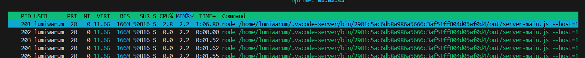
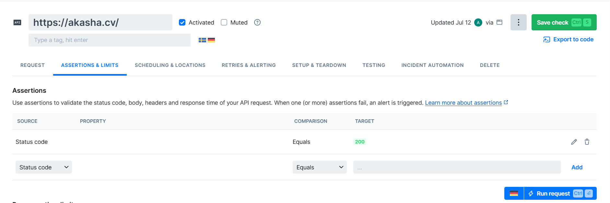
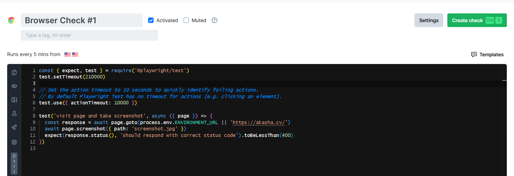
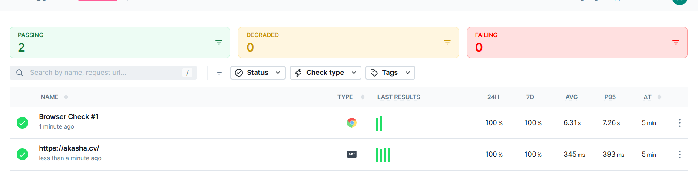

# Credentials

The work is done by M24-RO student  
Anton Kirilin  
a.kirilin@innopolis.university 

# Task 1

Here are the screenshot from htop for top 3 cpu and memory processes




```sh
:~/Sum25-intro-labs$ iostat -x 1 3
Linux 6.6.87.2-microsoft-standard-WSL2 (akirilinacer)   07/12/25        _x86_64_        (12 CPU)

avg-cpu:  %user   %nice %system %iowait  %steal   %idle
           0.43    0.00    0.62    0.14    0.00   98.81

Device            r/s     rkB/s   rrqm/s  %rrqm r_await rareq-sz     w/s     wkB/s   wrqm/s  %wrqm w_await wareq-sz     d/s     dkB/s   drqm/s  %drqm d_await dareq-sz     f/s f_await  aqu-sz  %util
sda              0.27     16.51     0.10  26.48    1.10    62.27    0.00      0.00     0.00   0.00    0.00     0.00    0.00      0.00     0.00   0.00    0.00     0.00    0.00    0.00    0.00   0.02
sdb              0.04      2.62     0.02  27.24    1.56    62.89    0.00      0.00     0.00   0.00    0.00     0.00    0.00      0.00     0.00   0.00    0.00     0.00    0.00    0.00    0.00   0.01
sdc              0.02      0.50     0.00   0.00    0.11    22.73    0.00      0.00     0.00   0.00    3.50     2.00    0.00      0.00     0.00   0.00    0.00     0.00    0.00    5.00    0.00   0.00
sdd             11.60    326.92     3.45  22.94    0.83    28.18    3.72    267.31    10.73  74.26   11.03    71.87    0.78    946.70     0.05   5.57    0.37  1206.60    1.28    1.46    0.05   1.20


avg-cpu:  %user   %nice %system %iowait  %steal   %idle
           0.17    0.00    0.17    0.17    0.00   99.50

Device            r/s     rkB/s   rrqm/s  %rrqm r_await rareq-sz     w/s     wkB/s   wrqm/s  %wrqm w_await wareq-sz     d/s     dkB/s   drqm/s  %drqm d_await dareq-sz     f/s f_await  aqu-sz  %util
sda              0.00      0.00     0.00   0.00    0.00     0.00    0.00      0.00     0.00   0.00    0.00     0.00    0.00      0.00     0.00   0.00    0.00     0.00    0.00    0.00    0.00   0.00
sdb              0.00      0.00     0.00   0.00    0.00     0.00    0.00      0.00     0.00   0.00    0.00     0.00    0.00      0.00     0.00   0.00    0.00     0.00    0.00    0.00    0.00   0.00
sdc              0.00      0.00     0.00   0.00    0.00     0.00    0.00      0.00     0.00   0.00    0.00     0.00    0.00      0.00     0.00   0.00    0.00     0.00    0.00    0.00    0.00   0.00
sdd              0.00      0.00     0.00   0.00    0.00     0.00    2.00     12.00     1.00  33.33    4.50     6.00    0.00      0.00     0.00   0.00    0.00     0.00    2.00    1.50    0.01   1.20


avg-cpu:  %user   %nice %system %iowait  %steal   %idle
           0.58    0.00    1.00    0.00    0.00   98.42

Device            r/s     rkB/s   rrqm/s  %rrqm r_await rareq-sz     w/s     wkB/s   wrqm/s  %wrqm w_await wareq-sz     d/s     dkB/s   drqm/s  %drqm d_await dareq-sz     f/s f_await  aqu-sz  %util
sda              0.00      0.00     0.00   0.00    0.00     0.00    0.00      0.00     0.00   0.00    0.00     0.00    0.00      0.00     0.00   0.00    0.00     0.00    0.00    0.00    0.00   0.00
sdb              0.00      0.00     0.00   0.00    0.00     0.00    0.00      0.00     0.00   0.00    0.00     0.00    0.00      0.00     0.00   0.00    0.00     0.00    0.00    0.00    0.00   0.00
sdc              0.00      0.00     0.00   0.00    0.00     0.00    0.00      0.00     0.00   0.00    0.00     0.00    0.00      0.00     0.00   0.00    0.00     0.00    0.00    0.00    0.00   0.00
sdd              0.00      0.00     0.00   0.00    0.00     0.00   16.00     68.00     1.00   5.88    7.00     4.25    0.00      0.00     0.00   0.00    0.00     0.00    0.00    0.00    0.11   0.40
```

another variant which is also not really working. I wonder why? is it WSL or some other access problem.

```sh
:~/Sum25-intro-labs$ sudo iotop -b -n 1 | head -n 5
Total DISK READ:         0.00 B/s | Total DISK WRITE:         0.00 B/s
Current DISK READ:       0.00 B/s | Current DISK WRITE:       0.00 B/s
    TID  PRIO  USER     DISK READ  DISK WRITE  SWAPIN      IO    COMMAND
      1 be/4 root        0.00 B/s    0.00 B/s  ?unavailable?  init
      2 be/4 root        0.00 B/s    0.00 B/s  ?unavailable?  init
```  

It even returned only 2 processes instead of 5 which is strange but alright.  


Now we are working with the disk space  

```sh
:~/Sum25-intro-labs$ df -h /
Filesystem      Size  Used Avail Use% Mounted on
/dev/sdd       1007G  137G  819G  15% /
```  

top3 in var directory  (command found with the help of qwen)

```sh
:~/Sum25-intro-labs$ sudo du -ah /var/* 2>/dev/null | sort -rh | head -n 3
1.5G    /var/lib
1.3G    /var/lib/snapd
814M    /var/log
```  

# Task 2

## Step 1: choose website

So I pick

```
https://akasha.cv
```

Let's start with the api check  





Now let's configure that when my very important cite with genshin impact is not working I'll get a notification on my students' email. Done


Genshin artifacts system is still running, life is good I guess. Should have taken the moodle instead If I wanted regular notifications.  

