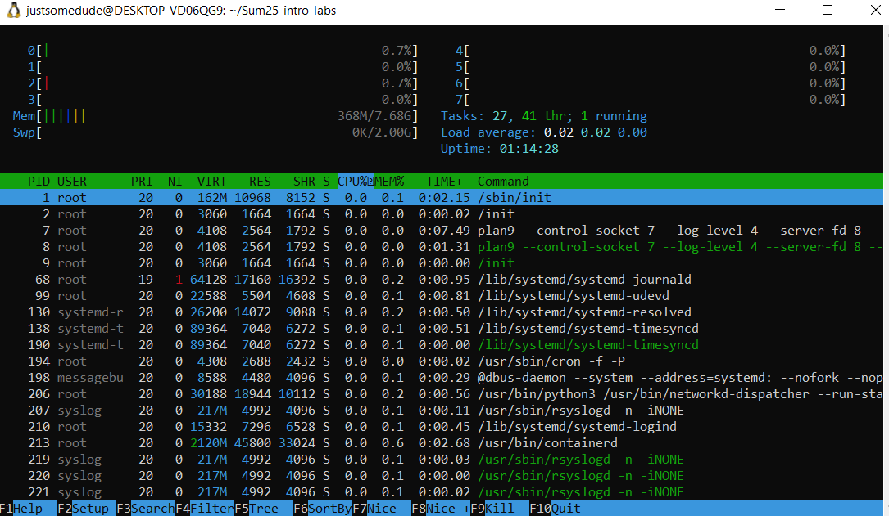
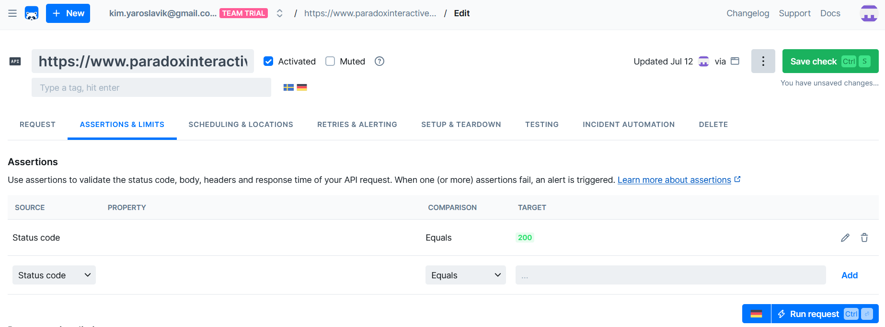
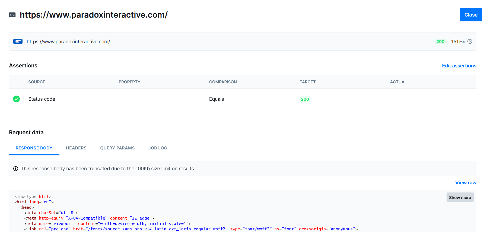
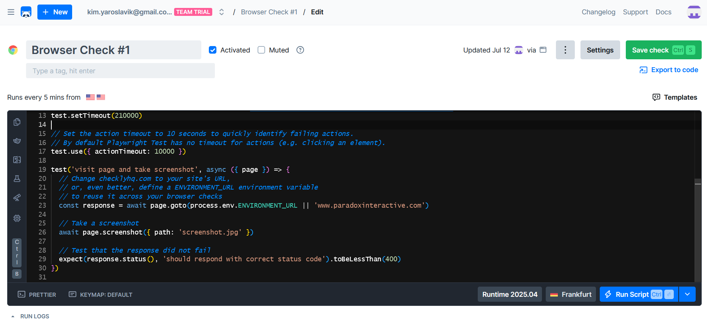
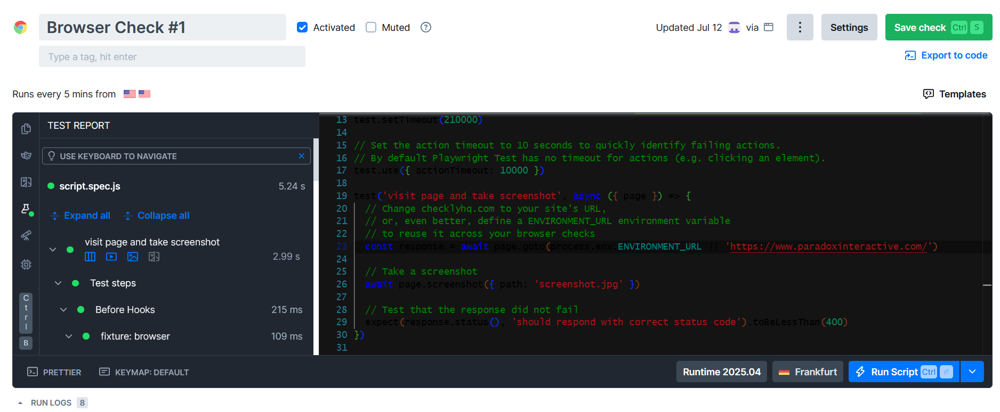
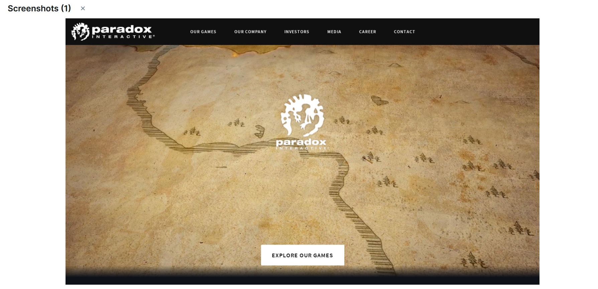
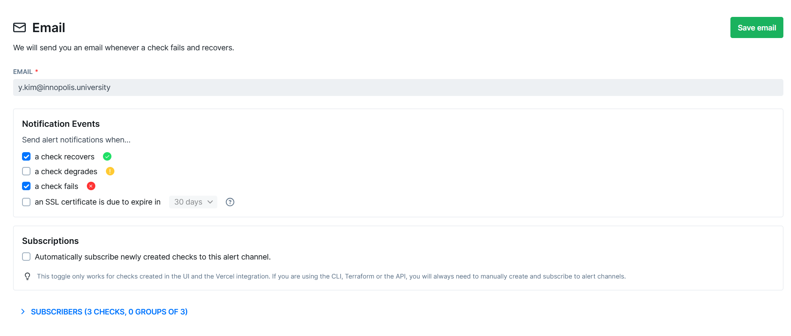
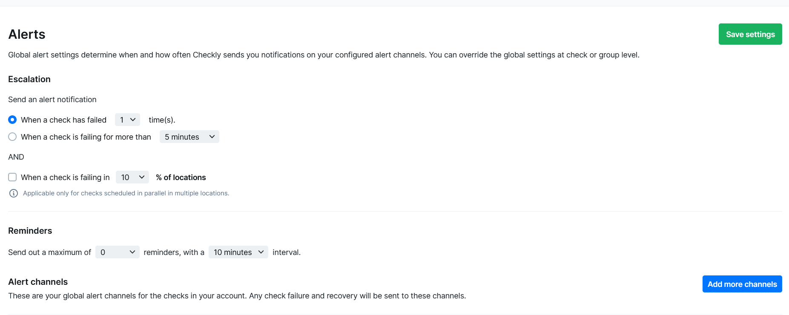
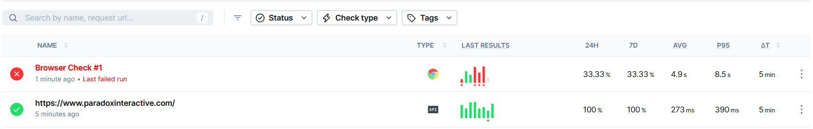
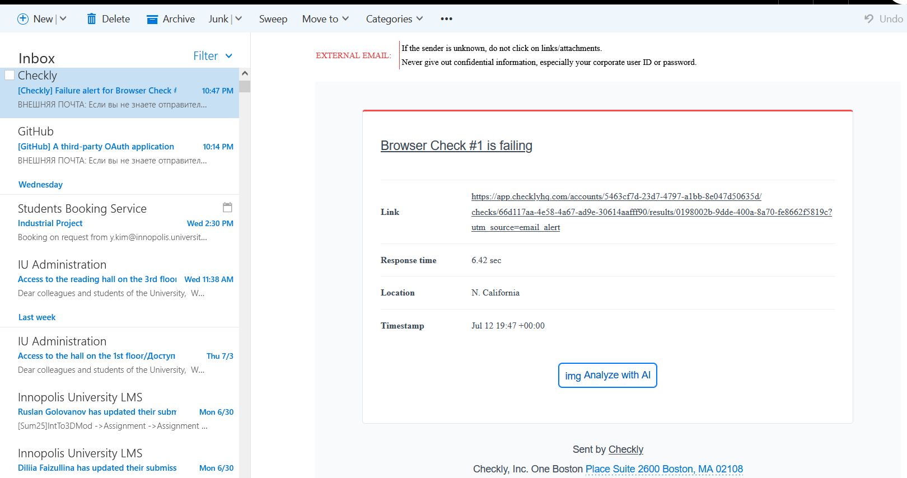

# SRE Lab

## Task 1: Key Metrics for SRE and SLAs

**Objective**: Monitor system resources and manage disk space.

1. **Monitor System Resources**:
   - Use commands like `htop` and `iostat` to monitor CPU, memory, and I/O usage.
   - Identify and document the top 3 most consuming applications for CPU, memory, and I/O usage in a `submission8.md` file.

htop interface sorted by CPU usage:

The top 3 here are `init` and `sbin/init` which are just processes that manage startup, as well as `plan9` which is responsible for file sharing between WSL and host windows system

htop interface sorted by memory usage:

Top processes here are most likely just docker daemons that appear when docker is installed on WSL2.

`iostat` shows information by device, not by application. Installed `iotop`.
iotop interface:

here at the top are `init`, `plan9`, and `systemd-journald`
First two I explained above, the third is a system journaling subroutine.

As can be seen, I do not have many processes using resources of my WSL due to it being a very stripped-down virtual machine.

2. **Disk Space Management**:
   - Use `du` and `df` to manage disk space.
   - Identify and log the top 3 largest files in the `/var` directory in the `submission8.md` file.

`du` shows directories too without filetering for files, and `df` is a mountable device management tool. They did not fit the task.

Instead I used `find` to find top 3 biggest files in `/var`.
Input:
```
# Get all files bigger than 50 megabytes
justsomedude@DESKTOP-VD06QG9:~/Sum25-intro-labs$ sudo find /var -size +50M -ls
```
Output:
```
33558011  58512 -rw-r--r--   1 root     root     59910310 Jul 12 21:52 /var/cache/apt/srcpkgcache.bin
 33555846  58528 -rw-r--r--   1 root     root     59932527 Jul 12 21:55 /var/cache/apt/pkgcache.bin
 33557507  62828 -rw-r--r--   1 root     root     64332414 Apr 21  2022 /var/lib/apt/lists/archive.ubuntu.com_ubuntu_dists_jammy_universe_binary-amd64_Packages
```
similar results could have been achieved by getting all files bigger than 1 byte and taking `head` after piping it through `sort`

## Task 2: Practical Website Monitoring Setup

**Objective**: Set up real-time monitoring for any website using Checkly. You'll create checks for:

   1. Basic availability (is the site loading?)
   2. Content validation (is a key element visible?)
   3. Interaction performance (how long does a button click take?)
   4. Alerting (get notified when something breaks)

### Step 1: Choose Your Website

Pick ANY public website you want to monitor (e.g., your favorite store, news site, or portfolio)

Picked website: https://www.paradoxinteractive.com/ - a website of my favorite videogame publisher

### Step 2: Create Checks in Checkly

1. **Sign up at [Checkly](https://checklyhq.com/)** (free account)
2. Create **API Check** for basic availability:
   - URL: Your chosen website
   - Assertion: Status code is 200
3. Create **Browser Check** for content & interactions:
   - URL: Same website

Fulfillment:
1. Signed up using my github
2. API check created for https://www.paradoxinteractive.com/ and added assertion for status code 200

The manual `run request` responds with following:

3. Created a browser check from provided template

After running manually:

Also obtained screenshot checkly made per script.


### Step 3: Set Up Alerts

Configure **alert rules** of YOUR choice:

- What to alert on? (e.g., failed checks, slow latency)
- How to be notified? (email, telegram, etc.)
- Set thresholds that make sense for your site

Fulfillment:
Added Alert channel to my email

Used default alert settings


Now I'll edit my browser check to expect invalid code and run it to trigger a notification email

Here I break my check to always fail

And here is the email I received


### Step 4: Capture Proof & Documentation

1. Run checks manually to verify they work
2. Take screenshots and add them to `submission8.md` showing:
   - Your browser check configuration
   - A successful check result
   - Your alert settings

All proof has been captured and provided under each point above.
 
