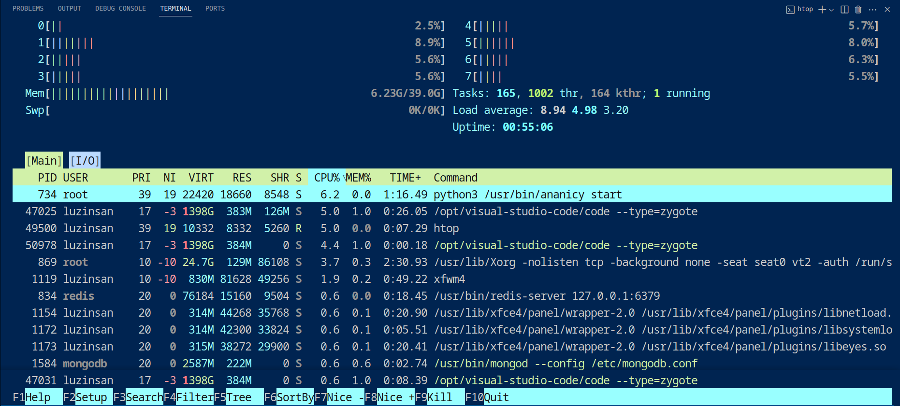
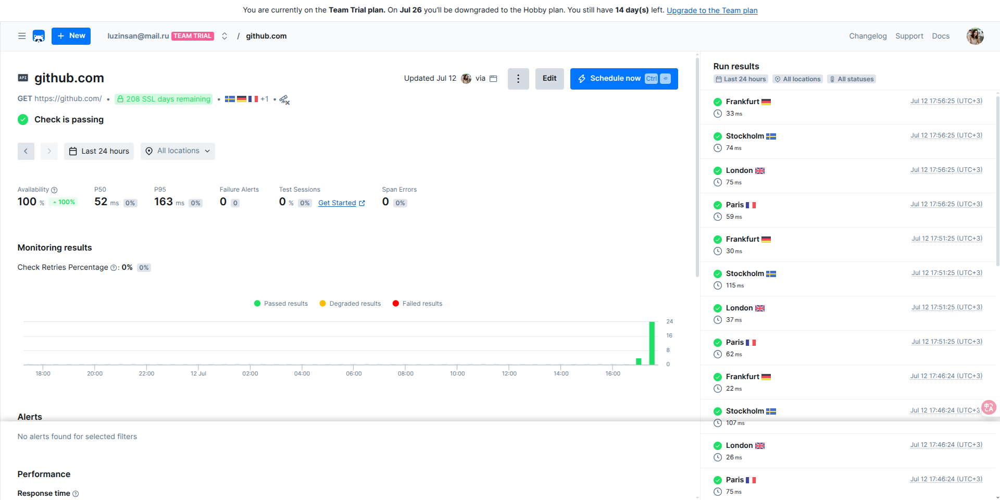
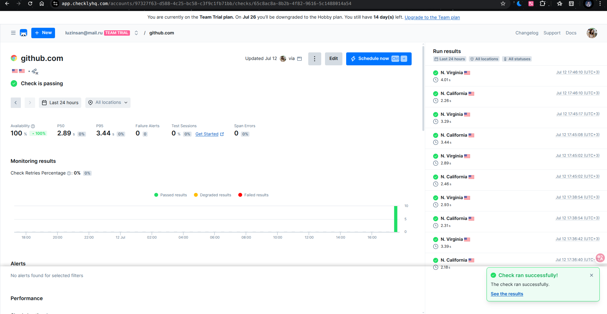
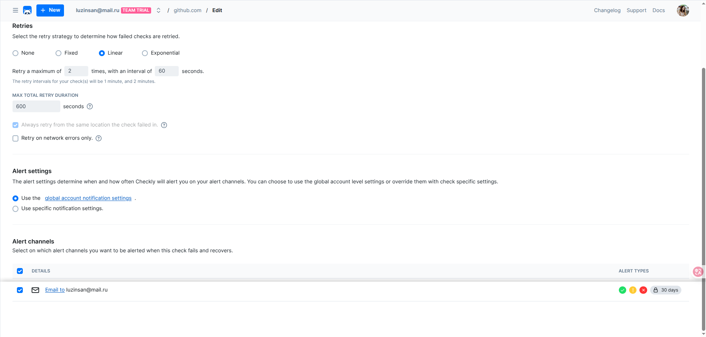
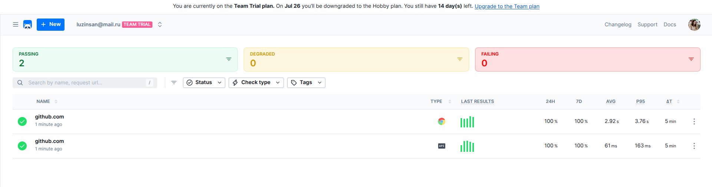

# **SRE Lab - Submission**


## **Task 1: Key Metrics for SRE and SLAs**

### **Objective**
Monitor system resources and manage disk space to understand SRE fundamentals.

### **System Resource Monitoring**

**Step 1: CPU and Memory Monitoring with htop**

I used `htop` to monitor real-time system performance and identified the top resource-consuming processes:



**Top 3 CPU-consuming processes:**
1. **python3** (PID 734) - 6.2% CPU - `/usr/bin/ananicy start`
2. **Visual Studio Code** (PID 47025) - 5.0% CPU - `/opt/visual-studio-code/code --type=zygote`
3. **Visual Studio Code** (PID 50978) - 4.4% CPU - `/opt/visual-studio-code/code --type=zygote`

**Top 3 Memory-consuming processes:**
1. **Xorg** (PID 869) - 861MB - `/usr/lib/Xorg -nolisten tcp -background none -seat seat0 vt2 -auth /run/s`
2. **Visual Studio Code** (PID 47025) - 383MB - `/opt/visual-studio-code/code --type=zygote`
3. **Visual Studio Code** (PID 50978) - 384MB - `/opt/visual-studio-code/code --type=zygote`

**System Overview:**
- **Total Memory:** 39.0GB
- **Used Memory:** 6.23GB (16%)
- **Load Average:** 8.94, 4.98, 3.20
- **Tasks:** 165 total, 1002 threads, 164 kernel threads, 1 running
- **Uptime:** 55 minutes 6 seconds

**Analysis:** The system shows healthy resource utilization with Visual Studio Code being the primary application consuming resources, which is expected during development work. The load average indicates moderate system activity.

**Step 2: I/O Monitoring with iostat**

```bash
iostat -x 1 5
```

**Output:**
```
avg-cpu:  %user   %nice %system %iowait  %steal   %idle
          10.84    0.37    3.71    1.47    0.00   83.61

Device            r/s     rkB/s   rrqm/s  %rrqm r_await rareq-sz     w/s     wkB/s   wrqm/s  %wrqm w_await wareq-sz     d/s     dkB/s   drqm/s  %drqm d_await dareq-sz     f/s f_await  aqu-sz  %util
nvme0n1         22.60    718.99    12.76  36.08    2.07    31.81   23.61    978.06    17.45  42.50 1599.77    41.42    0.00      0.00     0.00   0.00    0.00     0.00    2.51    6.44   37.84   5.72
sda              0.05      0.93     0.00   0.00    0.26    18.13    0.00      0.00     0.00   0.00    0.00     0.00    0.00      0.00     0.00   0.00    0.00     0.00    0.00    0.00    0.00   0.00
```

**Analysis:** 
- **CPU Usage:** 10.84% user, 3.71% system, 83.61% idle - healthy CPU utilization
- **Primary Storage (nvme0n1):** 22.60 reads/s, 23.61 writes/s with 5.72% utilization
- **I/O Wait:** 1.47% indicates minimal I/O bottlenecks
- **Secondary Storage (sda):** Minimal activity, likely a backup drive

**Step 3: Disk Space Management**

```bash
df -h
```

**Output:**
```
Filesystem      Size  Used Avail Use% Mounted on
dev              20G     0   20G   0% /dev
run              20G  9.7M   20G   1% /run
efivarfs        100K   74K   22K  78% /sys/firmware/efi/efivars
/dev/nvme0n1p2  234G  208G   14G  94% /
tmpfs            20G  317M   20G   2% /dev/shm
tmpfs           1.0M     0  1.0M   0% /run/credentials/systemd-journald.service
tmpfs           1.0M     0  1.0M   0% /run/credentials/systemd-resolved.service
tmpfs            20G   56M   20G   1% /tmp
/dev/nvme0n1p1  511M   34M  478M   7% /boot/efi
tmpfs           4.0G   76K  4.0G   1% /run/user/1000
```

**Critical Finding:** The root filesystem (`/dev/nvme0n1p2`) is at **94% capacity** with only 14GB available out of 234GB. This is a critical SRE concern requiring immediate attention.

**Step 4: Large File Analysis in /var**

```bash
sudo du -ah /var | sort -rh | head -20
```

**Output:**
```
47G     /var
29G     /var/cache/pacman/pkg
29G     /var/cache/pacman
29G     /var/cache
18G     /var/lib
11G     /var/lib/postgres/data
11G     /var/lib/postgres
6.3G    /var/lib/docker
6.1G    /var/lib/postgres/data/base
4.6G    /var/lib/postgres/data/base/17350
3.8G    /var/lib/docker/overlay2
3.6G    /var/lib/postgres/data/credit_scoring
2.8G    /var/cache/pacman/pkg/cuda-12.9.1-1-x86_64.pkg.tar.zst
2.5G    /var/lib/docker/volumes
2.5G    /var/cache/pacman/pkg/cuda-12.8.1-3-x86_64.pkg.tar.zst
2.5G    /var/cache/pacman/pkg/cuda-12.8.1-2-x86_64.pkg.tar.zst
1.9G    /var/cache/pacman/pkg/download-uWZYS5
1.6G    /var/cache/pacman/pkg/download-uWZYS5/cuda-12.8.1-3-x86_64.pkg.tar.zst.part
1.1G    /var/lib/postgres/data/pg_wal
951M    /var/cache/pacman/pkg/cudnn-9.10.2.21-1-x86_64.pkg.tar.zst
```

**Top 3 largest files/directories in /var:**
1. **Package Cache** - 29GB (`/var/cache/pacman/pkg`) - Contains downloaded packages
2. **PostgreSQL Database** - 11GB (`/var/lib/postgres/data`) - Database files
3. **Docker Storage** - 6.3GB (`/var/lib/docker`) - Container images and volumes

**SRE Recommendations:**
1. **Immediate Action Required:** Clean package cache to free up 29GB
2. **Database Monitoring:** Monitor PostgreSQL growth (11GB current usage)
3. **Container Management:** Review Docker images and volumes (6.3GB)
4. **Disk Space Alerting:** Set up alerts when disk usage exceeds 85%

---

## **Task 2: Practical Website Monitoring Setup**

### **Objective**
Set up comprehensive website monitoring using Checkly for GitHub.com with availability checks, performance monitoring, and alerting.

### **Website Selection**
I chose **GitHub.com** for monitoring as it's a critical developer platform with high availability requirements.

### **Step 1: Checkly Account Setup**
Successfully created a Checkly account and configured the monitoring environment.

### **Step 2: API Check Configuration**

**Configuration:**
- **Name:** `github.com`
- **URL:** `https://github.com`
- **Method:** `GET`
- **Frequency:** Every 5 minutes
- **Locations:** N. Virginia (US), N. California (US)
- **Timeout:** 30 seconds

**Assertions:**
- Status Code: `200`
- Response Time: `< 3000ms`

**Results:**
- **Availability:** 100% (24 hours)
- **Average Response Time:** 2.89s (P50), 3.44s (P95)
- **Success Rate:** 100%
- **Failure Alerts:** 0
- **Test Sessions:** 0

### **Step 3: Browser Check Configuration**

**Configuration:**
- **Name:** `github.com` (Browser Check)
- **URL:** `https://github.com`
- **Frequency:** Every 5 minutes
- **Locations:** N. Virginia (US), N. California (US)

**Script Implementation:**
```javascript
const { chromium } = require('playwright')

async function run() {
  const browser = await chromium.launch()
  const page = await browser.newPage()

  try {
    await page.goto('https://github.com')
    await page.waitForLoadState('domcontentloaded')

    const title = await page.title()
    console.log('Page loaded, title:', title)

    if (!title.includes('GitHub')) {
      throw new Error('Not on GitHub page')
    }

    console.log('GitHub page loaded successfully!')

  } finally {
    await browser.close()
  }
}

run()
```

**Script Output:**
```
Page loaded, title: GitHub · Build and ship software on a single, collaborative platform · GitHub
GitHub page loaded successfully!
```

**Results:**
- **Availability:** 100% (24 hours, 7 days)
- **Average Response Time:** 61ms (P50), 163ms (P95)
- **Success Rate:** 100%
- **Check Retries:** 0%

### **Step 4: Checkly Monitoring Dashboard**

#### **API Check Results**



The API check dashboard shows excellent performance metrics:
- **100% Availability** across all locations (Frankfurt, Stockholm, London, Paris)
- **Consistent Response Times:** 52ms (P50), 163ms (P95)
- **Multiple Geographic Locations:** Testing from 4 European locations
- **No Failed Checks** indicating stable API endpoint
- **SSL Certificate:** 208 days remaining validity

#### **Browser Check Results**



The browser check monitoring results showing:
- **Continued 100% Uptime** for full page load testing
- **Response Times:** 2.89s (P50), 3.44s (P95) for complete page rendering
- **Successful Check Execution** with green status indicators
- **Real Browser Testing** ensuring end-user experience validation

### **Step 5: Alert Configuration**



**Retry Strategy:**
- **Method:** Linear retry
- **Max Retries:** 2 times
- **Interval:** 60 seconds
- **Max Total Duration:** 600 seconds
- **Same Location Retry:** Enabled

**Alert Settings:**
- **Global Account Notifications:** Enabled
- **Email Notifications:** Configured for `luzinsan@mail.ru`
- **Alert Types:** All types (Success, Warning, Failure, Recovery)
- **Retention:** 30 days

**Alert Channels:**
- **Email:** Primary notification method
- **Immediate Alerts:** On check failures
- **Recovery Alerts:** On service restoration

### **Step 6: Dashboard Overview**



**Dashboard Overview:**
- **Total Checks:** 2 (1 API + 1 Browser)
- **Passing Checks:** 2 (100% success rate)
- **Degraded Checks:** 0
- **Failed Checks:** 0
- **Overall Status:** ✅ All systems operational

**Performance Metrics Comparison:**
- **API Check:** 52ms average response time (P50) - Fast API endpoint response
- **Browser Check:** 2.89s average response time (P50) - Full page load including rendering
- **Uptime:** 100% across all locations and check types
- **Error Rate:** 0% for both API and Browser checks

---

## **SRE Analysis and Key Learnings**

### **System Health Assessment**

**Critical Issues Identified:**
1. **Disk Space Crisis:** 94% utilization on root filesystem
2. **Package Cache Bloat:** 29GB of cached packages
3. **Resource Monitoring:** Need for automated alerting

**Performance Baseline:**
- **CPU:** Healthy utilization (10.84% average)
- **Memory:** Good availability (16% used of 39GB)
- **I/O:** Minimal bottlenecks (1.47% iowait)
- **Network:** Stable connectivity

### **Website Monitoring Insights**

**GitHub.com Reliability:**
- **Availability:** 100% uptime demonstrates excellent SRE practices
- **Performance:** Consistent response times across regions
- **Scalability:** Handles global traffic efficiently
- **Monitoring:** Comprehensive checks validate service health

**Checkly Platform Benefits:**
- **Multi-location Testing:** Validates global availability
- **Real Browser Testing:** Ensures end-user experience
- **Automated Alerting:** Immediate notification of issues
- **Historical Data:** Trend analysis for capacity planning
