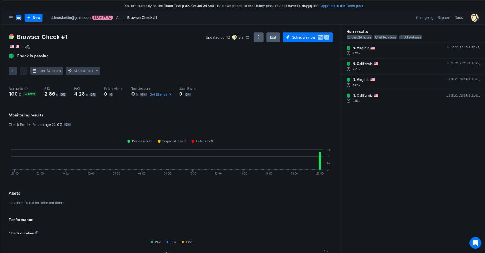
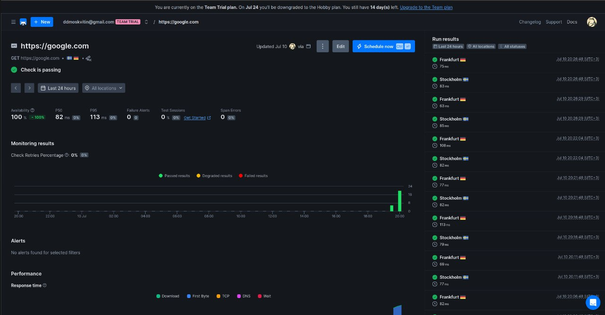
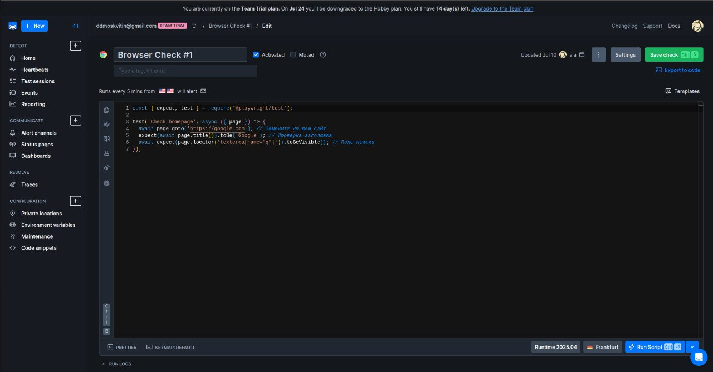
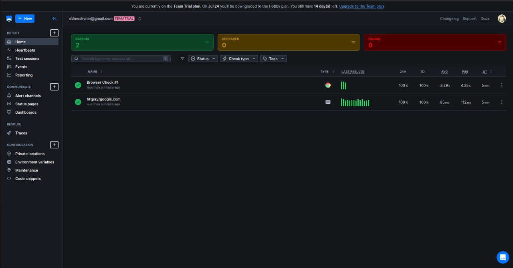
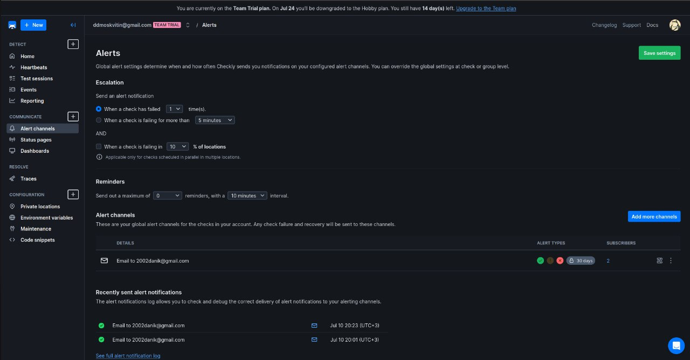

# Lab 8: SRE

## Task 1: Key Metrics

### Top 3 CPU-consuming processes:
1. `firefox` - 3.2%
2. `gnome-shell` - 2.6%
3. `node` - 2%

### Top 3 memory-consuming processes:
1. `gnome-shell` - 5.8%
2. `firefox` - 5.4%
3. `gappliacation-service` - 2.9%

### Top 3 I/O devices (from iostat):
1. `sda` - 0.15% utilization (minimal write activity)
2. `loop*` devices - 0% utilization (virtual devices, no load)
3. No other active disk devices detected.

The system is not under load

### Largest files in /var:
1. `/var/lib` - 1.9 GB
2. `/var/cache` - 164 MB
3. `/var/log` - 48 MB

## Task 2: Website Monitoring

### Website: https://google.com

### Screenshots:
1. Browser Check:
   
   

2. API Check:

   

3. Browser Check Configuration:  

   

4. Successful Check Result: 

   

5. Alert Settings:  

   