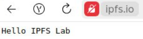

## LAB 8
Nikita Yaneev n.yaneev@innopolis.unversity

### Task 1


1. 


**Input:**
```sh
iostat
```

**Output:**

```sh
sumnios@Nikita:~$ iostat
Linux 5.15.167.4-microsoft-standard-WSL2 (Nikita)       07/11/25        _x86_64_        (8 CPU)

avg-cpu:  %user   %nice %system %iowait  %steal   %idle
           1.85    0.00    1.50    4.19    0.00   92.47

Device             tps    kB_read/s    kB_wrtn/s    kB_dscd/s    kB_read    kB_wrtn    kB_dscd
sda               8.24       546.08         0.00         0.00      74037          0          0
sdb               0.77        16.43         0.03         0.00       2228          4          0
sdc             104.26      3084.98       841.63      1282.90     418261     114108     173936
```


2. 


**Input:**
```sh
du
```

**Output:**

```sh
```


**Input:**

```sh

```

**Output:**

```sh
sumnios@Nikita:~$ df
Filesystem      1K-blocks      Used Available Use% Mounted on
none              3880972         0   3880972   0% /usr/lib/modules/5.15.167.4-microsoft-standard-WSL2
none              3880972         4   3880968   1% /mnt/wsl
drivers         335057916 217792928 117264988  66% /usr/lib/wsl/drivers
/dev/sdc       1055762868  15690744 986368652   2% /
none              3880972        80   3880892   1% /mnt/wslg
none              3880972         0   3880972   0% /usr/lib/wsl/lib
rootfs            3877560      2208   3875352   1% /init
none              3880972       852   3880120   1% /run
none              3880972         0   3880972   0% /run/lock
none              3880972         0   3880972   0% /run/shm
tmpfs                4096         0      4096   0% /sys/fs/cgroup
none              3880972       100   3880872   1% /mnt/wslg/versions.txt
none              3880972       100   3880872   1% /mnt/wslg/doc
C:\             335057916 217792928 117264988  66% /mnt/c
D:\             163838972  63664704 100174268  39% /mnt/d
snapfuse            75776     75776         0 100% /snap/core22/2010
snapfuse            52224     52224         0 100% /snap/snapd/24718
snapfuse           144000    144000         0 100% /snap/docker/3221
snapfuse            50560     50560         0 100% /snap/snapd/24792
snapfuse            75776     75776         0 100% /snap/core22/1981
snapfuse           144000    144000         0 100% /snap/docker/3265
tmpfs              776192        16    776176   1% /run/user/1000
```


### Task 2


1. 

I choose [Yandex Music](https://music.yandex.ru/)

```
url: https://music.yandex.ru/

```

2.




