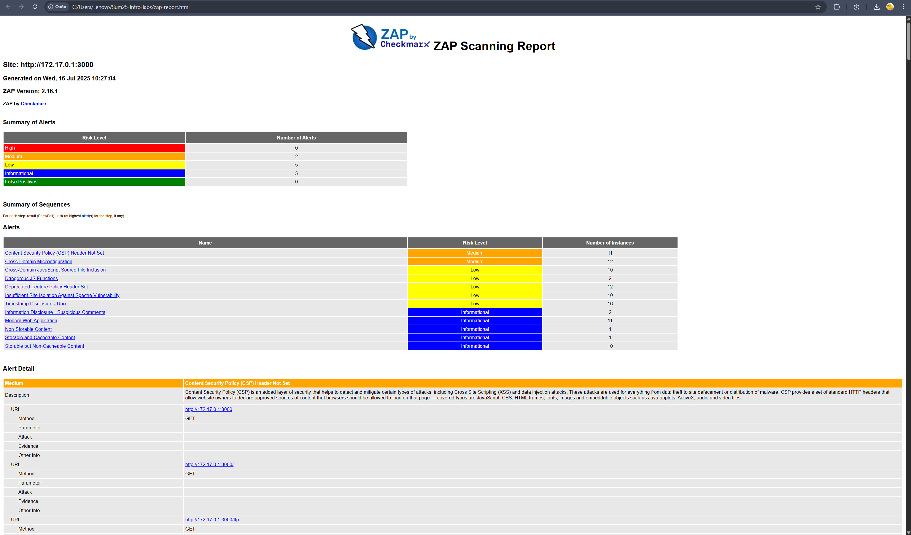

# Task 1

## Monitor System Resources


### Consuming applications:

/domain (PID: 2868) is the most resource-intensive process in both CPU and memory.
Multiple instances of MySQL (mysqld) and Xorg are also consuming significant resources.

### I/O:

Loop24 is the primary I/O bottleneck, consuming ~500x more read bandwidth than other devices.

No write activity is observed across all devices (all kB_wrtn/s = 0).

All loop devices (e.g., Loop0–Loop25) seem to be read-only, suggesting they might be related to snap packages, containers, or virtual filesystems.

## Disk Space Management


`/var/lib/snapd`

Size Impact: Hundreds of MB to GB per snap (e.g., intellij-idea-ultimate uses ~1.4GB, kf6-core22 uses ~2.1GB).

`/var/lib/docker`

Size Impact: Often grows to multiple GB depending on usage.

`/var/log`

Size Impact: Potentially large if logs aren’t rotated (e.g., 100MB–1GB+).

`/var/cache`

Size Impact: usually large, grows drastically

# Task 2


## API check:


## Browser check:


## Alerts:


## Browser check:



```
/**
  * To learn more about Playwright Test visit:
  * https://checklyhq.com/docs/browser-checks/playwright-test/
  * https://playwright.dev/docs/writing-tests
  */

const { expect, test } = require('@playwright/test')

// Configure the Playwright Test timeout to 210 seconds,
// ensuring that longer tests conclude before Checkly's browser check timeout of 240 seconds.
// The default Playwright Test timeout is set at 30 seconds.
// For additional information on timeouts, visit: https://checklyhq.com/docs/browser-checks/timeouts/
test.setTimeout(210000)

// Set the action timeout to 10 seconds to quickly identify failing actions.
// By default Playwright Test has no timeout for actions (e.g. clicking an element).
test.use({ actionTimeout: 10000 })

test('visit page and take screenshot', async ({ page }) => {
  // Change checklyhq.com to your site's URL,
  // or, even better, define a ENVIRONMENT_URL environment variable
  // to reuse it across your browser checks
  const response = await page.goto(process.env.ENVIRONMENT_URL || 'https://google.com')

  // Take a screenshot
  await page.screenshot({ path: 'screenshot.jpg' })

  // Test that the response did not fail
  expect(response.status(), 'should respond with correct status code').toBeLessThan(400)
})

```

