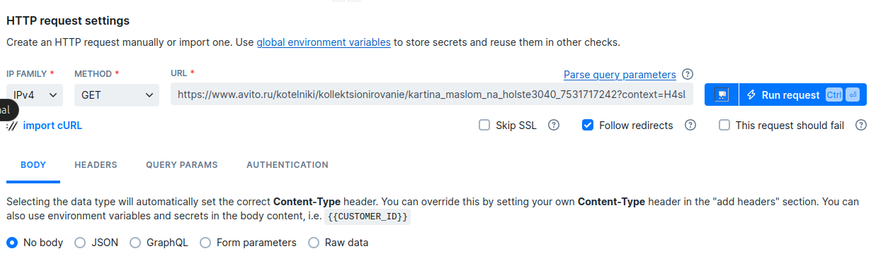

## LAB 8
Nikita Yaneev n.yaneev@innopolis.unversity

### Task 1


1. 


**Input:**
```sh
iostat
```

**Output:**

```sh
sumnios@Nikita:~$ iostat
Linux 5.15.167.4-microsoft-standard-WSL2 (Nikita)       07/12/25        _x86_64_        (8 CPU)

avg-cpu:  %user   %nice %system %iowait  %steal   %idle
           3.33    0.00    3.43    8.16    0.00   85.08

Device             tps    kB_read/s    kB_wrtn/s    kB_dscd/s    kB_read    kB_wrtn    kB_dscd
sda              23.58      1553.32         0.00         0.00      74109          0          0
sdb               2.18        46.70         0.08         0.00       2228          4          0
sdc             160.66      6567.70       660.24      4888.95     313345      31500     233252

```


**Results:**
*CPU Usage*
- dockerd (PID 702) - 1.0% CPU

- systemd-journald (PID 65) - 0.2% CPU

- init processes (PIDs 1, 126-133) - 0.1-0.2% CPU each

*Memory Usage*
- dockerd (PID 702) - 77,464 KB RES (resident memory)

- systemd-journald (PID 65) - 15,988 KB RES

- init process (PID 1) - 12,836 KB RES


*I/O Usage*
- sdc device - 160.66 transactions per second, 6,567.70 kB_read/s, 660.24 kB_wrtn/s

- sda device - 23.58 transactions per second, 1,553.32 kB_read/s

- sdb device - 2.18 transactions per second, 46.70 kB_read/s

2. 


**Input:**
```sh
sudo du -ah /var | sort -rh | head -n 3
```

**Output:**
```sh
sumnios@Nikita:~$ sudo du -ah /var | sort -rh | head -n 3
2.3G    /var
1.4G    /var/lib
921M    /var/lib/snapd/cache
```


**Input:**

```sh
df
```

**Output:**

```sh
sumnios@Nikita:~$ df
Filesystem      1K-blocks      Used Available Use% Mounted on
none              3880972         0   3880972   0% /usr/lib/modules/5.15.167.4-microsoft-standard-WSL2
none              3880972         4   3880968   1% /mnt/wsl
drivers         335057916 217792928 117264988  66% /usr/lib/wsl/drivers
/dev/sdc       1055762868  15690744 986368652   2% /
none              3880972        80   3880892   1% /mnt/wslg
none              3880972         0   3880972   0% /usr/lib/wsl/lib
rootfs            3877560      2208   3875352   1% /init
none              3880972       852   3880120   1% /run
none              3880972         0   3880972   0% /run/lock
none              3880972         0   3880972   0% /run/shm
tmpfs                4096         0      4096   0% /sys/fs/cgroup
none              3880972       100   3880872   1% /mnt/wslg/versions.txt
none              3880972       100   3880872   1% /mnt/wslg/doc
C:\             335057916 217792928 117264988  66% /mnt/c
D:\             163838972  63664704 100174268  39% /mnt/d
snapfuse            75776     75776         0 100% /snap/core22/2010
snapfuse            52224     52224         0 100% /snap/snapd/24718
snapfuse           144000    144000         0 100% /snap/docker/3221
snapfuse            50560     50560         0 100% /snap/snapd/24792
snapfuse            75776     75776         0 100% /snap/core22/1981
snapfuse           144000    144000         0 100% /snap/docker/3265
tmpfs              776192        16    776176   1% /run/user/1000
```
**Results:**

- /lib/snapd/snaps/docker_3265.snap
Size: 144,000 KB (144 MB)


- /lib/snapd/snaps/docker_3221.snap
Size: 144,000 KB (144 MB)


- /lib/snapd/snaps/core22_2010.snap
Size: 75,776 KB (76 MB)


The system have multiple versions of docker and core22 

All snap packages show 100% usage as they're read-only mounts

### Task 2


1. 

I choose [Yandex Music](https://music.yandex.ru/)

```
url: https://music.yandex.ru/

```

2.


