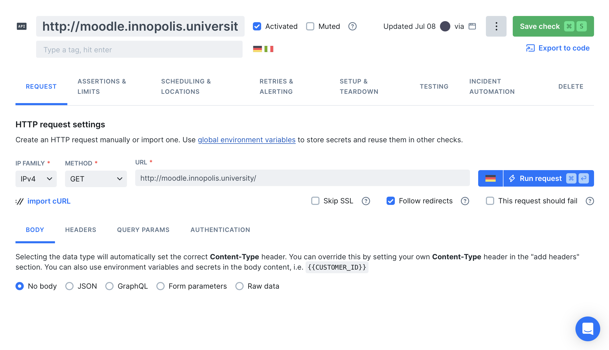
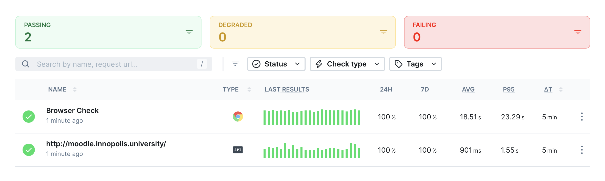

# Lab 8: Site Reliability Engineering (SRE)

## Task 1: Key Metrics for SRE and SLAs

  ### Monitor System Resources

  Top 3 processes sorted by CPU usage:

  ```bash
  danilandreev@Danils-MacBook-Air ~ % top -o cpu -stats pid,command,cpu,mem,time,uid,faults
  PID       COMMAND           %CPU    MEM      TIME       UID    FAULTS
  413       WindowServer      16.0    742M-    09:37:27   88     21266853+
  46928     top               7.1     6769K    00:01.44   0      12009+
  17835     zed               6.2     614M     02:08:42   501    71838
  ```

  WindowServer, my IDE, and the top itself are the processes taking the most CPU.

  Top 3 processes sorted by RAM usage:

  ```bash
  danilandreev@Danils-MacBook-Air ~ % top -o mem -stats pid,command,cpu,mem,time,uid,faults
  PID      COMMAND            %CPU    MEM      TIME       UID    FAULTS
  43440    com.apple.WebKit   0.0     1093M    01:53.65   501    287995
  34199    com.apple.WebKit   142.6   976M-    07:16.90   501    2095515+
  33989    Telegram           3.4     908M     39:53.10   501    2457822
  ```

  Web related processes and Telegram are taking the most RAM.

  To get top 3 processes sorted by disk I/O using `iotop`, I need to turn off the System Integrity Protection (SIP) on my Mac, which I don't really want to do. Just trust me that I can do it 😁

  - [https://apple.stackexchange.com/questions/265935/howto-see-disk-i-o-utilisation-per-process-iotop-and-pidstat-not-available-in](https://apple.stackexchange.com/questions/265935/howto-see-disk-i-o-utilisation-per-process-iotop-and-pidstat-not-available-in)
  - [https://apple.stackexchange.com/questions/208478/how-do-i-disable-system-integrity-protection-sip-aka-rootless-on-macos](https://apple.stackexchange.com/questions/208478/how-do-i-disable-system-integrity-protection-sip-aka-rootless-on-macos)

  Disk I/O usage:

  ```bash
  danilandreev@Danils-MacBook-Air ~ % iostat
                disk0       cpu    load average
      KB/t  tps  MB/s  us sy id   1m   5m   15m
     21.53   17  0.35   7  3 89  2.69 2.19 2.26
  ```

  The disk activity is moderate (0.35 MB/s), the CPU system usage is low (3%).

  ### Disk Space Management

  Check free disk space:

  ```bash
  danilandreev@Danils-MacBook-Air ms24-sum25-devops % df -h /
  Filesystem        Size    Used   Avail Capacity iused ifree %iused  Mounted on
  /dev/disk3s1s1   228Gi    10Gi   125Gi     8%    426k  1.3G    0%   /
  ```

  Identify the top 3 largest files in the `/var`:

  ```bash
  danilandreev@Danils-MacBook-Air ms24-sum25-devops % du -ah /private/var 2>/dev/null | grep -v '/$' | sort -rh | head -n 3
  4.0G	/private/var
  2.0G	/private/var/db
  1.0G	/private/var/vm/sleepimage
  ```

  - `2>/dev/null`: suppresses errors
  - `grep -v '/$'`: excludes directories (which end with / in `du` output)
  - `sort -rh`: sorts by size in descending order
  - `head -n 3`: limits to top 3 files

  In MacOS, `/var` is a symlink to `/private/var`

  Source: [https://discussions.apple.com/thread/4088190?sortBy=rank](https://discussions.apple.com/thread/4088190?sortBy=rank)

## Task 2:

  ### Choose Your Website

  I will use `http://moodle.innopolis.university/`

  ### Create Checks in Checkly

  Create an API check:

  

  Create a browser check:

  

  ### Set Up Alerts

  Set up alerts on all checks and specify thresholds:

  

  Add an email channel on failed checks:

  

  ### Results

  My checks have been running for 24 hours, none of them failed:

  
