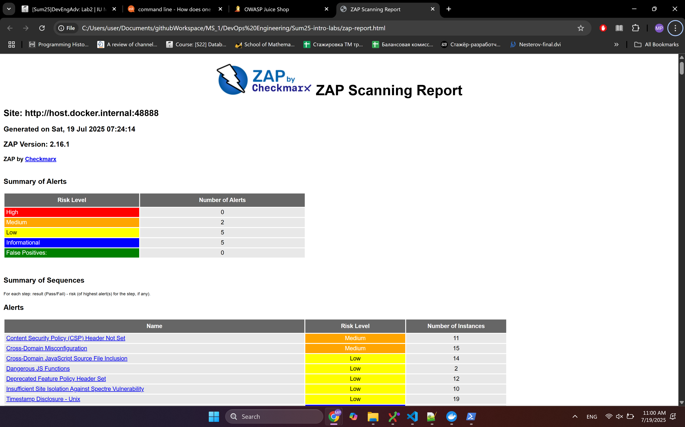
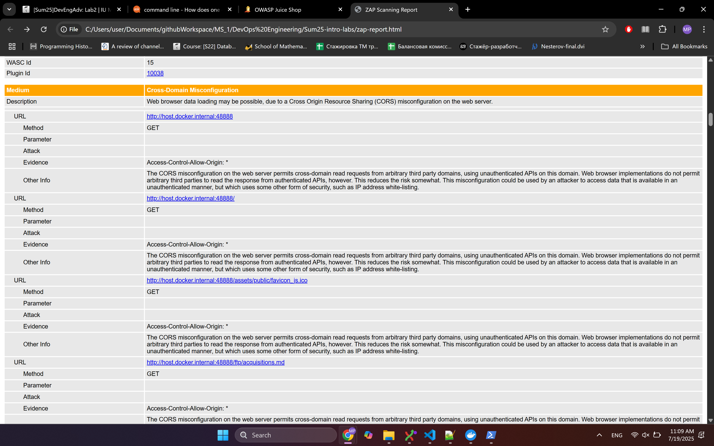
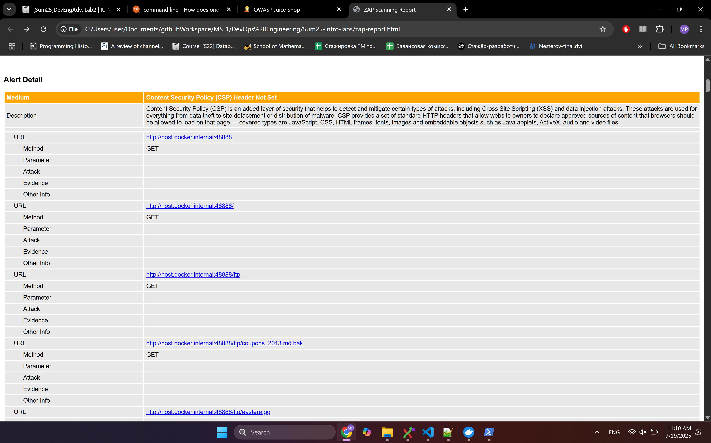
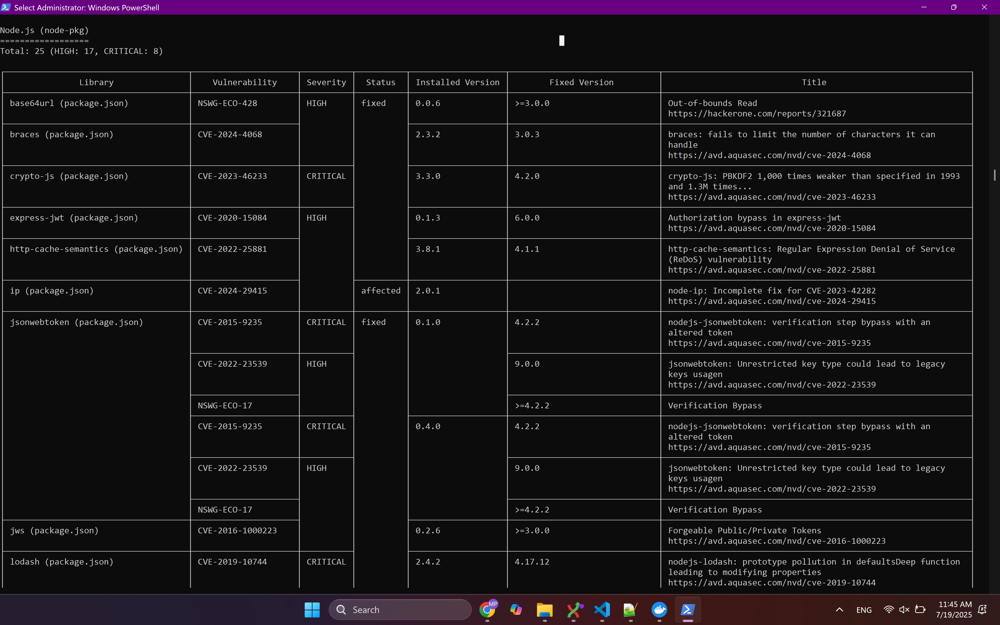
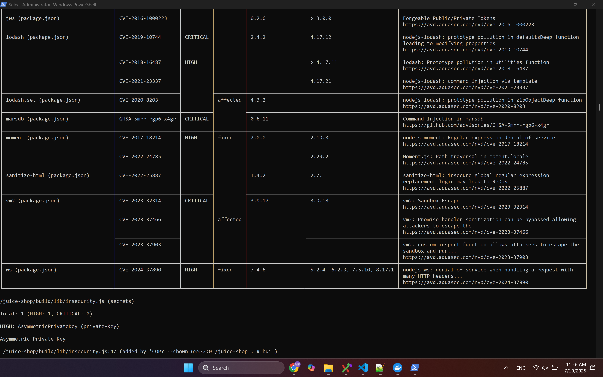

# Lab 9: Introduction to DevSecOps Tools

## Task 1 Results
   - Juice Shop vulnerabilities found (Medium): **2**
   
   - Most interesting vulnerability found: **Cross-Domain Misconfiguration**, as any domain can make requests to the Juice Shop and get a response, even if the request comes from a malicious origin. This misconfiguration allows arbitrary third-party websites to send requests to Juice Shop’s APIs and read the responses. While browsers block credentialed CORS by default, any unauthenticated or IP-based access controls are effectively bypassed. This could be abused to leak open data, exploit browser-side weaknesses, or perform phishing-style attacks.
   
   - Security headers present: **No**
   

## Task 2 Results
   - Critical vulnerabilities in Juice Shop image: **8**
   - Simply vulnerable packages:
   
   
   - Critically vulnerable packages: 
      1. crypto-js (CVE-2023-46233)
      2. jsonwebtoken (CVE-2015-9235, CVE-2015-9235)
      3. lodash (CVE-2019-10744)
      4. marsdb (GHSA-5mrr-rgp6-x4gr)
      5. vm2 (CVE-2023-32314, CVE-2023-37466, CVE-2023-37903)
   - Dominant vulnerability type: verification bypass (CVE-2015-9235, CVE-2022-23539, NSWG-ECO-17, CVE-2020-15084, CVE-2016-1000223).
   - Dominant critical vulnerability type: Sandbox Escape / Remote Code Execution (CVE-2023-32314, -37466, -37903)