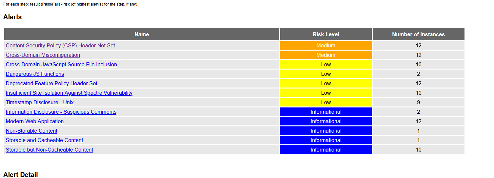
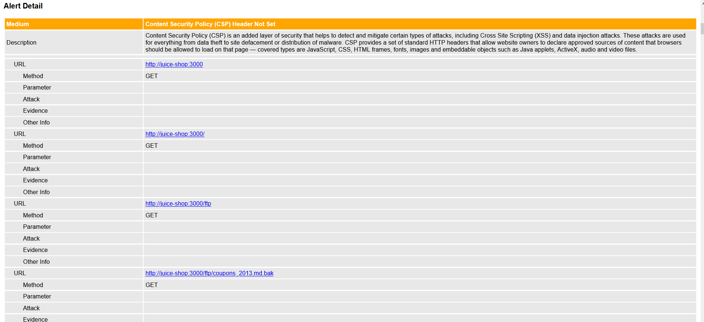
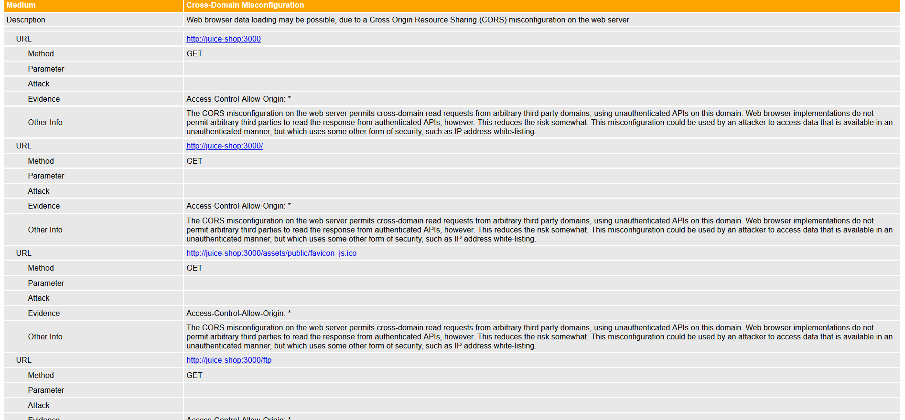
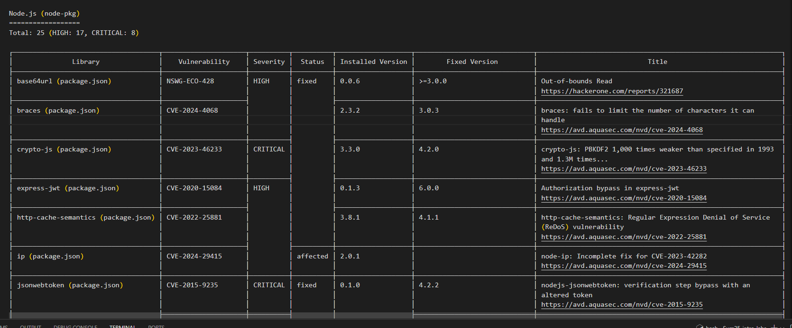
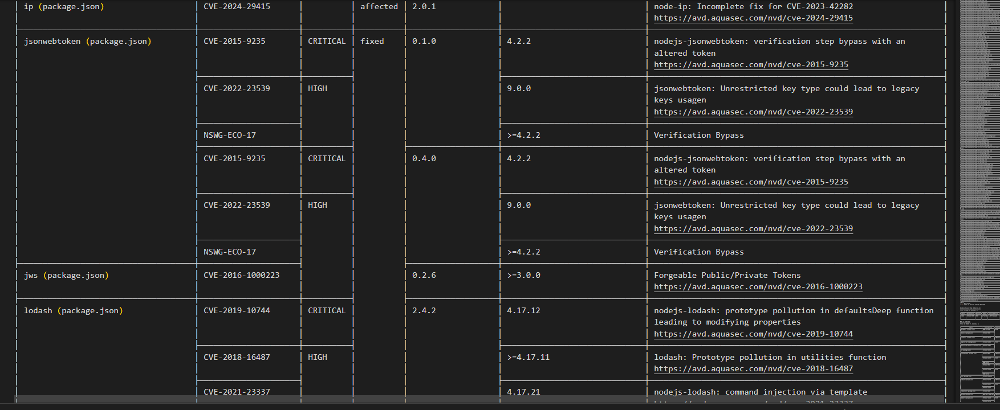

# Lab 9

## Web Application Scanning with OWASP ZAP

```
docker run -d --name juice-shop -p 3000:3000 bkimminich/juice-shop
```

```
Unable to find image 'bkimminich/juice-shop:latest' locally
latest: Pulling from bkimminich/juice-shop
35d697fe2738: Pulling fs layer 
bfb59b82a9b6: Pulling fs layer 
4eff9a62d888: Pulling fs layer 
a62778643d56: Waiting 
7c12895b777b: Waiting 
3214acf345c0: Waiting 
5664b15f108b: Pull complete 
0bab15eea81d: Pull complete 
4aa0ea1413d3: Pull complete 
da7816fa955e: Pull complete 
ddf74a63f7d8: Pull complete 
d00c3209d929: Pull complete 
c1e595f74d52: Pull complete 
7faf0cfa885c: Pull complete 
5b14f6c9a813: Pull complete 
33ce0b1d99fc: Pull complete 
f45e0372ce60: Pull complete 
a8bb57d21f11: Pull complete 
883ffadaac7b: Pull complete 
dcc354d5cbbd: Pull complete 
Digest: sha256:51134b74c523b6779a4bf25bca021b5cfae7898b6e68f6545e8bb9e4d33ce6b0
Status: Downloaded newer image for bkimminich/juice-shop:latest
aa3e608c2440275341fc1ebb7d6688efd413868ae2eeebfdba484a79b7ed37e3
```

check:

```
curl localhost:3000
```

```
<!--
  ~ Copyright (c) 2014-2025 Bjoern Kimminich & the OWASP Juice Shop contributors.
  ~ SPDX-License-Identifier: MIT
  -->

<!doctype html>
<html lang="en" data-beasties-container>
<head>

...

html page
```

check for docker0 interface

```
ip -f inet -o addr show docker0 | awk '{print $4}' | cut -d '/' -f 1
```

```
172.17.0.1
```

run

```
docker run --rm -u zap -v $(pwd):/zap/wrk:rw \
  -t ghcr.io/zaproxy/zaproxy:stable zap-baseline.py \
  -t http://172.17.0.1:3000 \
  -g gen.conf \
  -r zap-report.html
```

i got some report, but i received this message before

```
Total of 2 URLs
ERROR [Errno 13] Permission denied: '/zap/wrk/gen.conf'
2025-07-19 12:06:37,397 I/O error: [Errno 13] Permission denied: '/zap/wrk/gen.conf'
Traceback (most recent call last):
  File "/zap/zap-baseline.py", line 561, in main
    with open(os.path.join(base_dir, generate), 'w') as f:
         ^^^^^^^^^^^^^^^^^^^^^^^^^^^^^^^^^^^^^^^^^^^
PermissionError: [Errno 13] Permission denied: '/zap/wrk/gen.conf'
```

```
sudo chown -R 1000:1000 .
```

now error disappeared

BUT i got 0 vulnurabilities

```
FAIL-NEW: 0     FAIL-INPROG: 0  WARN-NEW: 0     WARN-INPROG: 0  INFO: 0 IGNORE: 0       PASS: 65
```

i tried to find out if juice shop is available from container

```
docker run --rm ghcr.io/zaproxy/zaproxy:stable curl http://172.17.0.1:3000
```

```
  % Total    % Received % Xferd  Average Speed   Time    Time     Time  Current
                                 Dload  Upload   Total   Spent    Left  Speed
  0     0    0     0    0     0      0      0 --:--:--  0:01:34 --:--:--     0
```

let's create a virtual network

```
docker network create zap-net
```

```
docker run -d --name juice-shop --network zap-net -p 3000:3000 bkimminich/juice-shop
```

```
docker run --rm --network zap-net ghcr.io/zaproxy/zaproxy:stable curl http://juice-shop:3000
```

here i got site available 

now let's try to run

```
docker run --rm --network zap-net -u zap -v $(pwd):/zap/wrk:rw \
  -t ghcr.io/zaproxy/zaproxy:stable zap-baseline.py \
  -t http://juice-shop:3000 \
  -g gen.conf \
  -r zap-report.html
```

now we recwive at least something 

```
FAIL-NEW: 0     FAIL-INPROG: 0  WARN-NEW: 7     WARN-INPROG: 0  INFO: 0 IGNORE: 0       PASS: 58
```


let's analyse `zap_report.html` file


we got:
- Content Security Policy (CSP) Header Not Set: absence of Content-Security-Policy header which increases the risk of XSS atack
- Cross-Domain Misconfiguration: server returns `Access-Control-Allow-Origin: *` header from 12 urls. this allows third-party sites to make cross-domain requests and receive responses from the server if they do not require authorization.

- Juice Shop vulnerabilities found (Medium): 2
- Most interesting vulnerability found: Cross-Domain Misconfiguration
- Security headers present: No

Clean up

```
docker stop juice-shop && docker rm juice-shop
```





## Container Vulnerability Scanning with Trivy

```
docker run --rm -v /var/run/docker.sock:/var/run/docker.sock \
   aquasec/trivy:latest image \
   --severity HIGH,CRITICAL \
   bkimminich/juice-shop > trivy_report
```

snippets from `trivy_report`

```
bkimminich/juice-shop (debian 12.11)
====================================
Total: 1 (HIGH: 1, CRITICAL: 0)
```

```
Node.js (node-pkg)
==================
Total: 25 (HIGH: 17, CRITICAL: 8)
```

```
/juice-shop/build/lib/insecurity.js (secrets)
=============================================
Total: 1 (HIGH: 1, CRITICAL: 0)
```

```
bkimminich/juice-shop (debian 12.11)
====================================
Total: 1 (HIGH: 1, CRITICAL: 0)
```

total: 8 vulnurabilities






- Critical vulnerabilities in Juice Shop image: 8
- Vulnerable packages:
  1. crypto-js
  2. jsonwebtoken
- Dominant vulnerability type: Authentication Bypass and Cryptographic Weaknesses
