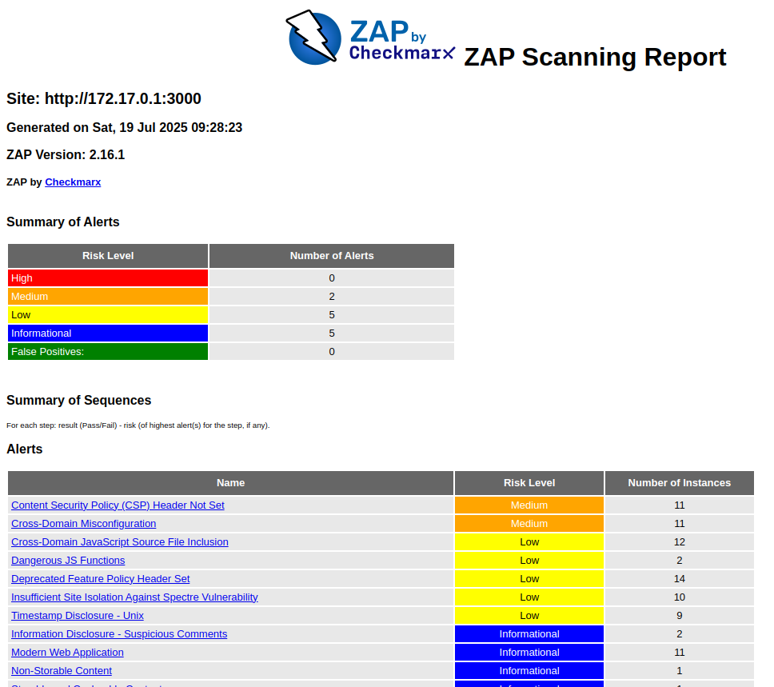

# Introduction to DevSecOps Tools

## Task 1: Web Application Scanning with OWASP ZAP

**Objective**: Perform automated security scanning of a vulnerable web application using OWASP ZAP in Docker to identify common web vulnerabilities. Web application scanning helps discover security flaws like XSS, SQL injection, and misconfigurations before attackers exploit them. ZAP is an industry-standard tool maintained by OWASP.

- Juice Shop vulnerabilities found (Medium): 2
    - `Content Security Policy (CSP) Header Not Set`
    - `Cross-Domain Misconfiguration`
- Most interesting vulnerability found: `Content Security Policy (CSP) Header Not Set`
- Security headers present: **No**


---

## Task 2: Container Vulnerability Scanning with Trivy

**Objective**: Identify vulnerabilities in container images using Trivy executed via Docker, focusing on intentionally vulnerable images for education. Container scanning detects OS/library vulnerabilities in images before deployment. Trivy is the industry's most comprehensive open-source scanner.

```sh
bkimminich/juice-shop (debian 12.11)
====================================
Total: 1 (HIGH: 1, CRITICAL: 0)

┌─────────┬───────────────┬──────────┬──────────┬───────────────────┬───────────────┬───────────────────────────────────────────────────────────┐
│ Library │ Vulnerability │ Severity │  Status  │ Installed Version │ Fixed Version │                           Title                           │
├─────────┼───────────────┼──────────┼──────────┼───────────────────┼───────────────┼───────────────────────────────────────────────────────────┤
│ libc6   │ CVE-2025-4802 │ HIGH     │ affected │ 2.36-9+deb12u10   │               │ glibc: static setuid binary dlopen may incorrectly search │
│         │               │          │          │                   │               │ LD_LIBRARY_PATH                                           │
│         │               │          │          │                   │               │ https://avd.aquasec.com/nvd/cve-2025-4802                 │
└─────────┴───────────────┴──────────┴──────────┴───────────────────┴───────────────┴───────────────────────────────────────────────────────────┘

Node.js (node-pkg)
==================
Total: 25 (HIGH: 17, CRITICAL: 8)

┌─────────────────────────────────────┬─────────────────────┬──────────┬──────────┬───────────────────┬──────────────────────────────┬──────────────────────────────────────────────────────────────┐
│               Library               │    Vulnerability    │ Severity │  Status  │ Installed Version │        Fixed Version         │                            Title                             │
├─────────────────────────────────────┼─────────────────────┼──────────┼──────────┼───────────────────┼──────────────────────────────┼──────────────────────────────────────────────────────────────┤
│ base64url (package.json)            │ NSWG-ECO-428        │ HIGH     │ fixed    │ 0.0.6             │ >=3.0.0                      │ Out-of-bounds Read                                           │
│                                     │                     │          │          │                   │                              │ https://hackerone.com/reports/321687                         │
├─────────────────────────────────────┼─────────────────────┤          │          ├───────────────────┼──────────────────────────────┼──────────────────────────────────────────────────────────────┤
│ braces (package.json)               │ CVE-2024-4068       │          │          │ 2.3.2             │ 3.0.3                        │ braces: fails to limit the number of characters it can       │
│                                     │                     │          │          │                   │                              │ handle                                                       │
│                                     │                     │          │          │                   │                              │ https://avd.aquasec.com/nvd/cve-2024-4068                    │
├─────────────────────────────────────┼─────────────────────┼──────────┤          ├───────────────────┼──────────────────────────────┼──────────────────────────────────────────────────────────────┤
│ crypto-js (package.json)            │ CVE-2023-46233      │ CRITICAL │          │ 3.3.0             │ 4.2.0                        │ crypto-js: PBKDF2 1,000 times weaker than specified in 1993  │
│                                     │                     │          │          │                   │                              │ and 1.3M times...                                            │
│                                     │                     │          │          │                   │                              │ https://avd.aquasec.com/nvd/cve-2023-46233                   │
├─────────────────────────────────────┼─────────────────────┼──────────┤          ├───────────────────┼──────────────────────────────┼──────────────────────────────────────────────────────────────┤
│ express-jwt (package.json)          │ CVE-2020-15084      │ HIGH     │          │ 0.1.3             │ 6.0.0                        │ Authorization bypass in express-jwt                          │
│                                     │                     │          │          │                   │                              │ https://avd.aquasec.com/nvd/cve-2020-15084                   │
├─────────────────────────────────────┼─────────────────────┤          │          ├───────────────────┼──────────────────────────────┼──────────────────────────────────────────────────────────────┤
│ http-cache-semantics (package.json) │ CVE-2022-25881      │          │          │ 3.8.1             │ 4.1.1                        │ http-cache-semantics: Regular Expression Denial of Service   │
│                                     │                     │          │          │                   │                              │ (ReDoS) vulnerability                                        │
│                                     │                     │          │          │                   │                              │ https://avd.aquasec.com/nvd/cve-2022-25881                   │
├─────────────────────────────────────┼─────────────────────┤          ├──────────┼───────────────────┼──────────────────────────────┼──────────────────────────────────────────────────────────────┤
│ ip (package.json)                   │ CVE-2024-29415      │          │ affected │ 2.0.1             │                              │ node-ip: Incomplete fix for CVE-2023-42282                   │
│                                     │                     │          │          │                   │                              │ https://avd.aquasec.com/nvd/cve-2024-29415                   │
├─────────────────────────────────────┼─────────────────────┼──────────┼──────────┼───────────────────┼──────────────────────────────┼──────────────────────────────────────────────────────────────┤
│ jsonwebtoken (package.json)         │ CVE-2015-9235       │ CRITICAL │ fixed    │ 0.1.0             │ 4.2.2                        │ nodejs-jsonwebtoken: verification step bypass with an        │
│                                     │                     │          │          │                   │                              │ altered token                                                │
│                                     │                     │          │          │                   │                              │ https://avd.aquasec.com/nvd/cve-2015-9235                    │
│                                     ├─────────────────────┼──────────┤          │                   ├──────────────────────────────┼──────────────────────────────────────────────────────────────┤
│                                     │ CVE-2022-23539      │ HIGH     │          │                   │ 9.0.0                        │ jsonwebtoken: Unrestricted key type could lead to legacy     │
│                                     │                     │          │          │                   │                              │ keys usagen                                                  │
│                                     │                     │          │          │                   │                              │ https://avd.aquasec.com/nvd/cve-2022-23539                   │
│                                     ├─────────────────────┤          │          │                   ├──────────────────────────────┼──────────────────────────────────────────────────────────────┤
│                                     │ NSWG-ECO-17         │          │          │                   │ >=4.2.2                      │ Verification Bypass                                          │
│                                     ├─────────────────────┼──────────┤          ├───────────────────┼──────────────────────────────┼──────────────────────────────────────────────────────────────┤
│                                     │ CVE-2015-9235       │ CRITICAL │          │ 0.4.0             │ 4.2.2                        │ nodejs-jsonwebtoken: verification step bypass with an        │
│                                     │                     │          │          │                   │                              │ altered token                                                │
│                                     │                     │          │          │                   │                              │ https://avd.aquasec.com/nvd/cve-2015-9235                    │
│                                     ├─────────────────────┼──────────┤          │                   ├──────────────────────────────┼──────────────────────────────────────────────────────────────┤
│                                     │ CVE-2022-23539      │ HIGH     │          │                   │ 9.0.0                        │ jsonwebtoken: Unrestricted key type could lead to legacy     │
│                                     │                     │          │          │                   │                              │ keys usagen                                                  │
│                                     │                     │          │          │                   │                              │ https://avd.aquasec.com/nvd/cve-2022-23539                   │
│                                     ├─────────────────────┤          │          │                   ├──────────────────────────────┼──────────────────────────────────────────────────────────────┤
│                                     │ NSWG-ECO-17         │          │          │                   │ >=4.2.2                      │ Verification Bypass                                          │
├─────────────────────────────────────┼─────────────────────┤          │          ├───────────────────┼──────────────────────────────┼──────────────────────────────────────────────────────────────┤
│ jws (package.json)                  │ CVE-2016-1000223    │          │          │ 0.2.6             │ >=3.0.0                      │ Forgeable Public/Private Tokens                              │
│                                     │                     │          │          │                   │                              │ https://avd.aquasec.com/nvd/cve-2016-1000223                 │
├─────────────────────────────────────┼─────────────────────┼──────────┤          ├───────────────────┼──────────────────────────────┼──────────────────────────────────────────────────────────────┤
│ lodash (package.json)               │ CVE-2019-10744      │ CRITICAL │          │ 2.4.2             │ 4.17.12                      │ nodejs-lodash: prototype pollution in defaultsDeep function  │
│                                     │                     │          │          │                   │                              │ leading to modifying properties                              │
│                                     │                     │          │          │                   │                              │ https://avd.aquasec.com/nvd/cve-2019-10744                   │
│                                     ├─────────────────────┼──────────┤          │                   ├──────────────────────────────┼──────────────────────────────────────────────────────────────┤
│                                     │ CVE-2018-16487      │ HIGH     │          │                   │ >=4.17.11                    │ lodash: Prototype pollution in utilities function            │
│                                     │                     │          │          │                   │                              │ https://avd.aquasec.com/nvd/cve-2018-16487                   │
│                                     ├─────────────────────┤          │          │                   ├──────────────────────────────┼──────────────────────────────────────────────────────────────┤
│                                     │ CVE-2021-23337      │          │          │                   │ 4.17.21                      │ nodejs-lodash: command injection via template                │
│                                     │                     │          │          │                   │                              │ https://avd.aquasec.com/nvd/cve-2021-23337                   │
├─────────────────────────────────────┼─────────────────────┤          ├──────────┼───────────────────┼──────────────────────────────┼──────────────────────────────────────────────────────────────┤
│ lodash.set (package.json)           │ CVE-2020-8203       │          │ affected │ 4.3.2             │                              │ nodejs-lodash: prototype pollution in zipObjectDeep function │
│                                     │                     │          │          │                   │                              │ https://avd.aquasec.com/nvd/cve-2020-8203                    │
├─────────────────────────────────────┼─────────────────────┼──────────┤          ├───────────────────┼──────────────────────────────┼──────────────────────────────────────────────────────────────┤
│ marsdb (package.json)               │ GHSA-5mrr-rgp6-x4gr │ CRITICAL │          │ 0.6.11            │                              │ Command Injection in marsdb                                  │
│                                     │                     │          │          │                   │                              │ https://github.com/advisories/GHSA-5mrr-rgp6-x4gr            │
├─────────────────────────────────────┼─────────────────────┼──────────┼──────────┼───────────────────┼──────────────────────────────┼──────────────────────────────────────────────────────────────┤
│ moment (package.json)               │ CVE-2017-18214      │ HIGH     │ fixed    │ 2.0.0             │ 2.19.3                       │ nodejs-moment: Regular expression denial of service          │
│                                     │                     │          │          │                   │                              │ https://avd.aquasec.com/nvd/cve-2017-18214                   │
│                                     ├─────────────────────┤          │          │                   ├──────────────────────────────┼──────────────────────────────────────────────────────────────┤
│                                     │ CVE-2022-24785      │          │          │                   │ 2.29.2                       │ Moment.js: Path traversal in moment.locale                   │
│                                     │                     │          │          │                   │                              │ https://avd.aquasec.com/nvd/cve-2022-24785                   │
├─────────────────────────────────────┼─────────────────────┤          │          ├───────────────────┼──────────────────────────────┼──────────────────────────────────────────────────────────────┤
│ sanitize-html (package.json)        │ CVE-2022-25887      │          │          │ 1.4.2             │ 2.7.1                        │ sanitize-html: insecure global regular expression            │
│                                     │                     │          │          │                   │                              │ replacement logic may lead to ReDoS                          │
│                                     │                     │          │          │                   │                              │ https://avd.aquasec.com/nvd/cve-2022-25887                   │
├─────────────────────────────────────┼─────────────────────┼──────────┤          ├───────────────────┼──────────────────────────────┼──────────────────────────────────────────────────────────────┤
│ vm2 (package.json)                  │ CVE-2023-32314      │ CRITICAL │          │ 3.9.17            │ 3.9.18                       │ vm2: Sandbox Escape                                          │
│                                     │                     │          │          │                   │                              │ https://avd.aquasec.com/nvd/cve-2023-32314                   │
│                                     ├─────────────────────┤          ├──────────┤                   ├──────────────────────────────┼──────────────────────────────────────────────────────────────┤
│                                     │ CVE-2023-37466      │          │ affected │                   │                              │ vm2: Promise handler sanitization can be bypassed allowing   │
│                                     │                     │          │          │                   │                              │ attackers to escape the...                                   │
│                                     │                     │          │          │                   │                              │ https://avd.aquasec.com/nvd/cve-2023-37466                   │
│                                     ├─────────────────────┤          │          │                   ├──────────────────────────────┼──────────────────────────────────────────────────────────────┤
│                                     │ CVE-2023-37903      │          │          │                   │                              │ vm2: custom inspect function allows attackers to escape the  │
│                                     │                     │          │          │                   │                              │ sandbox and run...                                           │
│                                     │                     │          │          │                   │                              │ https://avd.aquasec.com/nvd/cve-2023-37903                   │
├─────────────────────────────────────┼─────────────────────┼──────────┼──────────┼───────────────────┼──────────────────────────────┼──────────────────────────────────────────────────────────────┤
│ ws (package.json)                   │ CVE-2024-37890      │ HIGH     │ fixed    │ 7.4.6             │ 5.2.4, 6.2.3, 7.5.10, 8.17.1 │ nodejs-ws: denial of service when handling a request with    │
│                                     │                     │          │          │                   │                              │ many HTTP headers...                                         │
│                                     │                     │          │          │                   │                              │ https://avd.aquasec.com/nvd/cve-2024-37890                   │
└─────────────────────────────────────┴─────────────────────┴──────────┴──────────┴───────────────────┴──────────────────────────────┴──────────────────────────────────────────────────────────────┘

/juice-shop/build/lib/insecurity.js (secrets)
=============================================
Total: 1 (HIGH: 1, CRITICAL: 0)

HIGH: AsymmetricPrivateKey (private-key)
════════════════════════════════════════
Asymmetric Private Key
────────────────────────────────────────
 /juice-shop/build/lib/insecurity.js:47 (added by 'COPY --chown=65532:0 /juice-shop . # bui')
────────────────────────────────────────
  45   const z85 = __importStar(require("z85"));
  46   exports.publicKey = node_fs_1.default ? node_fs_1.default.readFileSync('encryptionkeys/jwt.pub', 'ut
  47 [ ----BEGIN RSA PRIVATE KEY-----****************************************************************************************************************************************************************************************************************************************************************************************************************************************************************************************************************************************************************************************************************************************************************************************************************************************************************************************************************************************************************************************************************************************************-----END RSA PRIVATE
  48   const hash = (data) => node_crypto_1.default.createHash('md5').update(data).digest('hex');
────────────────────────────────────────


/juice-shop/lib/insecurity.ts (secrets)
=======================================
Total: 1 (HIGH: 1, CRITICAL: 0)

HIGH: AsymmetricPrivateKey (private-key)
════════════════════════════════════════
Asymmetric Private Key
────────────────────────────────────────
 /juice-shop/lib/insecurity.ts:23 (added by 'COPY --chown=65532:0 /juice-shop . # bui')
────────────────────────────────────────
  21   
  22   export const publicKey = fs ? fs.readFileSync('encryptionkeys/jwt.pub', 'utf8') : 'placeholder-publi
  23 [ ----BEGIN RSA PRIVATE KEY-----****************************************************************************************************************************************************************************************************************************************************************************************************************************************************************************************************************************************************************************************************************************************************************************************************************************************************************************************************************************************************************************************************************************************************-----END RSA PRIVATE
  24   
────────────────────────────────────────
```
- Critical vulnerabilities in Juice Shop image: 8
- Vulnerable packages (for example): 
    1. `crypto-js`
    2. `jsonwebtoken`
- Dominant vulnerability type: **Insecure Dependencies**

- The scan detected multiple instances of hardcoded asymmetric private keys in the source code.
This exposes the application to serious risks such as impersonation, data decryption, and unauthorized access.

---
