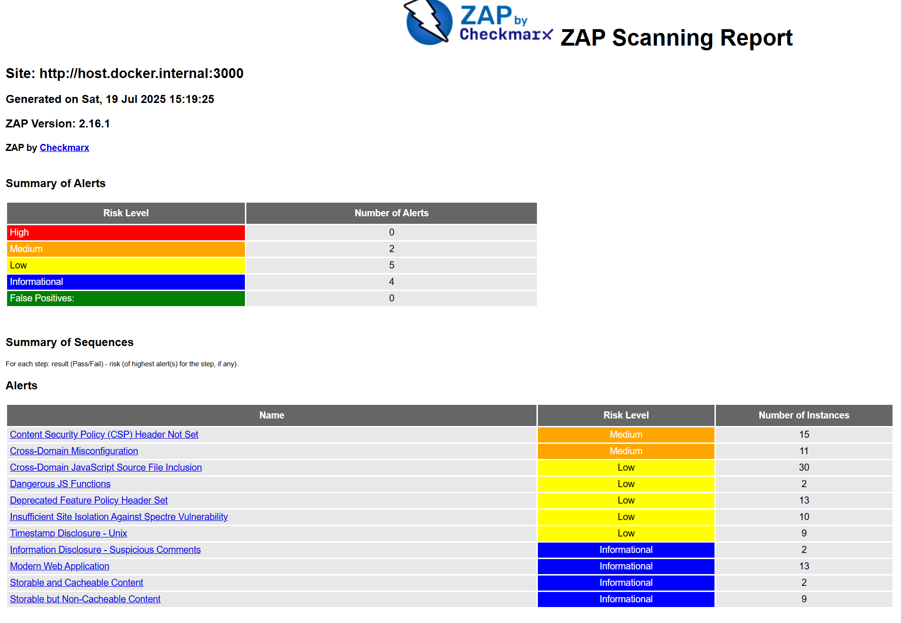

# Лабораторная работа 9. Безопасность 

## Задание 1. 

Создали котейнер и командой 

    docker run --rm -u zap -v ${PWD}:/zap/wrk:rw -t ghcr.io/zaproxy/zaproxy:stable zap-baseline.py -t http://host.docker.internal:3000 -g gen.conf -r zap-report.html

запустили проверку безопасности 

Content Security Policy (CSP) Header Not Set	Medium	15
Cross-Domain Misconfiguration	Medium	11

- Сервер не отправляет заголовок Content-Security-Policy, который защищает от XSS-атак, запрещая загрузку скриптов, стилей и других ресурсов из ненадёжных источников.

- Неправильная настройка политик кросс-доменных запросов (CORS, JSONP и др.), позволяющая другим сайтам получать доступ к данным приложения.

Останавливаем у удаляем конейтенер 

    docker stop juice-shop && docker rm juice-shop

Скрин:

## Задание 2.

**Всего уязвимостей:** 25  
**CRITICAL:** 8, **HIGH:** 17

### Критические уязвимости (CRITICAL)

| Библиотека     | ID уязвимости | Установленная версия | Исправлено в | Описание |
|----------------|---------------|----------------------|--------------|----------|
| `crypto-js`    | CVE-2023-46233 | 3.3.0 | 4.2.0 | PBKDF2 в 1000 раз слабее стандарта |
| `jsonwebtoken` | CVE-2015-9235  | 0.1.0 | 4.2.2 | Обход проверки подписи токена |
| `lodash`       | CVE-2019-10744 | 2.4.2 | 4.17.12 | Уязвимость прототипного загрязнения |
| `vm2`          | CVE-2023-32314 | 3.9.17 | 3.9.18 | Побег из песочницы |

### Высокорисковые уязвимости (HIGH)

| Библиотека       | ID уязвимости | Установленная версия | Исправлено в | Описание |
|------------------|---------------|----------------------|--------------|----------|
| `base64url`      | NSWG-ECO-428  | 0.0.6 | >=3.0.0 | Уязвимость чтения памяти |
| `express-jwt`    | CVE-2020-15084| 0.1.3 | 6.0.0 | Обход авторизации |
| `http-cache-semantics` | CVE-2022-25881 | 3.8.1 | 4.1.1 | Уязвимость ReDoS |

Оригинальный вывод лежит в файле lab9_out.txt

