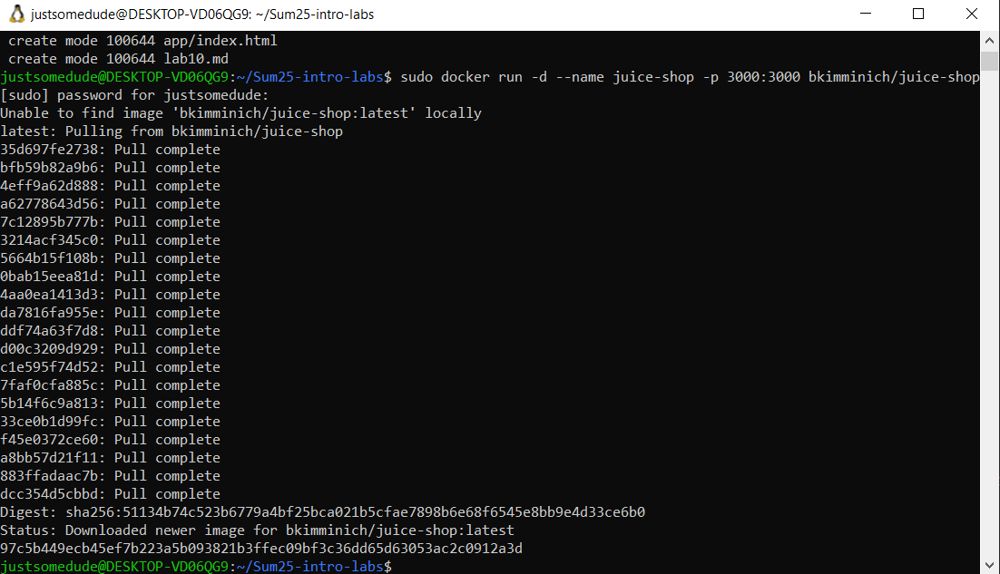
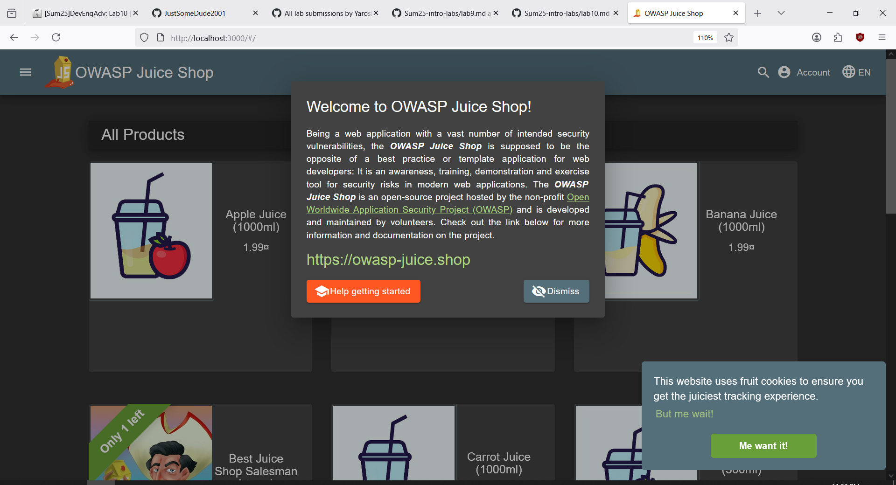
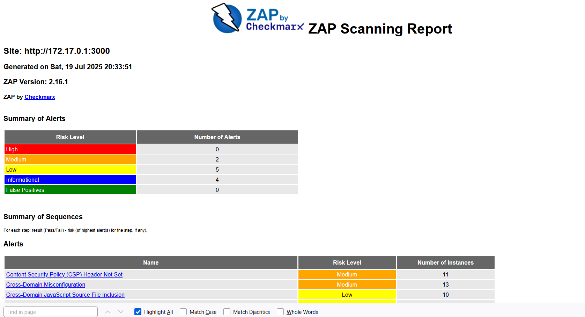

# Introduction to DevSecOps Tools

## Task 1: Web Application Scanning with OWASP ZAP

**Objective**: Perform automated security scanning of a vulnerable web application using OWASP ZAP in Docker to identify common web vulnerabilities. Web application scanning helps discover security flaws like XSS, SQL injection, and misconfigurations before attackers exploit them. ZAP is an industry-standard tool maintained by OWASP.

1. **Start the vulnerable target application** (Juice Shop):

   ```bash
      docker run -d --name juice-shop -p 3000:3000 bkimminich/juice-shop
   ```

Output:
    

   Verify it's running: `http://localhost:3000` in your browser

Juice-shop running correctly:
    

2. **Scan with OWASP ZAP**:

My machine is Linux so I got its' LAN IP.
```bash
docker run --rm -u zap -v $(pwd):/zap/wrk:rw \
-t ghcr.io/zaproxy/zaproxy:stable zap-baseline.py \
-t http://172.17.0.1:3000 \
-g gen.conf \
-r zap-report.html
```
Output of running: my [zap-report](/zap-report.html)


3. **Analyze results**:
    - Find the HTML report in your current directory: `zap-report.html`
    - Open it in a browser and identify:
    - 2 Medium risk vulnerabilities
    - Security headers status

Answer:
    There are only 2 Medium risk vulnerabilities in the report:
        - Content Security Policy (CSP) Header Not Set - this vulnerability might lead to data injections that could be used to clickjacking or other malicious attacks
        - Cross-Domain Misconfiguration - this is, from what I could gather, an exposure vulnerability, except for web pages, which allows for attacks on different user sessions to steal session tokens. Also this could allow for stealing whatever API keys the frontend uses to work with the backend.
    Security headers status is that they are just not set - the security headers were not set at all, at least from what I could find.

4. **Clean up**:

   ```bash
      docker stop juice-shop && docker rm juice-shop
   ```
Clean up was done. No more containers running.
```
justsomedude@DESKTOP-VD06QG9:~/Sum25-intro-labs$ sudo docker container ls
CONTAINER ID   IMAGE     COMMAND   CREATED   STATUS    PORTS     NAMES
justsomedude@DESKTOP-VD06QG9:~/Sum25-intro-labs$
```
---

## Task 2: Container Vulnerability Scanning with Trivy

**Objective**: Identify vulnerabilities in container images using Trivy executed via Docker, focusing on intentionally vulnerable images for education. Container scanning detects OS/library vulnerabilities in images before deployment. Trivy is the industry's most comprehensive open-source scanner.

1. **Scan using Trivy in Docker**:

   ```bash
docker run --rm -v /var/run/docker.sock:/var/run/docker.sock \
aquasec/trivy:latest image \
--severity HIGH,CRITICAL \
bkimminich/juice-shop
   ```

Outputs can be fount in [Trivy.txt](/Trivy.txt)

2. **Analyze results**:
    - Identify:
    - The total number of CRITICAL vulnerabilities
    - 2 vulnerable package names
    - The most common vulnerability type

- Total number of Critical vulnerabilities is 8, most of them are marked as Fixed so they could be resolved by updating associated dependencies
- 2 vulnerable packages are bkimminich/juice-shop and Node.js (node-pkg)
- CVE  is the most common type of vulnerability - A CVE (Common Vulnerabilities and Exposures) is a publicly disclosed security flaw in software or hardware

3. **Clean up**:

   ```bash
      docker rmi bkimminich/juice-shop
   ```

---

## Task 1 Results
- Juice Shop vulnerabilities found (Medium): 2
- Most interesting vulnerability found: I would say it is Cross-Domain Misconfiguration, as it seems especially dangerous to the business with possible highjacking of backend API keys
- Security headers present: No

## Task 2 Results
- Critical vulnerabilities in Juice Shop image: 8
- Vulnerable packages: 
   1. bkimminich/juice-shop
   2. Node.js
- Dominant vulnerability type: CVE
   

2. Include screenshot evidence:
    - ZAP HTML report overview
        - You can find the report in [zap-report.html](/zap-report.html)
        - 
    - Trivy terminal output showing critical findings
        - You can find the output in [Trivy.txt](/Trivy.txt)

