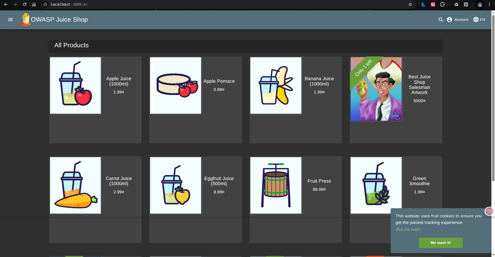
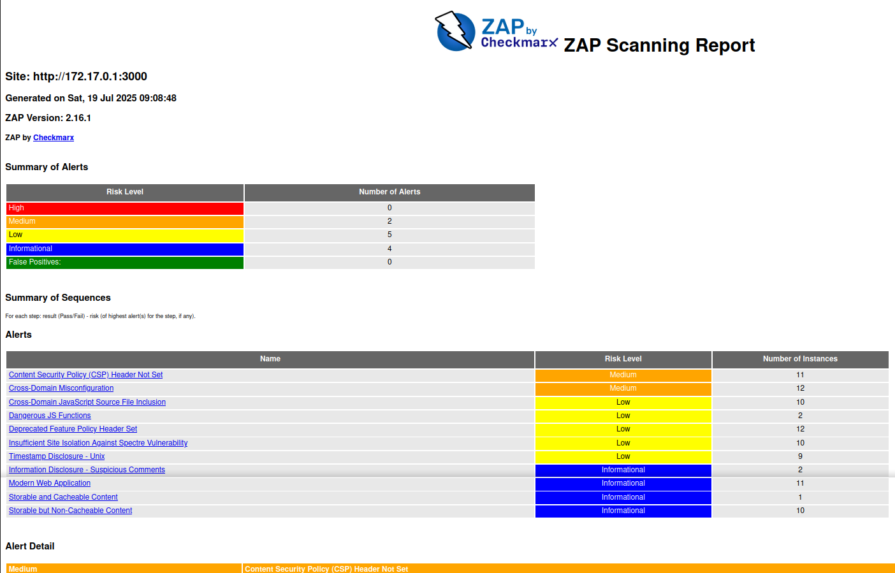

# **Lab9: Introduction to DevSecOps Tools - Submission**

## **Task 1: Web Application Scanning with OWASP ZAP**

### **Objective**
Perform automated security scanning of OWASP Juice Shop using OWASP ZAP in Docker to identify common web vulnerabilities such as XSS, SQL injection, and misconfigurations.

### **Implementation and Results**

**1. Start the vulnerable target application**
```bash
docker run -d --name juice-shop -p 3000:3000 bkimminich/juice-shop
```

**Output:**
```
Unable to find image 'bkimminich/juice-shop:latest' locally
latest: Pulling from bkimminich/juice-shop
dcc354d5cbbd: Pull complete 
c1e595f74d52: Pull complete 
4eff9a62d888: Pull complete 
33ce0b1d99fc: Pull complete 
bfb59b82a9b6: Pull complete 
da7816fa955e: Pull complete 
ddf74a63f7d8: Pull complete 
7c12895b777b: Pull complete 
883ffadaac7b: Pull complete 
Digest: sha256:51134b74c523b6779a4bf25bca021b5cfae7898b6e68f6545e8bb9e4d33ce6b0
Status: Downloaded newer image for bkimminich/juice-shop:latest
5c71cfa2d023d86920cca1cccc856cb4bf1d70fdfce9c168c9999dc074b65504
```

**Analysis:** Successfully pulled and started the OWASP Juice Shop container. The application was accessible at `http://localhost:3000` showing the vulnerable e-commerce application.



**Get Docker Network IP**
```bash
ip -f inet -o addr show docker0 | awk '{print $4}' | cut -d '/' -f 1
```
**Output:** `172.17.0.1`

**2. Scan with OWASP ZAP**
```bash
docker run --rm -u zap -v $(pwd):/zap/wrk:rw \
-t ghcr.io/zaproxy/zaproxy:stable zap-baseline.py \
-t http://172.17.0.1:3000 \
-g gen.conf \
-r zap-report.html
```

**Scan Results:**
```
Total of 95 URLs
PASS: Vulnerable JS Library (Powered by Retire.js) [10003]
PASS: In Page Banner Information Leak [10009]
PASS: Cookie No HttpOnly Flag [10010]
PASS: Cookie Without Secure Flag [10011]
PASS: Re-examine Cache-control Directives [10015]
PASS: Content-Type Header Missing [10019]
PASS: Anti-clickjacking Header [10020]
PASS: X-Content-Type-Options Header Missing [10021]
PASS: Information Disclosure - Debug Error Messages [10023]
PASS: Information Disclosure - Sensitive Information in URL [10024]
PASS: Information Disclosure - Sensitive Information in HTTP Referrer Header [10025]
PASS: HTTP Parameter Override [10026]
PASS: Information Disclosure - Suspicious Comments [10027]
PASS: Off-site Redirect [10028]
PASS: Cookie Poisoning [10029]
PASS: User Controllable Charset [10030]
PASS: User Controllable HTML Element Attribute (Potential XSS) [10031]
PASS: Viewstate [10032]
PASS: Directory Browsing [10033]
PASS: Heartbleed OpenSSL Vulnerability (Indicative) [10034]
PASS: Strict-Transport-Security Header [10035]
PASS: HTTP Server Response Header [10036]
PASS: Server Leaks Information via "X-Powered-By" HTTP Response Header Field(s) [10037]
PASS: X-Backend-Server Header Information Leak [10039]
PASS: Secure Pages Include Mixed Content [10040]
PASS: HTTP to HTTPS Insecure Transition in Form Post [10041]
PASS: HTTPS to HTTP Insecure Transition in Form Post [10042]
PASS: User Controllable JavaScript Event (XSS) [10043]
PASS: Big Redirect Detected (Potential Sensitive Information Leak) [10044]
PASS: Content Cacheability [10049]
PASS: Retrieved from Cache [10050]
PASS: X-ChromeLogger-Data (XCOLD) Header Information Leak [10052]
PASS: Cookie without SameSite Attribute [10054]
PASS: CSP [10055]
PASS: X-Debug-Token Information Leak [10056]
PASS: Username Hash Found [10057]
PASS: X-AspNet-Version Response Header [10061]
PASS: PII Disclosure [10062]
PASS: Hash Disclosure [10097]
PASS: Source Code Disclosure [10099]
PASS: Weak Authentication Method [10105]
PASS: Reverse Tabnabbing [10108]
PASS: Modern Web Application [10109]
PASS: Authentication Request Identified [10111]
PASS: Session Management Response Identified [10112]
PASS: Verification Request Identified [10113]
PASS: Script Served From Malicious Domain (polyfill) [10115]
PASS: Absence of Anti-CSRF Tokens [10202]
PASS: Private IP Disclosure [2]
PASS: Session ID in URL Rewrite [3]
PASS: Script Passive Scan Rules [50001]
PASS: Insecure JSF ViewState [90001]
PASS: Java Serialization Object [90002]
PASS: Sub Resource Integrity Attribute Missing [90003]
PASS: Charset Mismatch [90011]
PASS: Application Error Disclosure [90022]
PASS: WSDL File Detection [90030]
PASS: Loosely Scoped Cookie [90033]

WARN-NEW: Cross-Domain JavaScript Source File Inclusion [10017] x 10 
WARN-NEW: Content Security Policy (CSP) Header Not Set [10038] x 11 
WARN-NEW: Deprecated Feature Policy Header Set [10063] x 12 
WARN-NEW: Timestamp Disclosure - Unix [10096] x 9 
WARN-NEW: Cross-Domain Misconfiguration [10098] x 12 
WARN-NEW: Dangerous JS Functions [10110] x 2 
WARN-NEW: Insufficient Site Isolation Against Spectre Vulnerability [90004] x 10 

FAIL-NEW: 0     FAIL-INPROG: 0  WARN-NEW: 7     WARN-INPROG: 0  INFO: 0 IGNORE: 0      PASS: 58
```

**Complete ZAP Report:** [`zap-report.html`](zap-report.html) - Detailed HTML report with technical details, affected URLs, and remediation steps.



### **ZAP Report Key Findings**

The OWASP ZAP scan identified the following security issues:

| Risk Level | Vulnerability | Count | Affected URLs | Description |
|------------|---------------|-------|---------------|-------------|
| **MEDIUM** | Content Security Policy (CSP) Header Not Set [10038] | 11 | Main pages, sitemap, FTP directory | Missing CSP headers allow potential XSS attacks |
| **MEDIUM** | Cross-Domain Misconfiguration [10098] | 12 | Multiple endpoints | CORS policy issues enable unauthorized requests |
| LOW | Cross-Domain JavaScript Source File Inclusion [10017] | 10 | Application pages | External JavaScript files pose injection risks |
| LOW | Deprecated Feature Policy Header Set [10063] | 12 | Various pages | Outdated security headers in use |
| LOW | Timestamp Disclosure - Unix [10096] | 9 | Application responses | Unix timestamps exposed in responses |
| LOW | Dangerous JS Functions [10110] | 2 | main.js, vendor.js | Potentially unsafe JavaScript functions |
| LOW | Insufficient Site Isolation Against Spectre [90004] | 10 | Multiple pages | Missing Spectre vulnerability protections |

**Scan Summary:**
- **Total URLs Scanned:** 95
- **Passed Checks:** 58
- **Medium Risk Issues:** 2 types (23 total instances)
- **Low Risk Issues:** 5 types (43 total instances)
- **Critical/High Issues:** 0

### **Task 1 Results Analysis**

**3. Analyze results**
- **HTML report location:** `zap-report.html` (opened in browser)
- **2 Medium risk vulnerabilities identified:**
  1. **Content Security Policy (CSP) Header Not Set** - 11 instances
  2. **Cross-Domain Misconfiguration** - 12 instances
- **Security headers status:** **Missing Critical Headers**
  - ❌ CSP headers not implemented
  - ❌ CORS policies misconfigured
  - ✅ Basic HTTP headers present

**4. Clean up**
```bash
docker stop juice-shop && docker rm juice-shop
```

### **Task 1 Results**
- **Medium risk vulnerabilities:** **2**
- **Security headers status:** **Partially implemented** (missing CSP and proper CORS)
- **Most critical finding:** **CSP Header Not Set** (XSS protection gap)

## **Task 2: Container Vulnerability Scanning with Trivy**

### **Objective**
Identify vulnerabilities in the OWASP Juice Shop container image using Trivy, focusing on OS/library vulnerabilities and secrets detection.

### **Implementation and Results**

**1. Scan using Trivy in Docker**
```bash
docker run --rm -v /var/run/docker.sock:/var/run/docker.sock \
aquasec/trivy:latest image \
--severity HIGH,CRITICAL \
bkimminich/juice-shop > trivy_check.log
```

**Output:**
```
2025-07-19T09:58:04Z    INFO    [vulndb] Need to update DB
2025-07-19T09:58:04Z    INFO    [vulndb] Downloading vulnerability DB...
2025-07-19T09:58:14Z    INFO    Detected OS     family="debian" version="12.11"
2025-07-19T09:58:44Z    INFO    [debian] Detecting vulnerabilities...   os_version="12" pkg_num=9
2025-07-19T09:58:44Z    INFO    Number of language-specific files       num=1
2025-07-19T09:58:44Z    INFO    [node-pkg] Detecting vulnerabilities...
2025-07-19T09:58:44Z    INFO    Table result includes only package filenames. Use '--format json' option to get the full path to the package file.
```

**Complete scan results:** [`trivy_check.log`](trivy_check.log)

**2. Analyze results**

| Package | Vulnerability | Severity | Current Version | Fixed Version | Description |
|---------|---------------|----------|-----------------|---------------|-------------|
| crypto-js | CVE-2023-46233 | CRITICAL | 3.3.0 | 4.2.0 | PBKDF2 1,000 times weaker than specified |
| jsonwebtoken | CVE-2015-9235 | CRITICAL | 0.1.0 | 4.2.2 | JWT verification step bypass |
| lodash | CVE-2019-10744 | CRITICAL | 2.4.2 | 4.17.12 | Prototype pollution vulnerability |
| marsdb | GHSA-5mrr-rgp6-x4gr | CRITICAL | 0.6.11 | - | Command injection vulnerability |
| vm2 | CVE-2023-32314 | CRITICAL | 3.9.17 | 3.9.18 | Sandbox escape vulnerability |

**Secrets Detection Results:**
```
/juice-shop/build/lib/insecurity.js (secrets)
=============================================
Total: 1 (HIGH: 1, CRITICAL: 0)

HIGH: AsymmetricPrivateKey (private-key)
════════════════════════════════════════
Asymmetric Private Key - Hardcoded RSA private key found in source code
```

**3. Clean up**
```bash
docker rmi bkimminich/juice-shop
```

**Output:**
```
Untagged: bkimminich/juice-shop:latest
Deleted: sha256:51134b74c523b6779a4bf25bca021b5cfae7898b6e68f6545e8bb9e4d33ce6b0
```

### **Task 2 Results**
- **Critical vulnerabilities in Juice Shop image:** **8**
- **Vulnerable packages:**
  1. **crypto-js**
  2. **jsonwebtoken**
- **Dominant vulnerability type:** **Authentication Bypass & Cryptographic Weaknesses**
