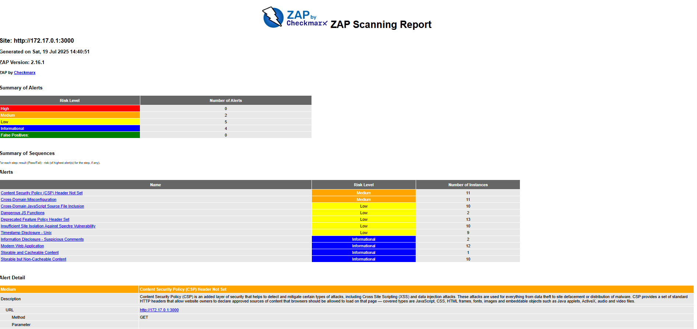
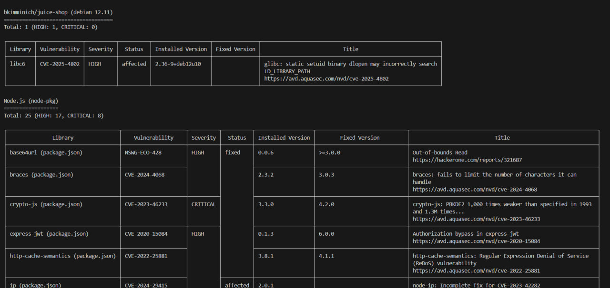
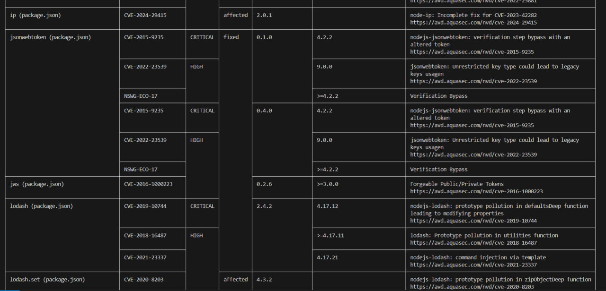

# Credentials

The work is done by M24-RO student  
Anton Kirilin  
a.kirilin@innopolis.university  

# Task 1

I am still using wsl. The default line is working but it just provides an output with everything okay, because there is no application on that address. Then I check the needed LAN ID and simply put it in.

   ```bash
      docker run --rm -u zap -v $(pwd):/zap/wrk:rw \
      -t ghcr.io/zaproxy/zaproxy:stable zap-baseline.py \
      -t http://172.17.0.1:3000 \
      -g gen.conf \
      -r zap-report.html
   ```

Here is the report picture



Yeah we've got some medium security alerts, even with the solutions. There is also an alert "suspicious comments" which is funny to see but okay.  

- Juice Shop vulnerabilities found (Medium): 2
- Most interesting vulnerability found: suspicious comments which is basically some comments that a potential hacker could use.
- Security headers present: No? not found I suppose  

Let's stop the [container](https://www.youtube.com/watch?v=d8FrPI0BVyE)  

# Task 2

Uhm so I can scan my images before the deployment??! No idea how to react to that information but okay. SO basically the report looks kinda ugly in the terminal.   





- found critical vulnerabilities: 8. But most of them are fixed in the future versions of the packages. So idk, upgarde?  

- vulnerable packages: http-cache-semantics; ip;  jsonwebtoken; sanitize-html e.t.c. too much to show in a single markdown. It even reached the cap of showable text in my terminal. 

- dominant vulnerability: verification bypass seems the most popular