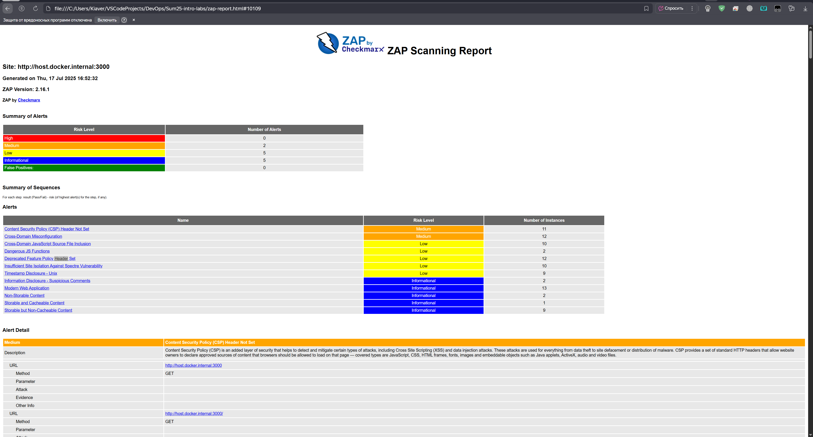

## Task 1 Results
- Juice Shop vulnerabilities found (Medium): 2 (`Content Security Policy (CSP) Header Not Set`, `Cross-Domain Misconfiguration`)
- Most interesting vulnerability found: `Dangerous JS Functions` - 	
A dangerous JS function seems to be in use that would leave the site vulnerable. (Didn't know they exist)
- Security headers present: No, since `Content Security Policy (CSP) Header Not Set`

In order to run check on Windows I had to change command a bit
```
docker run --rm -u zap -v ${pwd}:/zap/wrk:rw -t ghcr.io/zaproxy/zaproxy:stable zap-baseline.py -t http://host.docker.internal:3000 -g gen.conf -r zap-report.html
```


## Task 2 Results
- Critical vulnerabilities in Juice Shop image: 8
- Vulnerable packages: 
    1. base64url 
    2. braces
    3. crypto-js (crit)
    4. express-jwt
    5. http-cache-semantics
    6. ip
    7. jsonwebtoken (crit)
    8. jws
    9. lodash (crit)
    10. lodash.set
    11. marsdb (crit)
    12. moment
    13. sanitize-html
    14. vm2 (crit)
    15. ws
- Dominant vulnerability type: Verification Bypass


Check `trivy_out.txt`
