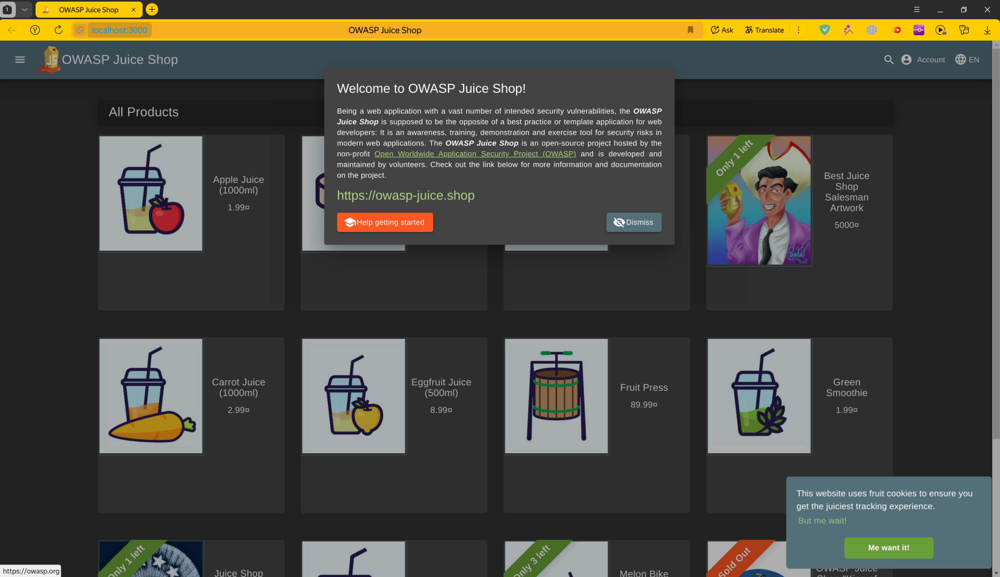
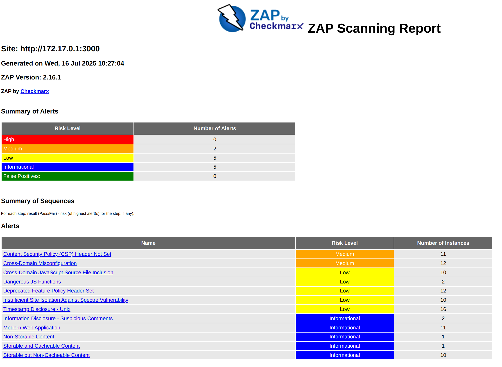

# Introduction to DevSecOps Tools

## Task 1: Web Application Scanning with OWASP ZAP

### 1) Start the vulnerable target application (Juice Shop)

Firstly i need to run some vulnerable application

```bash
$ docker run -d --name juice-shop -p 3000:3000 bkimminich/juice-shop
Unable to find image 'bkimminich/juice-shop:latest' locally
latest: Pulling from bkimminich/juice-shop
35d697fe2738: Pulling fs layer 
bfb59b82a9b6: Pulling fs layer 
4eff9a62d888: Pulling fs layer 
a62778643d56: Pulling fs layer 
7c12895b777b: Waiting 
3214acf345c0: Pull complete 
5664b15f108b: Pull complete 
0bab15eea81d: Pull complete 
4aa0ea1413d3: Pull complete 
da7816fa955e: Pull complete 
ddf74a63f7d8: Pull complete 
d00c3209d929: Pull complete 
c1e595f74d52: Pull complete 
7faf0cfa885c: Pull complete 
5b14f6c9a813: Pull complete 
33ce0b1d99fc: Pull complete 
f45e0372ce60: Pull complete 
a8bb57d21f11: Pull complete 
883ffadaac7b: Pull complete 
dcc354d5cbbd: Pull complete 
Digest: sha256:51134b74c523b6779a4bf25bca021b5cfae7898b6e68f6545e8bb9e4d33ce6b0
Status: Downloaded newer image for bkimminich/juice-shop:latest
17bcf4ca4afd2b462c2d5d4ba6c2b6f2a9ebbf9057d38b144e4626133b8e01a9
```

Shop application rinning locally:



### 2) Scan with OWASP ZAP

```bash
$ ip -f inet -o addr show docker0 | awk '{print $4}' | cut -d '/' -f 1
172.17.0.1

```bash
$ docker run --rm -u zap -v $(pwd):/zap/wrk:rw \
   -t ghcr.io/zaproxy/zaproxy:stable zap-baseline.py \
> -t http://172.17.0.1:3000 \
> -g gen.conf \
> -r zap-report.html
```

Generated report is looks like:



So it has found porblems and exploits in application of juice shop.

- Cross-Domain JavaScript Source File Inclusion (Medium) - loads JS from outer source
- Application Error Disclosure (Medium) - application errors is visible for user
- User Controllable HTML Element Attribute (Potential XSS) (Low) - HTML attribute is controllable by a user

Most interesting vulnerability here is Application Error Disclosure, because we can get a lot of information about server errors and ways of data processing.

Also there is almost no security headers

### 3) Then i cleaned everything up
```bash
$   docker stop juice-shop && docker rm juice-shop
juice-shop
juice-shop
```

## Task 2: Container Vulnerability Scanning with Trivy
### 0) Run shop again
```bash
$ docker run -d --name juice-shop -p 3000:3000 bkimminich/juice-shop
1afd1c1bcb1634bf7ab5be3a7c098ab96196ba2599b764e6462b9e7b18c868db
```
### 1) Scan using Trivy in Docker:
```bash
$ docker run --rm -v /var/run/docker.sock:/var/run/docker.sock    aquasec/trivy:latest image    --severity HIGH,CRITICAL    bkimminich/juice-shop > output.txt
2025-07-28T17:37:02Z    INFO    [vulndb] Need to update DB
2025-07-28T17:37:02Z    INFO    [vulndb] Downloading vulnerability DB...
2025-07-28T17:37:02Z    INFO    [vulndb] Downloading artifact...        repo="mirror.gcr.io/aquasec/trivy-db:2"
1.42 MiB / 67.21 MiB [->_____________________________________________________________] 2.11% ? p/s ?4.77 MiB / 67.21 MiB [---->__________________________________________________________] 7.09% ? p/s ?9.09 MiB / 67.21 MiB [-------->_____________________________________________________] 13.53% ? p/s ?12.75 MiB / 67.21 MiB [--------->______________________________________] 18.97% 18.88 MiB p/s ETA 2s16.42 MiB / 67.21 MiB [----------->____________________________________] 24.43% 18.88 MiB p/s ETA 2s20.72 MiB / 67.21 MiB [-------------->_________________________________] 30.82% 18.88 MiB p/s ETA 2s25.06 MiB / 67.21 MiB [----------------->______________________________] 37.29% 18.98 MiB p/s ETA 2s29.30 MiB / 67.21 MiB [-------------------->___________________________] 43.59% 18.98 MiB p/s ETA 1s33.59 MiB / 67.21 MiB [----------------------->________________________] 49.98% 18.98 MiB p/s ETA 1s37.64 MiB / 67.21 MiB [-------------------------->_____________________] 56.00% 19.11 MiB p/s ETA 1s41.03 MiB / 67.21 MiB [----------------------------->__________________] 61.05% 19.11 MiB p/s ETA 1s44.62 MiB / 67.21 MiB [------------------------------->________________] 66.39% 19.11 MiB p/s ETA 1s47.19 MiB / 67.21 MiB [--------------------------------->______________] 70.20% 18.90 MiB p/s ETA 1s50.34 MiB / 67.21 MiB [----------------------------------->____________] 74.90% 18.90 MiB p/s ETA 0s54.23 MiB / 67.21 MiB [-------------------------------------->_________] 80.69% 18.90 MiB p/s ETA 0s58.41 MiB / 67.21 MiB [----------------------------------------->______] 86.90% 18.89 MiB p/s ETA 0s62.72 MiB / 67.21 MiB [-------------------------------------------->___] 93.31% 18.89 MiB p/s ETA 0s66.36 MiB / 67.21 MiB [----------------------------------------------->] 98.73% 18.89 MiB p/s ETA 0s67.21 MiB / 67.21 MiB [---------------------------------------------->] 100.00% 18.62 MiB p/s ETA 0s67.21 MiB / 67.21 MiB [---------------------------------------------->] 100.00% 18.62 MiB p/s ETA 0s67.21 MiB / 67.21 MiB [---------------------------------------------->] 100.00% 18.62 MiB p/s ETA 0s67.21 MiB / 67.21 MiB [---------------------------------------------->] 100.00% 17.42 MiB p/s ETA 0s67.21 MiB / 67.21 MiB [---------------------------------------------->] 100.00% 17.42 MiB p/s ETA 0s67.21 MiB / 67.21 MiB [---------------------------------------------->] 100.00% 17.42 MiB p/s ETA 0s67.21 MiB / 67.21 MiB [---------------------------------------------->] 100.00% 16.29 MiB p/s ETA 0s67.21 MiB / 67.21 MiB [-------------------------------------------------] 100.00% 13.98 MiB p/s 5.0s2025-07-28T17:37:08Z    INFO    [vulndb] Artifact successfully downloaded       repo="mirror.gcr.io/aquasec/trivy-db:2"
2025-07-28T17:37:08Z    INFO    [vuln] Vulnerability scanning is enabled
2025-07-28T17:37:08Z    INFO    [secret] Secret scanning is enabled
2025-07-28T17:37:08Z    INFO    [secret] If your scanning is slow, please try '--scanners vuln' to disable secret scanning
2025-07-28T17:37:08Z    INFO    [secret] Please see also https://trivy.dev/v0.64/docs/scanner/secret#recommendation for faster secret detection
2025-07-28T17:37:12Z    INFO    Detected OS     family="debian" version="12.11"
2025-07-28T17:37:12Z    INFO    [debian] Detecting vulnerabilities...   os_version="12" pkg_num=9
2025-07-28T17:37:12Z    INFO    Number of language-specific files       num=1
2025-07-28T17:37:12Z    INFO    [node-pkg] Detecting vulnerabilities...
2025-07-28T17:37:12Z    WARN    Using severities from other vendors for some vulnerabilities. Read https://trivy.dev/v0.64/docs/scanner/vulnerability#severity-selection for details.
2025-07-28T17:37:13Z    INFO    Table result includes only package filenames. Use '--format json' option to get the full path to the package file.
```

Output is placed in file `output.txt`

- Total number of CRITICAL issues is 8
- Total number of HIGH issues is 17
- 2 vulnerable package names
-- jsonwebtoken
-- base64url
- The most common vulnerability type: JSON Web Tokens vulnerabilities

### 3) And clean up
```bash
$  docker stop juice-shop && docker rm juice-shop
juice-shop
juice-shop

$ docker rmi bkimminich/juice-shop
Untagged: bkimminich/juice-shop:latest
Untagged: bkimminich/juice-shop@sha256:51134b74c523b6779a4bf25bca021b5cfae7898b6e68f6545e8bb9e4d33ce6b0
Deleted: sha256:f056b7d0c127f1db8b00724c193cc4f8e2896f19a80c224dafa679d886c1d926
Deleted: sha256:5406583605d09126fd768c3e7bef24075c6293d7ffb9f39ef653379fe612d6c2
Deleted: sha256:b84a5949445f4206818e73149dab113d1f01431e03ba487517a393c059b26a86
Deleted: sha256:729f8d316feaa57f8c2a70916c91eb00b514fb5eb6367515f0275a574fe48ce4
Deleted: sha256:49fe1149bf56b6d771a25db8beaf495f73fd0b3d02ae71329c74322b077d82c5
Deleted: sha256:80a7b6dcbbda87cc7d4ccd899eed365ac6f43fefee23b8c5ae5a1b680678fd99
Deleted: sha256:a5c2f0525af7af62a2ea4e29f759233e3a3d0d8a673c8e6a46416203271dd0a2
Deleted: sha256:90be1b7dc61074867df1310a5163b3ac844132f1600ad4ef63d68d3583a2eb0d
Deleted: sha256:a8d1f363c269b9084353a219bc68e578d571f0797c10324366b795b15690126a
Deleted: sha256:7452a4f1105938fee18da78083fa39b53461c4e52a09917fb4d42f9298c5f98b
Deleted: sha256:c04b4694768f2e0039108bde566cf31cb961ae9c7937e000881bc354317a6ea8
Deleted: sha256:e45a7abda39327d7c9a796dcae371be6aba6b47b281aa0abb3e01ee4eaedbb7a
Deleted: sha256:d1cf240449e7ee84deab962b8ab5203f402517524237880c059c76b019f0a928
Deleted: sha256:d4f8d2e5e476a573610fa911800fd90c8e4892a7a52d4636be52a34ee8f929b9
Deleted: sha256:5c6b84fe62c2116d0691e2a0ef8194804419ebde1be412b1cd3d3acb7861a76a
Deleted: sha256:3f77f5aee71f0088956b90984b8cc57704dd0d0194b9df25a2af06020fa1e0f3
Deleted: sha256:0e03c2400d33033e7aae62382f2335330dbdb4dfa547a36abc850c59415f4f99
Deleted: sha256:7dd4767b333564be7a594c3269863a53cbf8b631bf0723862fa5eb477f088d78
Deleted: sha256:1f76c8c88e617e9af1d941f273ab575d36113a16c430831516856e0d9cfe01fd
Deleted: sha256:0834ef3973811a3021b34e6c11eff7410afe7331cabe4fa8e5e8cd57edefe1e9
Deleted: sha256:f464af4b9b251ebe8a7c2f186aff656f0892f6cb159837a6ce8fd63842e83e35
```
