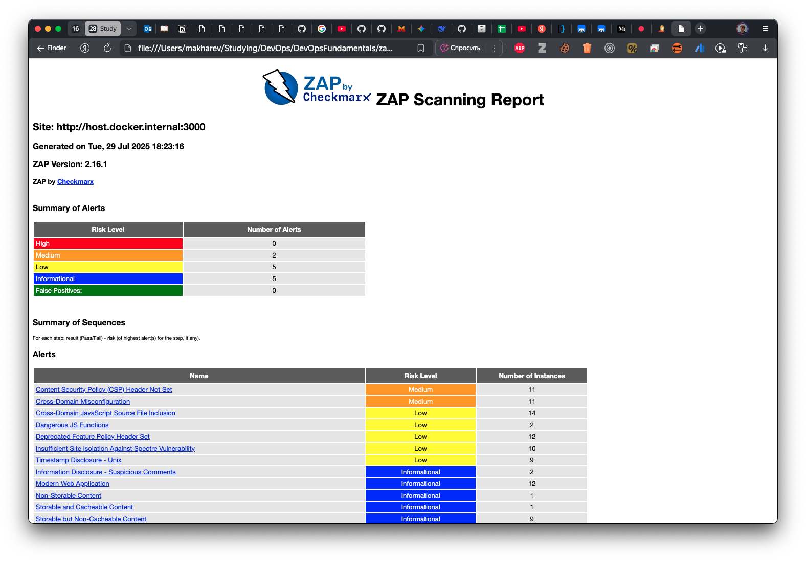
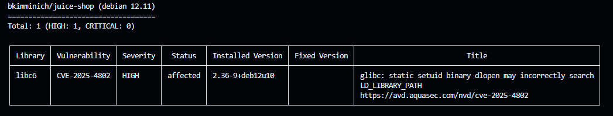

## Task 1 Results
- Juice Shop vulnerabilities found (Medium): 2 
- Found: Cross-Domain Misconfiguration, Content Security Policy (CSP) Header Not Set

## Task 2 Results
- Critical vulnerabilities in Juice Shop image: 12
- Vulnerable packages: 
    1. libc6
- Dominant vulnerability type: CVE (Memory Corruption)

