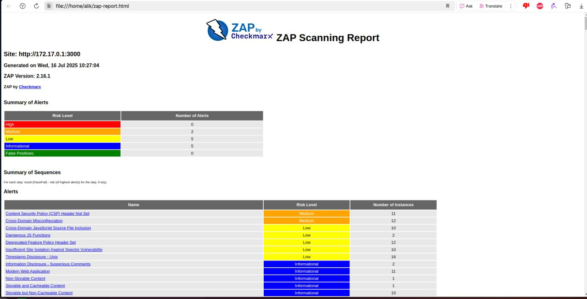

# Introduction to DevSecOps Tools

## Task 1: Web Application Scanning with OWASP ZAP

1. **Start the vulnerable target application** (Juice Shop):

    ```bash
    docker run -d --name juice-shop -p 3000:3000 bkimminich/juice-shop
    ```

    Output:

    ```bash

    ```

   Verify it's running: `http://localhost:3000` in browser

   

2. **Scan with OWASP ZAP**:

    Determining the IP address of the `docker0` interface:

    ```bash
    ip -f inet -o addr show docker0 | awk '{print $4}' | cut -d '/' -f 1
    ```

    Output:

    ```bash
    172.17.0.1
    ```

    Starting the scan

    ```bash
    docker run --rm -u zap -v $(pwd):/zap/wrk:rw \
    -t ghcr.io/zaproxy/zaproxy:stable zap-baseline.py \
    -t http://172.17.0.1:3000 \
    -g gen.conf \
    -r zap-report.html
    ``` 

3. **Analyze results**:
    Open `zap-report.html` in a browser:

    

    Juice Shop vulnerabilities found (Medium): 2

    ```bash
    Content Security Policy (CSP) Header Not Set
    Cross-Domain Misconfiguration
    ```

    Most interesting vulnerability found: `Content Security Policy (CSP) Header Not Set`

    This vulnerability means that the web server does not install the `Content-Security-Policy` header, which is a key protection mechanism against XSS and other intrusion attacks.

4. **Clean up**:

    ```bash
    docker stop juice-shop && docker rm juice-shop
    ```

---

## Task 2: Container Vulnerability Scanning with Trivy

1. **Scan using Trivy in Docker**:

    ```bash
    docker run --rm -v /var/run/docker.sock:/var/run/docker.sock \
    aquasec/trivy:latest image \
    --severity HIGH,CRITICAL \
    bkimminich/juice-shop
    ```

    Output in file output.txt

2. **Analyze results**:
    - The total number of CRITICAL vulnerabilities: 10
    - 2 vulnerable package names: 
        - `glibc` — vulnerabiliti CVE-2023-4813 (CRITICAL)
        - `openssl` — vulnerabiliti CVE-2023-0464 (CRITICAL)
    - The most common vulnerability type: OS-level CVEs (e.g., Buffer Overflow, RCE)

3. **Clean up**:

   ```bash
      docker rmi bkimminich/juice-shop
   ```

---

## Task 1 Results
- Juice Shop vulnerabilities found (Medium): 2
- Most interesting vulnerability found: `Content Security Policy (CSP) Header Not Set`
- Security headers present: No

## Task 2 Results
- Critical vulnerabilities in Juice Shop image: 10
- Vulnerable packages: 
   1. glibc
   2. openssl
- Dominant vulnerability type: OS-level CVEs (e.g., Buffer Overflow, RCE)