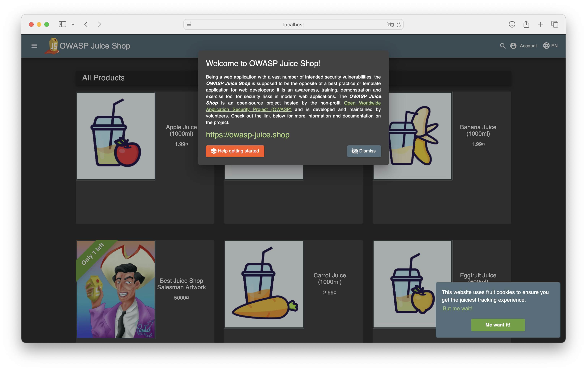

# Lab 9: Introduction to DevSecOps Tools

## Task 1: Web Application Scanning with OWASP ZAP

  ### Start the vulnerable target application (Juice Shop)

  ```bash
  docker run -d --name juice-shop -p 3000:3000 bkimminich/juice-shop
  ```

  Verify that it is running:

  

  ### Scan with OWASP ZAP

  ```bash
  docker run --rm -u zap -v $(pwd):/zap/wrk:rw \
    -t ghcr.io/zaproxy/zaproxy:stable zap-baseline.py \
    -t http://host.docker.internal:3000 \
    -g gen.conf \
    -r zap-report.html
  ```

  Check report:

  

  ### Results

  - Juice Shop vulnerabilities found (Medium): 2
  - Most interesting vulnerability found: Timestamp Disclosure - Unix
  - Security headers present: No

## Task 2: Container Vulnerability Scanning with Trivy

  ### Scan using Trivy in Docker

  ```bash
  docker run --rm -v /var/run/docker.sock:/var/run/docker.sock \
    aquasec/trivy:latest image \
    --severity HIGH,CRITICAL \
    bkimminich/juice-shop > trivy-report.txt
  ```

  Terminal output:

  

  ### Results

  - Critical vulnerabilities in Juice Shop image: 8
  - Vulnerable packages: 
    1. base64url
    2. braces
    
    (these are the first two, complete list is available in trivy-report.txt)
  - Dominant vulnerability type: Authorization bypass
  
  ### Clean up

  ```bash
  docker stop juice-shop && docker rm juice-shop
  docker rmi bkimminich/juice-shop
  ```
